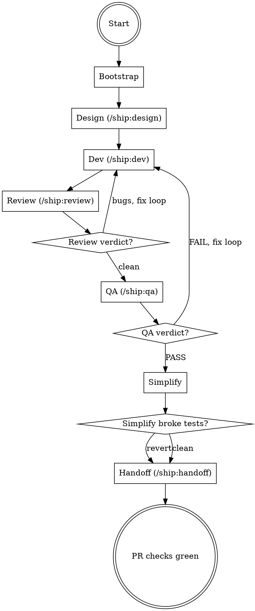

## Preamble (run first)

```bash
SHIP_PLUGIN_ROOT="${SHIP_PLUGIN_ROOT:-${CLAUDE_PLUGIN_ROOT:-${CODEX_HOME:-$HOME/.codex}/ship}}"
SHIP_SKILL_NAME=auto source "${SHIP_PLUGIN_ROOT}/scripts/preflight.sh"
```

### Auth Gate

If `SHIP_AUTH: not_logged_in`: AskUserQuestion — "Ship requires authentication to use all skills. Login now? (A: Yes / B: Not now)". A → run `ship auth login`, verify with `ship auth status --json`, proceed if logged_in, stop if failed. B → stop.
If `SHIP_AUTO_LOGIN: true`: skip AskUserQuestion, run `ship auth login` directly.
If `SHIP_TOKEN_EXPIRY` ≤ 3 days: warn user their token expires soon.

# Ship: Auto

Thin orchestrator that chains design → dev → review → QA →
simplify → handoff. Each phase is fully owned by its skill. Auto's
only job: call the skill, read the verdict, decide what's next.

## Core Principle

```
You dispatch Agent() calls and read their responses.
You may read code when needed (e.g. investigating NEEDS_CONTEXT).
You do NOT write code — all code changes go through subagents.
Allowed: git commands, mkdir, cat (for state file), Bash for coordination, Read for investigation.
```

## Process Flow



## Roles

| Role | Who |
|------|-----|
| Orchestrator | **You (Claude)** |
| Design | **/ship:design** — produces spec + plan |
| Dev | **/ship:dev** — implements stories, per-story review, cross-story regression |
| Code review | **/ship:review** — staff-engineer review of full diff |
| QA | **/ship:qa** — independent testing against running app |
| Simplify | **simplify** (standalone skill) — behavior-preserving cleanup |
| Handoff | **/ship:handoff** — PR creation, GitHub check loop, and fix loop |

## Red Flag

**Never:**
- Write code yourself — all code changes go through subagents
- Dispatch subagents in background
- Hardcode `main` — always use `BASE_BRANCH`
- Give up on a phase — fix and retry first
- Advance phase on a child's behalf — the dispatched agent advances the state file, you verify
- Guess artifacts from conversation — resume uses the `phase` field in the state file

---

## Phase 1: Bootstrap

**State file:** `.ship/ship-auto.local.md`

### Step A: Check for active task

```
Read(".ship/ship-auto.local.md")
```

- **File exists** → read frontmatter. Extract `task_id`, `branch`, `base_branch`, `phase`. Jump to Step C (resume).
- **File does not exist** → proceed to Step B (new task).

### Step B: New task

Generate task ID:
```
Bash("${SHIP_PLUGIN_ROOT:-${CLAUDE_PLUGIN_ROOT:-${CODEX_HOME:-$HOME/.codex}/ship}}/scripts/task-id.sh '<description>'")
```
Record as `TASK_ID`.

Create task directory:
```
Bash("mkdir -p .ship/tasks/<TASK_ID>")
```

Detect base branch:
```
Bash("git symbolic-ref refs/remotes/origin/HEAD 2>/dev/null | sed 's|refs/remotes/origin/||' || (git rev-parse --verify origin/main >/dev/null 2>&1 && echo main || echo master)")
```
Record as `BASE_BRANCH`. Use this value in ALL later phases — never hardcode `main`.

Ensure we're on a feature branch — never work directly on `BASE_BRANCH`:
```
CURRENT_BRANCH=$(git branch --show-current)
if [ "$CURRENT_BRANCH" = "<BASE_BRANCH>" ]; then
  git checkout -b ship/<TASK_ID>
fi
BRANCH=$(git branch --show-current)
```

Write state file (via Bash):
```markdown
---
active: true
task_id: <TASK_ID>
session_id: ${SHIP_SESSION_ID:-${CLAUDE_CODE_SESSION_ID:-${CODEX_SESSION_ID:-unknown}}}
branch: <BRANCH>
base_branch: <BASE_BRANCH>
phase: design
review_fix_round: 0
qa_fix_round: 0
started_at: "<ISO 8601 timestamp>"
---

<original user description>
```

If `.ship/rules/CONVENTIONS.md` is missing: suggest `/ship:setup` but do not block.

Output: `[Ship] Task "<title>" created. Starting design phase...`

### Step C: Resume

Read `phase` from state file frontmatter and jump directly to that phase
or fix loop:

- `design` → Phase 2
- `dev` → Phase 3
- `review` → Phase 4
- `review_fix` → Phase 4 review-fix loop
- `qa` → Phase 5
- `qa_fix` → Phase 5 QA-fix loop
- `simplify` → Phase 6
- `handoff` → Phase 7

For `review_fix` resume, read `.ship/tasks/<TASK_ID>/review.md` and use
its latest findings as the fix input if the prior Agent return is not in
memory.

For `qa_fix` resume, read the latest failing report in
`.ship/tasks/<TASK_ID>/qa/` and use it as the fix input if the prior
Agent return is not in memory.

Update `session_id` in state file to current session (so this session owns the task).

Output: `[Ship] Resuming task "<task_id>" — phase: <phase>`

---

## Phase 2: Design

```
Agent(prompt="Call Skill('design').
  Skip the skill's entire `## Preamble (run first)` section and Auth Gate.
  /ship:auto already handled preflight, auth, and repo context for this pipeline.
  This is the design phase only. Do not implement code in this phase.
  Read the existing code and produce the planning artifacts needed for implementation.
  Use the request below as planning context for `spec.md` and `plan.md` only.
  You are invoked by /ship:auto — do NOT ask the user questions. Treat
  any escalated items as blocked and say what is missing.
  Success means `.ship/tasks/<TASK_ID>/plan/spec.md` and `.ship/tasks/<TASK_ID>/plan/plan.md`
  both exist, are non-empty, and match the current branch and HEAD.
  On success, update `.ship/ship-auto.local.md` to `phase: dev` before returning.
  If design is blocked or incomplete, do not advance the state file.
  In your return, say whether design is complete or blocked, how many stories or tasks
  the plan contains, and where the artifacts were written.
  Planning request:
  ---
  <description from state file body>
  ---
  task_id: <TASK_ID>
  Artifacts go to: .ship/tasks/<TASK_ID>/plan/
  Current branch: <BRANCH>
  HEAD SHA: <current HEAD>")
```

**After return:** read the Agent response directly.
- Response clearly indicates design is complete → proceed
- Response indicates blocked or needs context → re-dispatch with more context (max 2 rounds)

**Verify state update:** confirm `.ship/ship-auto.local.md` now says `phase: dev`.

Output: `[Ship] Design complete — <N> stories identified. Starting dev...`

## Phase 3: Dev (ship:dev)

Record pre-dispatch HEAD SHA.

```
Agent(prompt="Call Skill('dev').
  Skip the skill's entire `## Preamble (run first)` section and Auth Gate.
  /ship:auto already handled preflight, auth, and repo context for this pipeline.
  This is the implementation phase only.
  Use the inputs below as implementation context.
  Implement against the provided spec and plan.
  Make the necessary code changes, run the most relevant verification you can inside this phase,
  and summarize any residual concerns that should carry forward.
  Do not redo design, review, QA, simplify, or handoff in this phase.
  You are invoked by /ship:auto — do NOT ask the user questions.
  If you cannot find TEST_CMD or need context, say clearly what context is missing.
  Success means the implementation is complete on the current branch and ready for review.
  On success, update `.ship/ship-auto.local.md` to `phase: review` before returning.
  If implementation is blocked or incomplete, do not advance the state file.
  In your return, say whether implementation is complete or blocked, which stories or tasks
  were completed, what verification ran, and any concerns worth carrying forward.
  Implementation context:
  task_dir: .ship/tasks/<TASK_ID>
  spec: .ship/tasks/<TASK_ID>/plan/spec.md
  plan: .ship/tasks/<TASK_ID>/plan/plan.md
  base_branch: <BASE_BRANCH>")
```

**After return:** read the Agent response directly.

| Response shape | Action |
|---------------|--------|
| Clearly indicates implementation is complete | proceed |
| Clearly indicates implementation is complete with concerns | Log concerns from the response, proceed |
| Clearly indicates blocked | Re-dispatch with fix instructions (max 2) |
| Clearly indicates needs context | Investigate and re-dispatch (max 2) |

**Verify state update:** confirm `.ship/ship-auto.local.md` now says `phase: review`.

Output: `[Ship] Dev complete. Starting review...`

## Phase 4: Review (ship:review)

```
Agent(prompt="Call Skill('review').
  Skip the skill's entire `## Preamble (run first)` section and Auth Gate.
  /ship:auto already handled preflight, auth, and repo context for this pipeline.
  This is the review phase only.
  Review the active change scope against the provided spec and write actionable findings.
  Do not implement fixes in this phase.
  You are invoked by /ship:auto (pipeline mode) — do NOT ask the user
  questions. If you cannot read the diff or spec, do a diff-only review.
  Write the review artifact to the path below and summarize the verdict in your return.
  On success with a clean review, update `.ship/ship-auto.local.md` to `phase: qa` before returning.
  If findings remain, update `.ship/ship-auto.local.md` to `phase: review_fix` before returning.
  If the review is blocked, do not advance the state file.
  In your return, say whether the review is clean, blocked, or has findings, and summarize
  the highest-severity findings when present.
  Review context:
  task_id: <TASK_ID>
  task_dir: .ship/tasks/<TASK_ID>
  spec: .ship/tasks/<TASK_ID>/plan/spec.md
  base_branch: <BASE_BRANCH>
  Write review to: .ship/tasks/<TASK_ID>/review.md")
```

**After return:** read the Agent response directly.

| Response shape | Action |
|----------------|--------|
| Clearly indicates the review is clean | verify `phase: qa`, then proceed |
| Includes findings or bug summaries | verify `phase: review_fix`, then enter review-fix loop |
| Clearly indicates the review is blocked or not reviewable | re-dispatch with adjusted context (max 2 rounds) |

### Review-fix loop (max 3 rounds)

Read `review_fix_round` from state file. Increment it at the start of each round
and write back. If `review_fix_round` ≥ 3, escalate remaining findings to user.

```
loop (max 3 rounds — tracked in state file as review_fix_round):
  1. Verify `.ship/ship-auto.local.md` now says `phase: review_fix`
  2. If resuming and the prior review Agent return is unavailable, read
     `.ship/tasks/<TASK_ID>/review.md` and use its latest findings as the fix input
  3. Dispatch ship:dev to fix the bugs (pass bug details from review Agent return):
     Agent(prompt="Call Skill('dev').
       Skip the skill's entire `## Preamble (run first)` section and Auth Gate.
       /ship:auto already handled preflight, auth, and repo context for this pipeline.
       This is the implementation fix phase only.
       Apply only the review findings below to the existing implementation.
       Keep the fix scope targeted to those findings and rerun the most relevant verification
       for the changed area before returning.
       Do not redo design, review, QA, simplify, or handoff in this phase.
       You are invoked by /ship:auto — fix mode.
       On success, update `.ship/ship-auto.local.md` to `phase: review` before returning.
       If the fixes are blocked or incomplete, do not advance the state file.
       In your return, say which findings were fixed, what verification ran, and whether any
       concerns remain for the next review pass.
       Review findings to fix:
       ---
       <bug details from review Agent return>
       ---
       Implementation context:
       task_dir: .ship/tasks/<TASK_ID>
       spec: .ship/tasks/<TASK_ID>/plan/spec.md
       base_branch: <BASE_BRANCH>...")
  4. Verify `.ship/ship-auto.local.md` now says `phase: review`
  5. Re-dispatch ship:review (same prompt as above)
  6. Read the review response directly:
     - No bugs found → break, proceed
     - Findings listed → next round (if round < 3)
     - Findings listed and round = 3 → escalate remaining findings to user
     - Review blocked → stop the loop and investigate or re-dispatch with better context
```

Output: `[Ship] Review clean. Starting QA...`

## Phase 5: QA (ship:qa)

```
Agent(prompt="Call Skill('qa').
  Skip the skill's entire `## Preamble (run first)` section and Auth Gate.
  /ship:auto already handled preflight, auth, and repo context for this pipeline.
  This is the QA phase only.
  Test the existing implementation against the provided spec and current changes.
  Produce evidence-backed reports in the QA output directory and summarize the verdict for Auto.
  Do not implement fixes in this phase.
  You are invoked by /ship:auto — do NOT ask the user questions.
  On PASS or SKIP, update `.ship/ship-auto.local.md` to `phase: simplify` before returning.
  On FAIL, update `.ship/ship-auto.local.md` to `phase: qa_fix` before returning.
  On BLOCKED, do not advance the state file.
  In your return, say PASS, SKIP, FAIL, or BLOCKED, what criteria were verified, and where
  the QA reports were written.
  QA context:
  task_dir: .ship/tasks/<TASK_ID>
  spec: .ship/tasks/<TASK_ID>/plan/spec.md
  base_branch: <BASE_BRANCH>
  Write reports to: .ship/tasks/<TASK_ID>/qa/")
```

**After return:** read the Agent response directly.

| Response shape | Action |
|---------------|--------|
| Clearly indicates PASS | verify `phase: simplify`, then proceed |
| Clearly indicates SKIP | verify `phase: simplify`, then proceed |
| Clearly indicates FAIL | verify `phase: qa_fix`, then enter QA-fix loop |
| Clearly indicates BLOCKED | re-dispatch with adjusted context or investigate (max 2 rounds) |

### QA-fix loop (max 3 rounds)

Read `qa_fix_round` from state file. Increment it at the start of each round
and write back. If `qa_fix_round` ≥ 3, escalate remaining failures to user.

```
loop (max 3 rounds — tracked in state file as qa_fix_round):
  1. Verify `.ship/ship-auto.local.md` now says `phase: qa_fix`
  2. If resuming and the prior QA Agent return is unavailable, read the latest
     failing report in `.ship/tasks/<TASK_ID>/qa/` and use it as the fix input
  3. Dispatch ship:dev to fix (pass issue details from QA Agent return):
     Agent(prompt="Call Skill('dev').
       Skip the skill's entire `## Preamble (run first)` section and Auth Gate.
       /ship:auto already handled preflight, auth, and repo context for this pipeline.
       This is the implementation fix phase only.
       Apply only the QA issues below to the existing implementation.
       Keep the fix scope targeted to those issues and rerun the most relevant verification
       for the changed area before returning.
       Do not redo design, review, QA, simplify, or handoff in this phase.
       You are invoked by /ship:auto — fix mode.
       On success, update `.ship/ship-auto.local.md` to `phase: qa` before returning.
       If the fixes are blocked or incomplete, do not advance the state file.
       In your return, say which QA issues were fixed, what verification ran, and whether any
       concerns remain for the next QA pass.
       QA issues to fix:
       ---
       <issue details from QA Agent return>
       ---
       Implementation context:
       task_dir: .ship/tasks/<TASK_ID>
       spec: .ship/tasks/<TASK_ID>/plan/spec.md
       base_branch: <BASE_BRANCH>...")
  4. Verify `.ship/ship-auto.local.md` now says `phase: qa`
  5. Re-dispatch ship:qa with --recheck
  6. Read the QA response directly:
     - PASS/SKIP → break, proceed
     - FAIL → next round (if round < 3)
     - FAIL and round = 3 → escalate remaining failures to user
     - BLOCKED → stop the loop and investigate or re-dispatch with better context
```

Output: `[Ship] QA passed. Running simplify...`

## Phase 6: Simplify

Record current HEAD before simplify:
```
Bash("git rev-parse HEAD")
```
Record as `PRE_SIMPLIFY_SHA`.

```
Agent(prompt="Call Skill('simplify').
  Skip the skill's entire `## Preamble (run first)` section and Auth Gate.
  /ship:auto already handled preflight, auth, and repo context for this pipeline.
  This is the simplify phase only.
  Do behavior-preserving cleanup within the task scope below.
  Prefer simplifications that reduce duplication, clarify structure, or remove incidental
  complexity without changing observable behavior.
  Do not add features, re-plan the task, or start handoff in this phase.
  On success, update `.ship/ship-auto.local.md` to `phase: handoff` before returning.
  If simplify is blocked, do not advance the state file.
  In your return, say whether code changed, which files changed, and what simplification
  work was performed.
  Simplify scope: only files changed in this task (git diff <BASE_BRANCH>...HEAD --name-only).
  Output: .ship/tasks/<TASK_ID>/simplify.md")
```

**After return:** read the Agent response directly.
- Nothing changed → proceed.
- Code changed → verify simplify didn't break tests:
  ```
  Agent(prompt="This is the post-simplify verification step only.
    Run the repo's test command for the current tree and report PASS or FAIL.
    If the command fails, summarize the failing check or error at a high level.
    Do not modify files, advance phase state, or make workflow decisions in this step.")
  ```
  - PASS → proceed.
  - FAIL → revert to `PRE_SIMPLIFY_SHA`, proceed anyway.

**Verify state update:** confirm `.ship/ship-auto.local.md` now says `phase: handoff`.

## Phase 7: Handoff (ship:handoff)

```
Agent(prompt="Call Skill('handoff').
  Skip the skill's entire `## Preamble (run first)` section and Auth Gate.
  /ship:auto already handled preflight, auth, and repo context for this pipeline.
  This is the handoff phase only.
  Ship the current implementation on the provided branch.
  Verify what is needed, commit the relevant changes, push, create or update the PR,
  and keep working the CI and review loop until the PR is ready.
  Do not redo design, review, or QA in this phase.
  You are invoked by /ship:auto — do NOT ask the user questions.
  On success, delete `.ship/ship-auto.local.md` before returning.
  If handoff is not ready or blocked, leave the state file in place.
  In your return, say whether handoff is complete, include the PR URL when available,
  summarize the current check status, and call out any remaining blockers.
  Handoff context:
  task_id: <TASK_ID>
  task_dir: .ship/tasks/<TASK_ID>
  base_branch: <BASE_BRANCH>
  branch: <BRANCH>")
```

**After return:** read the Agent response directly.

| Response shape | Action |
|---------------|--------|
| Clearly indicates checks are green and includes PR URL | done |
| Clearly indicates failure or not ready | Re-dispatch handoff — it owns its own CI fix loop (max 3 rounds) |

**Verify cleanup:** confirm `.ship/ship-auto.local.md` has been deleted.

Output: `[Ship] PR checks green: <url>`

## Phase 8: Learn

After the pipeline completes (handoff done or escalated), capture
session learnings. This runs silently — no user interaction.

```
Agent(prompt="Call Skill('learn').
  Skip the skill's entire `## Preamble (run first)` section and Auth Gate.
  /ship:auto already handled preflight and auth.
  Reflect on this pipeline run and capture learnings.
  You are invoked by /ship:auto — do NOT ask the user questions.
  Capture silently and report what was captured in your return.
  Pipeline context:
  task_id: <TASK_ID>
  branch: <BRANCH>
  base_branch: <BASE_BRANCH>")
```

This phase is best-effort — if it fails, the pipeline is still complete.

---

## Example Workflow

```
── Phase 1: Bootstrap ─────────────────────────────────────

[Ship] Generating task ID...
  Bash("scripts/task-id.sh 'add dark mode toggle'")
  → TASK_ID = add-dark-mode-toggle

[Ship] Creating task directory...
  Bash("mkdir -p .ship/tasks/add-dark-mode-toggle")

[Ship] Detecting base branch...
  → BASE_BRANCH = main

[Ship] On main — creating feature branch...
  Bash("git checkout -b ship/add-dark-mode-toggle")
  → BRANCH = ship/add-dark-mode-toggle

[Ship] Writing state file...
  phase: design

[Ship] Task "add dark mode toggle" created. Starting design phase...

── Phase 2: Design ────────────────────────────────────────

[Ship] Dispatching /ship:design...
  Agent(prompt="Call Skill('design'). This is the design phase only. Read the existing code and produce `spec.md` and `plan.md`. On success, update `.ship/ship-auto.local.md` to `phase: dev` before returning. In your return, summarize story count and artifact paths. Planning request: add dark mode toggle ...")

  Agent returns:
  Design complete.
  3 stories identified — toggle component, CSS variables, persistence.
  Artifacts written to .ship/tasks/add-dark-mode-toggle/plan/spec.md and plan.md.

[Ship] Verified state update: phase → dev
[Ship] Design complete — 3 stories identified. Starting dev...

── Phase 3: Dev ───────────────────────────────────────────

[Ship] Recording HEAD SHA: abc1234
[Ship] Dispatching /ship:dev...
  Agent(prompt="Call Skill('dev'). This is the implementation phase only. Implement against the provided spec and plan, run relevant verification, and summarize residual concerns. On success, update `.ship/ship-auto.local.md` to `phase: review` before returning. Implementation context: task_dir: .ship/tasks/add-dark-mode-toggle ...")

  Agent returns:
  Implementation complete.
  3/3 stories complete, tests pass.
  Files changed: src/components/ThemeToggle.tsx, src/styles/themes.css, src/hooks/useTheme.ts.

[Ship] Verified state update: phase → review
[Ship] Dev complete. Starting review...

── Phase 4: Review ────────────────────────────────────────

[Ship] Dispatching /ship:review...
  Agent(prompt="Call Skill('review'). This is the review phase only. Review the active change scope against the spec, write actionable findings, and summarize the verdict. On success with a clean review, update `.ship/ship-auto.local.md` to `phase: qa` before returning. If findings remain, update `.ship/ship-auto.local.md` to `phase: review_fix` before returning. Review context: base_branch: main ...")

  Agent returns:
  Found 2 bugs:
  - P1: missing null check in useTheme
  - P2: CSS variable fallback is stale
  Review written to .ship/tasks/add-dark-mode-toggle/review.md

[Ship] 2 bugs found. Entering review-fix loop...

[Ship] Verified state update: phase → review_fix
[Ship] Dispatching /ship:dev to fix review bugs...
  Agent(prompt="Call Skill('dev'). This is the implementation fix phase only. Apply only the listed review findings, rerun relevant verification, and summarize what was fixed. On success, update `.ship/ship-auto.local.md` to `phase: review` before returning. Review findings to fix: P1, P2 ...")

  Agent returns:
  Fixed both bugs. Tests pass.

[Ship] Verified state update: phase → review
[Ship] Re-dispatching /ship:review...

  Agent returns:
  No bugs found.
  Review written to .ship/tasks/add-dark-mode-toggle/review.md

[Ship] Verified state update: phase → qa
[Ship] Review clean. Starting QA...

── Phase 5: QA ────────────────────────────────────────────

[Ship] Dispatching /ship:qa...
  Agent(prompt="Call Skill('qa'). This is the QA phase only. Test the current implementation against the spec, write evidence-backed reports, and summarize PASS, SKIP, FAIL, or BLOCKED. On PASS or SKIP, update `.ship/ship-auto.local.md` to `phase: simplify` before returning. On FAIL, update `.ship/ship-auto.local.md` to `phase: qa_fix` before returning. QA context: base_branch: main ...")

  Agent returns:
  FAIL — dark mode toggle doesn't persist after hard refresh (localStorage not set).
  Report written to .ship/tasks/add-dark-mode-toggle/qa/browser-report.md.

[Ship] QA failed. Entering QA-fix loop...

[Ship] Verified state update: phase → qa_fix
[Ship] Dispatching /ship:dev to fix QA issues...
  Agent(prompt="Call Skill('dev'). fix mode.
    This is the implementation fix phase only.
    Apply only the listed QA issues, rerun relevant verification, and summarize what was fixed.
    On success, update `.ship/ship-auto.local.md` to `phase: qa` before returning.
    QA issues to fix: localStorage not set on toggle ...")

  Agent returns:
  Added localStorage.setItem in useTheme hook.

[Ship] Verified state update: phase → qa
[Ship] Re-dispatching /ship:qa with --recheck...
  Agent(prompt="Call Skill('qa'). This is the QA phase only. Re-test the implementation, refresh the QA reports, and summarize the updated verdict. On PASS or SKIP, update `.ship/ship-auto.local.md` to `phase: simplify` before returning. On FAIL, update `.ship/ship-auto.local.md` to `phase: qa_fix` before returning. QA context: --recheck ...")

  Agent returns:
  PASS — all 4 criteria pass, toggle persists across hard refresh.
  Report written to .ship/tasks/add-dark-mode-toggle/qa/browser-report.md.

[Ship] Verified state update: phase → simplify
[Ship] QA passed. Running simplify...

── Phase 6: Simplify ──────────────────────────────────────

[Ship] Recording PRE_SIMPLIFY_SHA: def5678
[Ship] Dispatching simplify...
  Agent(prompt="Call Skill('simplify'). This is the simplify phase only. Perform behavior-preserving cleanup within task scope, summarize whether code changed, and list the simplifications made. On success, update `.ship/ship-auto.local.md` to `phase: handoff` before returning. Simplify scope: git diff main...HEAD ...")

  Agent returns:
  Simplified useTheme hook — extracted shared logic.
  Notes written to .ship/tasks/add-dark-mode-toggle/simplify.md.

[Ship] Simplify made changes. Running tests...
  Agent(prompt="This is the post-simplify verification step only. Run npm test for the current tree, report PASS or FAIL, and summarize the failing check if it fails...")
  → PASS

[Ship] Verified state update: phase → handoff

── Phase 7: Handoff ───────────────────────────────────────

[Ship] Dispatching /ship:handoff...
  Agent(prompt="Call Skill('handoff'). This is the handoff phase only. Verify what is needed, push the branch, create or update the PR, and work the CI loop until ready. On success, delete `.ship/ship-auto.local.md` before returning. In your return, include the PR URL and current check status. Handoff context: base_branch: main ...")

  Agent returns:
  PR #42 checks are green:
  https://github.com/user/repo/pull/42

[Ship] Verified state file cleanup.
[Ship] PR checks green: https://github.com/user/repo/pull/42
```

### What This Shows

| Principle | How the example enforces it |
|-----------|---------------------------|
| **State file tracks phase** | The phase-owning child updates the state file and Auto verifies it |
| **Agent return is the contract** | Orchestrator reads the subagent response directly instead of parsing a result trailer |
| **Fix loops stay honest** | Review and QA move into `review_fix` or `qa_fix`, then the fix worker moves state back on success |
| **Simplify is safe** | SHA recorded before, tests run after, revert if broken |
| **No code writes** | Orchestrator dispatches Agents for all code changes |
| **Always ship** | Pipeline flows start to finish without stopping |
