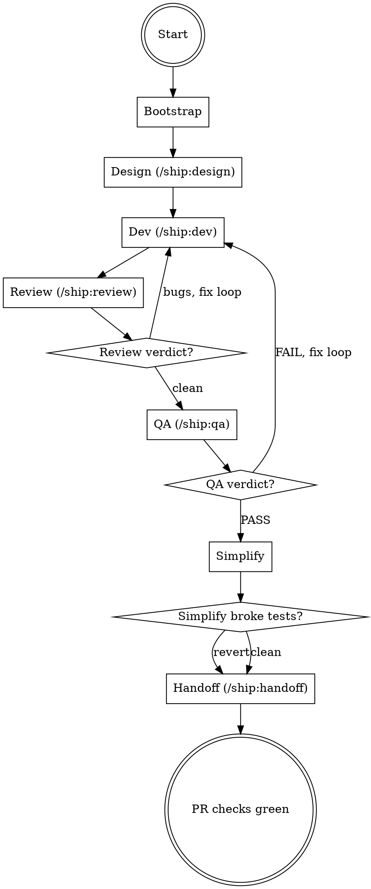

## Preamble (run first)

```bash
SHIP_PLUGIN_ROOT="${SHIP_PLUGIN_ROOT:-${CLAUDE_PLUGIN_ROOT:-${CODEX_HOME:-$HOME/.codex}/ship}}"
SHIP_SKILL_NAME=auto source "${SHIP_PLUGIN_ROOT}/scripts/preflight.sh"
```

### Auth Gate

If `SHIP_AUTH: not_logged_in`: AskUserQuestion — "Ship requires authentication to use all skills. Login now? (A: Yes / B: Not now)". A → run `ship auth login`, verify with `ship auth status --json`, proceed if logged_in, stop if failed. B → stop.
If `SHIP_AUTO_LOGIN: true`: skip AskUserQuestion, run `ship auth login` directly.
If `SHIP_TOKEN_EXPIRY` ≤ 3 days: warn user their token expires soon.

# Ship: Auto

Thin orchestrator that chains design → dev → review → QA →
simplify → handoff. Each phase is fully owned by its skill. Auto's
only job: call the skill, read the verdict, decide what's next.

## Core Principle

```
You dispatch Agent() calls and read their responses.
You may read code when needed (e.g. investigating NEEDS_CONTEXT).
You do NOT write code — all code changes go through subagents.
Allowed: git commands, mkdir, cat (for state file), Bash for coordination, Read for investigation.
```

## Process Flow



## Roles

| Role | Who |
|------|-----|
| Orchestrator | **You (Claude)** |
| Design | **/ship:design** — produces spec + plan |
| Dev | **/ship:dev** — implements stories, per-story review, cross-story regression |
| Code review | **/ship:review** — staff-engineer review of full diff |
| QA | **/ship:qa** — independent testing against running app |
| Simplify | **simplify** (standalone skill) — behavior-preserving cleanup |
| Handoff | **/ship:handoff** — PR creation, GitHub check loop, and fix loop |

## Hard Rules

1. All code changes go through subagents. You may read code for investigation.
2. State file writes use Bash (`cat > file`). All other artifacts are produced by subagents.
3. Resume uses the `phase` field in the state file. No artifact guessing.
4. You own the decision loop — read Agent return, decide next action.
5. Report progress after every phase transition.
6. Never dispatch subagents in background.
7. Each skill owns its own intra-phase logic. Auto owns inter-phase flow and retry loops.

---

## Phase 1: Bootstrap

**State file:** `.ship/ship-auto.local.md`

### Step A: Check for active task

```
Read(".ship/ship-auto.local.md")
```

- **File exists** → read frontmatter. Extract `task_id`, `branch`, `base_branch`, `phase`. Jump to Step C (resume).
- **File does not exist** → proceed to Step B (new task).

### Step B: New task

Generate task ID:
```
Bash("${SHIP_PLUGIN_ROOT:-${CLAUDE_PLUGIN_ROOT:-${CODEX_HOME:-$HOME/.codex}/ship}}/scripts/task-id.sh '<description>'")
```
Record as `TASK_ID`.

Create task directory:
```
Bash("mkdir -p .ship/tasks/<TASK_ID>")
```

Detect base branch:
```
Bash("git symbolic-ref refs/remotes/origin/HEAD 2>/dev/null | sed 's|refs/remotes/origin/||' || (git rev-parse --verify origin/main >/dev/null 2>&1 && echo main || echo master)")
```
Record as `BASE_BRANCH`. Use this value in ALL later phases — never hardcode `main`.

Ensure we're on a feature branch — never work directly on `BASE_BRANCH`:
```
CURRENT_BRANCH=$(git branch --show-current)
if [ "$CURRENT_BRANCH" = "<BASE_BRANCH>" ]; then
  git checkout -b ship/<TASK_ID>
fi
BRANCH=$(git branch --show-current)
```

Write state file (via Bash):
```markdown
---
active: true
task_id: <TASK_ID>
session_id: ${SHIP_SESSION_ID:-${CLAUDE_CODE_SESSION_ID:-${CODEX_SESSION_ID:-unknown}}}
branch: <BRANCH>
base_branch: <BASE_BRANCH>
phase: design
started_at: "<ISO 8601 timestamp>"
---

<original user description>
```

If `.ship/rules/CONVENTIONS.md` is missing: suggest `/ship:setup` but do not block.

Output: `[Ship] Task "<title>" created. Starting design phase...`

### Step C: Resume

Read `phase` from state file frontmatter → jump directly to that phase.

Update `session_id` in state file to current session (so this session owns the task).

Output: `[Ship] Resuming task "<task_id>" — phase: <phase>`

---

## Phase 2: Design

```
Agent(prompt="Call Skill('design').
  You are invoked by /ship:auto — do NOT ask the user questions. Treat
  any escalated items as blocked and say what is missing.
  Task description: <description from state file body>
  task_id: <TASK_ID>
  Artifacts go to: .ship/tasks/<TASK_ID>/plan/
  Current branch: <BRANCH>
  HEAD SHA: <current HEAD>")
```

**After return:** read the Agent response directly.
- Response clearly indicates design is complete → proceed
- Response indicates blocked or needs context → re-dispatch with more context (max 2 rounds)

**State update:** set `phase: dev` in `.ship/ship-auto.local.md`.

Output: `[Ship] Design complete — <N> stories identified. Starting dev...`

## Phase 3: Dev (ship:dev)

Record pre-dispatch HEAD SHA.

```
Agent(prompt="Call Skill('dev').
  You are invoked by /ship:auto — do NOT ask the user questions.
  If you cannot find TEST_CMD or need context, say clearly what context is missing.
  task_dir: .ship/tasks/<TASK_ID>
  spec: .ship/tasks/<TASK_ID>/plan/spec.md
  plan: .ship/tasks/<TASK_ID>/plan/plan.md
  base_branch: <BASE_BRANCH>")
```

**After return:** read the Agent response directly.

| Response shape | Action |
|---------------|--------|
| Clearly indicates implementation is complete | proceed |
| Clearly indicates implementation is complete with concerns | Log concerns from the response, proceed |
| Clearly indicates blocked | Re-dispatch with fix instructions (max 2) |
| Clearly indicates needs context | Investigate and re-dispatch (max 2) |

**State update:** set `phase: review` in `.ship/ship-auto.local.md`.

Output: `[Ship] Dev complete. Starting review...`

## Phase 4: Review (ship:review)

```
Agent(prompt="Call Skill('review').
  You are invoked by /ship:auto (pipeline mode) — do NOT ask the user
  questions. If you cannot read the diff or spec, do a diff-only review.
  task_id: <TASK_ID>
  task_dir: .ship/tasks/<TASK_ID>
  spec: .ship/tasks/<TASK_ID>/plan/spec.md
  base_branch: <BASE_BRANCH>
  Write review to: .ship/tasks/<TASK_ID>/review.md")
```

**After return:** read the Agent response directly.

| Response shape | Action |
|----------------|--------|
| Clearly indicates the review is clean | proceed |
| Includes findings or bug summaries | enter review-fix loop (below) |
| Clearly indicates the review is blocked or not reviewable | re-dispatch with adjusted context (max 2 rounds) |

### Review-fix loop

```
loop:
  1. Set phase: dev
  2. Dispatch ship:dev to fix the bugs (pass bug details from review Agent return):
     Agent(prompt="Call Skill('dev').
       You are invoked by /ship:auto — fix mode.
       These bugs were found by code review. Fix them.
       Bugs: <bug details from review Agent return>
       task_dir: .ship/tasks/<TASK_ID>
       spec: .ship/tasks/<TASK_ID>/plan/spec.md
       base_branch: <BASE_BRANCH>...")
  3. Set phase: review
  4. Re-dispatch ship:review (same prompt as above)
  5. Read the review response directly:
     - No bugs found → break, proceed
     - Findings listed → next round
```

**State update:** set `phase: qa` in `.ship/ship-auto.local.md`.

Output: `[Ship] Review clean. Starting QA...`

## Phase 5: QA (ship:qa)

```
Agent(prompt="Call Skill('qa').
  You are invoked by /ship:auto — do NOT ask the user questions.
  task_dir: .ship/tasks/<TASK_ID>
  spec: .ship/tasks/<TASK_ID>/plan/spec.md
  base_branch: <BASE_BRANCH>
  Write reports to: .ship/tasks/<TASK_ID>/qa/")
```

**After return:** read the Agent response directly.

| Response shape | Action |
|---------------|--------|
| Clearly indicates PASS | proceed |
| Clearly indicates SKIP | proceed |
| Clearly indicates FAIL or BLOCKED | enter QA-fix loop (below) |

### QA-fix loop

```
loop:
  1. Set phase: dev
  2. Dispatch ship:dev to fix (pass issue details from QA Agent return):
     Agent(prompt="Call Skill('dev').
       You are invoked by /ship:auto — fix mode.
       QA found these issues. Fix them.
       Issues: <issue details from QA Agent return>
       task_dir: .ship/tasks/<TASK_ID>
       spec: .ship/tasks/<TASK_ID>/plan/spec.md
       base_branch: <BASE_BRANCH>...")
  3. Set phase: qa
  4. Re-dispatch ship:qa with --recheck
  5. Read the QA response directly:
     - PASS/SKIP → break, proceed
     - FAIL/BLOCKED → next round
```

**State update:** set `phase: simplify` in `.ship/ship-auto.local.md`.

Output: `[Ship] QA passed. Running simplify...`

## Phase 6: Simplify

Record current HEAD before simplify:
```
Bash("git rev-parse HEAD")
```
Record as `PRE_SIMPLIFY_SHA`.

```
Agent(prompt="Call Skill('simplify').
  Scope: only files changed in this task (git diff <BASE_BRANCH>...HEAD --name-only).
  Output: .ship/tasks/<TASK_ID>/simplify.md")
```

**After return:** read the Agent response directly.
- Nothing changed → proceed.
- Code changed → verify simplify didn't break tests:
  ```
  Agent(prompt="Run the test command for this repo and report whether tests pass or fail.")
  ```
  - PASS → proceed.
  - FAIL → revert to `PRE_SIMPLIFY_SHA`, proceed anyway.

**State update:** set `phase: handoff` in `.ship/ship-auto.local.md`.

## Phase 7: Handoff (ship:handoff)

```
Agent(prompt="Call Skill('handoff').
  You are invoked by /ship:auto — do NOT ask the user questions
  task_id: <TASK_ID>
  task_dir: .ship/tasks/<TASK_ID>
  base_branch: <BASE_BRANCH>
  branch: <BRANCH>")
```

**After return:** read the Agent response directly.

| Response shape | Action |
|---------------|--------|
| Clearly indicates checks are green and includes PR URL | done |
| Clearly indicates failure or not ready | Re-dispatch handoff — it owns its own CI fix loop (max 3 rounds) |

**State update (DONE):** delete `.ship/ship-auto.local.md`.

Output: `[Ship] PR checks green: <url>`

---

## Example Workflow

```
── Phase 1: Bootstrap ─────────────────────────────────────

[Ship] Generating task ID...
  Bash("scripts/task-id.sh 'add dark mode toggle'")
  → TASK_ID = add-dark-mode-toggle

[Ship] Creating task directory...
  Bash("mkdir -p .ship/tasks/add-dark-mode-toggle")

[Ship] Detecting base branch...
  → BASE_BRANCH = main

[Ship] On main — creating feature branch...
  Bash("git checkout -b ship/add-dark-mode-toggle")
  → BRANCH = ship/add-dark-mode-toggle

[Ship] Writing state file...
  phase: design

[Ship] Task "add dark mode toggle" created. Starting design phase...

── Phase 2: Design ────────────────────────────────────────

[Ship] Dispatching /ship:design...
  Agent(prompt="Call Skill('design'). task_id: add-dark-mode-toggle ...")

  Agent returns:
  Design complete.
  3 stories identified — toggle component, CSS variables, persistence.
  Artifacts written to .ship/tasks/add-dark-mode-toggle/plan/spec.md and plan.md.

[Ship] State update: phase → dev
[Ship] Design complete — 3 stories identified. Starting dev...

── Phase 3: Dev ───────────────────────────────────────────

[Ship] Recording HEAD SHA: abc1234
[Ship] Dispatching /ship:dev...
  Agent(prompt="Call Skill('dev'). task_dir: .ship/tasks/add-dark-mode-toggle ...")

  Agent returns:
  Implementation complete.
  3/3 stories complete, tests pass.
  Files changed: src/components/ThemeToggle.tsx, src/styles/themes.css, src/hooks/useTheme.ts.

[Ship] State update: phase → review
[Ship] Dev complete. Starting review...

── Phase 4: Review ────────────────────────────────────────

[Ship] Dispatching /ship:review...
  Agent(prompt="Call Skill('review'). base_branch: main ...")

  Agent returns:
  Found 2 bugs:
  - P1: missing null check in useTheme
  - P2: CSS variable fallback is stale
  Review written to .ship/tasks/add-dark-mode-toggle/review.md

[Ship] 2 bugs found. Entering review-fix loop...

[Ship] State update: phase → dev (fix mode)
[Ship] Dispatching /ship:dev to fix review bugs...
  Agent(prompt="Call Skill('dev'). fix mode. Bugs: P1, P2 ...")

  Agent returns:
  Fixed both bugs. Tests pass.

[Ship] State update: phase → review
[Ship] Re-dispatching /ship:review...

  Agent returns:
  No bugs found.
  Review written to .ship/tasks/add-dark-mode-toggle/review.md

[Ship] State update: phase → qa
[Ship] Review clean. Starting QA...

── Phase 5: QA ────────────────────────────────────────────

[Ship] Dispatching /ship:qa...
  Agent(prompt="Call Skill('qa'). base_branch: main ...")

  Agent returns:
  FAIL — dark mode toggle doesn't persist after hard refresh (localStorage not set).
  Report written to .ship/tasks/add-dark-mode-toggle/qa/browser-report.md.

[Ship] QA failed. Entering QA-fix loop...

[Ship] State update: phase → dev (fix mode)
[Ship] Dispatching /ship:dev to fix QA issues...
  Agent(prompt="Call Skill('dev'). fix mode.
    Issues: localStorage not set on toggle ...")

  Agent returns:
  Added localStorage.setItem in useTheme hook.

[Ship] State update: phase → qa
[Ship] Re-dispatching /ship:qa with --recheck...
  Agent(prompt="Call Skill('qa'). --recheck ...")

  Agent returns:
  PASS — all 4 criteria pass, toggle persists across hard refresh.
  Report written to .ship/tasks/add-dark-mode-toggle/qa/browser-report.md.

[Ship] State update: phase → simplify
[Ship] QA passed. Running simplify...

── Phase 6: Simplify ──────────────────────────────────────

[Ship] Recording PRE_SIMPLIFY_SHA: def5678
[Ship] Dispatching simplify...
  Agent(prompt="Call Skill('simplify'). Scope: git diff main...HEAD ...")

  Agent returns:
  Simplified useTheme hook — extracted shared logic.
  Notes written to .ship/tasks/add-dark-mode-toggle/simplify.md.

[Ship] Simplify made changes. Running tests...
  Agent(prompt="Run npm test and report PASS or FAIL...")
  → PASS

[Ship] State update: phase → handoff

── Phase 7: Handoff ───────────────────────────────────────

[Ship] Dispatching /ship:handoff...
  Agent(prompt="Call Skill('handoff'). base_branch: main ...")

  Agent returns:
  PR #42 checks are green:
  https://github.com/user/repo/pull/42

[Ship] Deleting state file.
[Ship] PR checks green: https://github.com/user/repo/pull/42
```

### What This Shows

| Principle | How the example enforces it |
|-----------|---------------------------|
| **State file tracks phase** | Every phase transition updates the state file |
| **Agent return is the contract** | Orchestrator reads the subagent response directly instead of parsing a result trailer |
| **Fix loops go back to dev** | Review bugs → phase set to dev → dev fixes → phase set to review |
| **Simplify is safe** | SHA recorded before, tests run after, revert if broken |
| **No code writes** | Orchestrator dispatches Agents for all code changes |
| **Always ship** | Pipeline flows start to finish without stopping |

## Red Flag
- Writing code yourself instead of delegating
- Hardcoding `main` instead of using BASE_BRANCH
- Giving up on a phase instead of fixing and retrying
- Dispatching subagents in background
