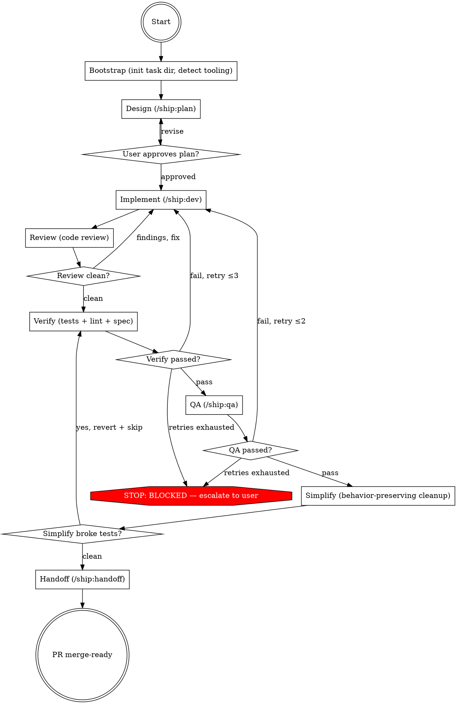

## Preamble (run first)

```bash
SHIP_SKILL_NAME=auto source ${CLAUDE_PLUGIN_ROOT}/scripts/preflight.sh
```

### Auth Gate

If `SHIP_AUTH: not_logged_in`: AskUserQuestion — "Ship requires authentication to use all skills. Login now? (A: Yes / B: Not now)". A → run `ship auth login`, verify with `ship auth status --json`, proceed if logged_in, stop if failed. B → stop.
If `SHIP_AUTO_LOGIN: true`: skip AskUserQuestion, run `ship auth login` directly.
If `SHIP_TOKEN_EXPIRY` ≤ 3 days: warn user their token expires soon.

# Ship: Auto

Execute scoped code changes by orchestrating fresh subagents through
a pipeline — from design through PR — with quality gates at every
transition.

## Principal Contradiction

**Individual phase correctness vs full-pipeline correctness.**

Each skill can produce good output in isolation, but chaining them
exposes system-level failures: a plan that implement misinterprets,
code that passes review but fails QA, a branch that works locally
but breaks in CI. Auto exists to ensure that partial correctness
at each stage compounds into whole-pipeline correctness — not
whole-pipeline failure. This is the relationship between local
battles and the overall war.

## Core Principle

```
READ-ONLY ORCHESTRATOR.
NEVER READ CODE, WRITE CODE, OR WRITE ARTIFACTS YOURSELF.
DELEGATE EVERYTHING. DECIDE EVERYTHING.
COORDINATION COMMANDS (git rev-parse, git status, mkdir) ARE ALLOWED.
```

You delegate every phase to specialized subagents with isolated
context. They never inherit your session history. You never pollute
your context window with implementation detail. Your job: bootstrap
state, interpret results, decide what to delegate next, advance
through the pipeline.

## Process Flow



## Roles

| Role | Who | Why |
|------|-----|-----|
| Orchestrator | **You (Claude)** | Read-only coordinator, no code/tests |
| Design | **/ship:plan** (subagent) | Adversarial planning with Codex |
| Implementation | **/ship:dev** (subagent) | Codex MCP implements, Claude reviews |
| Code review | **/ship:review** (subagent) | Staff-engineer review: find all bugs + diagnose structural deficiencies |
| Verification | **Agent** (subagent, runs TEST_CMD + lint, writes verify.md) | Keeps orchestrator artifact-free |
| QA | **/ship:qa** (subagent) | Independent testing against running app |
| Simplify | **simplify** (Claude built-in skill, via Agent) | Behavior-preserving cleanup |
| Handoff | **/ship:handoff** (subagent) | PR creation + CI loop |

## Hard Rules

1. You have NO Write or Edit tools. All artifacts are produced by subagents or MCP calls.
2. All codebase work goes through subagents — never read code yourself.
3. Derive phase from artifacts on disk (see resume table).
4. You own the decision loop — read output, decide next action.
5. Always report progress after every phase transition.
6. Never dispatch subagents in background.

## Quality Gates

| Gate | Condition | Fail action |
|------|-----------|-------------|
| Bootstrap → Design | Task dir exists, tooling detected | Re-bootstrap |
| Design → Approval | spec.md + plan.md non-empty on disk | Escalate BLOCKED |
| Approval → Implement | User said "proceed" | Wait or re-design |
| Implement → Review | New commits exist (HEAD advanced) | Escalate BLOCKED |
| Review → Verify | No bugs in review.md | Fix → re-review (max 3) |
| Verify → QA | Tests + lint pass | Fix → re-verify (max 3) |
| QA → Simplify | QA PASS or SKIP | Fix → re-verify → re-QA (max 2) |
| Simplify → Handoff | Tests still pass after simplify | Revert simplify, proceed |
| Handoff → Done | PR merge-ready | Fix loop in handoff (max 2) |

---

## Phase 1: Bootstrap

### Step A: Init task directory

Create task directory and detect repo tooling:
```
Bash("mkdir -p .ship/tasks/<task_id>")
```

Detect languages, lint config, test command. Record `TASK_ID` and `TASK_DIR`.

Detect the base branch:
```
Bash("git symbolic-ref refs/remotes/origin/HEAD 2>/dev/null | sed 's|refs/remotes/origin/||' || git rev-parse --verify origin/main >/dev/null 2>&1 && echo main || echo master")
```
Record as `BASE_BRANCH`. Use this value wherever `<base>` appears in later phases.

- If `.ship/rules/CONVENTIONS.md` is missing: suggest `/ship:setup` but do not block.

Output: `[Ship] Task "<title>" created. Starting design phase...`

### Step B: Resume (if applicable)

If a task directory already exists, derive resume phase from artifacts:

| Last non-empty artifact | Resume at |
|-------------------------|-----------|
| (none) | Design (Phase 2) |
| `plan/spec.md` + `plan/plan.md` | Implement (Phase 4) |
| `review.md` | Verify (Phase 6) |
| `verify.md` | QA (Phase 7) |
| `qa/qa.md` | Simplify (Phase 8) |
| `simplify.md` | Handoff (Phase 9) |

Output: `[Ship] Resuming task "<title>" — phase: <derived phase>`

## Phase 2: Design

Dispatch a subagent to produce spec + plan via adversarial planning.

**Check existing:**
```
Bash("[ -s .ship/tasks/<task_id>/plan/spec.md ] && [ -s .ship/tasks/<task_id>/plan/plan.md ] && echo 'PLAN_FOUND' || echo 'NO_PLAN'")
```
If `PLAN_FOUND`: skip to Phase 3.

If `NO_PLAN`: dispatch plan. Plan will detect whether spec.md already
exists (e.g. from a prior refactor diagnosis) and preserve it, producing
only plan.md. If spec.md does not exist, plan produces both.

```
Agent(prompt="Call Skill('plan'). Params: repo=<repo>, task=<description>, task_id=<id>, artifact_dir=.ship/tasks/<task_id>/plan/")
```

**After return:** verify both `spec.md` and `plan.md` exist and are non-empty. If incomplete → escalate BLOCKED.

Extract stories from `plan/plan.md`. Output: `[Ship] Design complete — <N> stories extracted.`

## Phase 3: User Approval

The ONE user interaction gate — everything else is autonomous.

Present summary via AskUserQuestion:
```
[Ship] Design complete. Here's what I'll build:

Goal: <1-2 sentence goal from spec.md>
Files affected: <list>
Stories: <numbered list with titles>
Estimated scope: <N> stories, <N> file changes
```

Options:
- A) Proceed → Phase 4
- B) Revise → re-dispatch design with feedback (max 2 rounds)
- C) Show full spec → output spec.md + plan.md, then re-ask

## Phase 4: Implement

Record pre-dispatch HEAD SHA.

```
Agent(prompt="Call Skill('dev'). Params: task_dir=.ship/tasks/<task_id>, spec=.ship/tasks/<task_id>/plan/spec.md, plan=.ship/tasks/<task_id>/plan/plan.md")
```

**After return:** verify HEAD advanced. If unchanged → escalate BLOCKED.

Output: `[Ship] All stories implemented. Starting code review...`

## Phase 5: Review (/ship:review, independent)

Global code review across all stories. Implement's per-story review
catches story-level issues; this catches cross-story bugs and
diagnoses the structural deficiencies that breed them.

```
Agent(prompt="Call Skill('review'). Params: spec=.ship/tasks/<task_id>/plan/spec.md, task_id=<task_id>, task_dir=.ship/tasks/<task_id>, base_branch=<base>")
```

**After return:** read `.ship/tasks/<task_id>/review.md`.
- No bugs → proceed to Phase 6
- Bugs found → fix via Codex MCP, re-review (max 3 rounds)

## Phase 6: Verify (Agent subagent)

Mechanical verification: run tests, linter, type checker. Delegated to
a subagent to keep the orchestrator artifact-free.

```
Agent(prompt="Run the following and write results to .ship/tasks/<task_id>/verify.md:
  1. Tests: <TEST_CMD>
  2. Linter: <LINT_CMD>
  First line of verify.md must be: <!-- VERIFY_RESULT: PASS|FAIL -->
  Then full output of each command.
  If any command fails, result is FAIL.")
```

**After return:** read first line of `verify.md` for PASS/FAIL.
- PASS → Phase 7
- FAIL → fix via Codex MCP → re-verify (max 3 rounds, then escalate)

## Phase 7: QA

**Skip check:** `git diff main...HEAD --name-only`
- Only test/docs/config changed → write skip QA_RESULT, proceed to Phase 8
- Otherwise → **always dispatch QA**. The orchestrator MUST NOT pre-empt
  QA's own skip logic.

```
Agent(prompt="Call Skill('qa'). Params: spec=<spec_path>, diff_cmd='git diff main...HEAD', output=.ship/tasks/<task_id>/qa/qa.md, rubric_output=.ship/tasks/<task_id>/qa/rubric.md")
```

**After return:**
- PASS → Phase 8
- FAIL → fix → re-verify → re-QA (max 2 rounds, then escalate)
- SKIP → Phase 8

## Phase 8: Simplify

```
Agent(prompt="Call Skill('simplify').
  Scope: only files changed in this task (git diff main...HEAD --name-only).
  Code conduct: <CODE_CONDUCT from Phase 1 detection>.
  User notes: <any special notes from user, if provided>.
  Rules:
  - Only simplify code this task touched. Do not refactor unrelated files.
  - Preserve all behavior — tests must still pass after changes.
  - Follow the repo's existing patterns and naming conventions.
  - Do not add abstractions, helpers, or wrappers that didn't exist before.
  - If nothing needs simplifying, report STATUS: SKIP.
  Output: .ship/tasks/<task_id>/simplify.md")
```

**After return:**
- Code changed → re-verify. If tests break → revert simplify, proceed.
- No changes or clean → Phase 9.

## Phase 9: Handoff

```
Agent(prompt="Call Skill('handoff'). Params: repo=<repo>, task_dir=.ship/tasks/<task_id>, base_branch=<base>")
```

---

## Anti-Pattern: "I'll Just Do This One Thing Myself"

Every phase goes through a subagent. A one-line fix, a quick test run,
a "let me just read this file to check" — all of them. The moment you
read code yourself, you pollute your context window. The moment you
write code yourself, you bypass quality gates. The subagent dispatch
can be short, but you MUST delegate it.

## Retry Limits

| Trigger | Fix path | Max |
|---------|----------|-----|
| Test / lint fail | fix → re-verify | 3 |
| Review findings | fix → re-review | 3 |
| Spec gap | fix → re-verify → spec re-check | 3 |
| Wrong approach | re-implement → review → verify | 2 |
| QA failure | fix → re-verify → re-QA | 2 |
| Simplify breaks tests | revert, skip simplify | 1 |

After limit → escalate BLOCKED.

## Progress Reporting

After every phase transition, output a status line:

```
[Ship] <phase> <status> — <detail>
```

Examples:
```
[Ship] Bootstrap complete — task "add-dark-mode" created
[Ship] Design complete — 4 stories identified
[Ship] Implementing story 2/4: "Create toggle component" ...
[Ship] All 4 stories implemented. Starting code review...
[Ship] Review found 1 issue. Fixing...
[Ship] Review clean. Starting verification...
[Ship] Verification passed. Starting QA...
[Ship] QA passed. Running simplify...
[Ship] Simplify clean. Delegating to handoff...
[Ship] PR merge-ready: https://github.com/...
```

## Decision Principles

When making decisions at phase transitions:

1. **Complete over partial** — ship the whole thing, cover edge cases
2. **Fix in blast radius** — broken in files this task touched → fix now
3. **Explicit over clever** — 10-line obvious fix > 200-line abstraction
4. **DRY** — reuse existing functionality, don't reinvent
5. **Bias toward action** — advance > deliberate > stall
6. **Escalate honestly** — retries exhausted → stop and tell the user

## Completion

### Only stop for
- User approval gate (Phase 3)
- Retries exhausted at any phase
- Task scope grew beyond original spec

### Never stop for
- Mechanical failures within retry limits
- Simplify finding nothing to change
- QA returned SKIP verdict (must dispatch QA first, never pre-empt)

### Escalation

```
[Ship] BLOCKED
REASON: <what failed and why>
ATTEMPTED: <what was tried, how many times>
RECOMMENDATION: <what the user should do next>
```

## Subagent Error Recovery

| Exit | Action |
|------|--------|
| 0 + empty artifact | Retry once, then escalate |
| 1 | Read stderr, retry with adjusted prompt (max 2) |
| 124 (timeout) | Break story smaller, retry |
| 137 (OOM) | Reduce scope, retry once |
| 429 / rate limit | Wait 30s, retry once |
| Other | Escalate to user |

<Bad>
- Reading code yourself instead of delegating to a subagent
- Jumping to implement before spec.md and plan.md are complete
- Skipping simplify because "the code already looks clean"
- Assuming subagent success from exit code 0 without checking artifact
- Skipping a failing phase ("tests are flaky, just move on")
- Weakening acceptance criteria to make verify pass
- Using TODO instead of implementing
- Rewriting spec to match what was built instead of what was asked
- Pre-empting QA's skip logic with your own judgment
- Dispatching subagents in background
</Bad>
