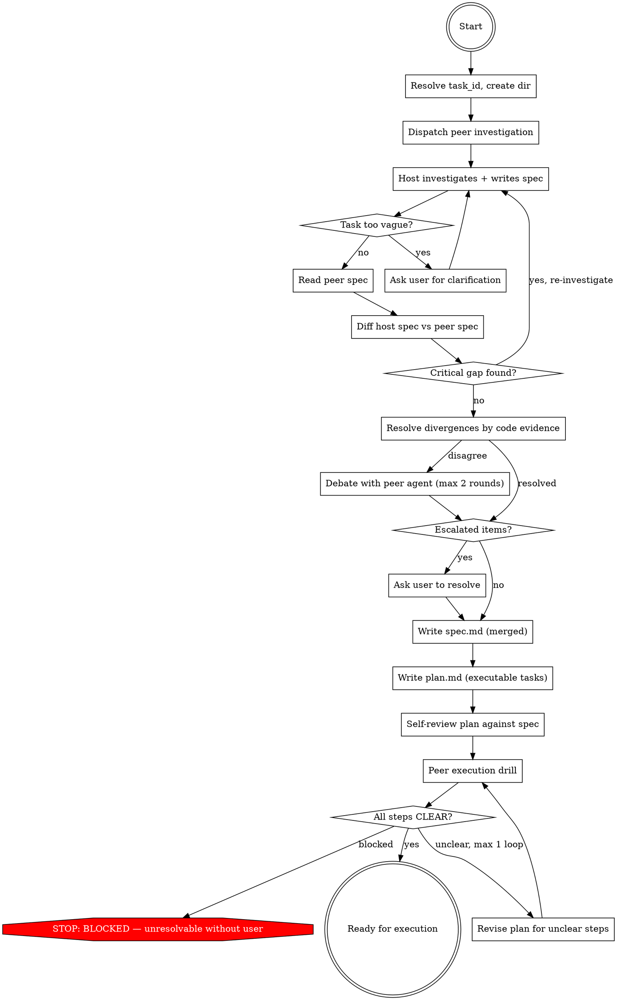

## Preamble (run first)

```bash
SHIP_PLUGIN_ROOT="${SHIP_PLUGIN_ROOT:-${CLAUDE_PLUGIN_ROOT:-${CODEX_HOME:-$HOME/.codex}/ship}}"
SHIP_SKILL_NAME=design source "${SHIP_PLUGIN_ROOT}/scripts/preflight.sh"
```

### Auth Gate

If `SHIP_AUTH: not_logged_in`: AskUserQuestion — "Ship requires authentication to use all skills. Login now? (A: Yes / B: Not now)". A → run `ship auth login`, verify with `ship auth status --json`, proceed if logged_in, stop if failed. B → stop.
If `SHIP_AUTO_LOGIN: true`: skip AskUserQuestion, run `ship auth login` directly.
If `SHIP_TOKEN_EXPIRY` ≤ 3 days: warn user their token expires soon.

# Ship: Design

You ARE the planner. You read code, investigate, write spec and plan.
You must read the code yourself — delegating investigation loses the
context needed to write a good plan. A peer agent investigates
independently and produces its own spec for adversarial comparison.

## Runtime Resolution

- **Host agent**: the provider currently running this skill
- **Peer agent**: the non-host provider when available; otherwise a
  fresh same-provider session

Resolve once at the start:
- Claude host → Codex is the peer investigator and drill agent
- Codex host → Claude is the peer investigator and drill agent
- If Claude is the peer, dispatch with `claude -p --permission-mode bypassPermissions`.
- If Codex is the peer, dispatch with `mcp__codex__codex`.
- If only one provider is available, use a fresh same-provider session
  and note that independence is weaker.

## Process Flow



## Roles

| Phase | Who | Why |
|-------|-----|-----|
| Investigation (read code, trace paths) | **Host + peer (parallel)** | Independent investigation catches different blind spots |
| Write spec (host version) | **You** | Investigation context must not be lost |
| Write spec (peer version) | **Peer agent** | Independence requires separation |
| Diff & verify divergences | **You** | You have the context + code access to judge |
| Write plan.md | **You** | Spec context must flow into plan |
| Execution Drill | **Peer agent** (fresh session) | Fresh eyes test implementability |


## Quality Gates

| Gate | Condition | Fail action |
|------|-----------|-------------|
| Investigation → Spec | All claims trace to file:line you read | Re-investigate |
| Spec → Diff | spec.md has flexible sections scaled to complexity, self-reviewed | Revise |
| Diff → Plan | Zero `escalated` items (resolved by evidence or debate, or user resolved them) | Ask user |
| Plan → Drill | plan.md has TDD tasks, checkbox steps, complete code, no placeholders | Revise |
| Drill → Ready | Zero BLOCKED steps, zero UNCLEAR steps | Revise plan (max 1 loop) |

No artifact passes to the next phase without meeting its gate.

## Red Flag
- Citing files you haven't opened
- Letting the peer see your spec before producing its own
- Resolving divergences by reasoning instead of code evidence (max 2 debate rounds, both sides cite file:line)
- Trusting prior conversation over disk artifacts
- Marking plan ready when drill has BLOCKED or UNCLEAR items
- Skipping the drill because "the plan looks solid"
- Delegating investigation to a sub-agent (you must read the code yourself)
- Claiming "function X is not called" without tracing all callers
- Proposing a fix without searching for existing defenses
- Proposing to create a file without checking if it already exists
- Changing a value without grepping tests that assert the old value
- Writing plan.md with vague steps or placeholders (TBD, TODO, "similar to Task N")

---

## Phase 1: Init

- Resolve task_id, create `.ship/tasks/<task_id>/plan/` directory.
- If resuming, read existing artifacts and determine current state.
- Collect branch name and HEAD SHA.

### Task ID

1. If invoked by /ship:auto, the task_id is provided.
2. If invoked standalone, generate `task_id` using the shared script:
   ```bash
   TASK_ID=$(bash "${SHIP_PLUGIN_ROOT:-${CLAUDE_PLUGIN_ROOT:-${CODEX_HOME:-$HOME/.codex}/ship}}/scripts/task-id.sh" "<description>")
   ```

Artifacts go to `.ship/tasks/<task_id>/plan/`. The Write tool creates
directories automatically — no mkdir needed.

### Existing spec.md detection

Check if `spec.md` already exists with content:
```bash
[ -s .ship/tasks/<task_id>/plan/spec.md ] && echo 'SPEC_EXISTS' || echo 'NO_SPEC'
```

If `SPEC_EXISTS`:
- Read `spec.md`. This was written by an upstream skill (e.g. refactor).
- Check if spec records a HEAD SHA. If it does and it differs from
  current HEAD, treat spec as stale — proceed as `NO_SPEC`.
- **Do not overwrite it.** Use it as your investigation input.
- Your job narrows: investigate to validate the spec's claims, then
  produce only `plan.md`. You may append an `## Investigation` section
  to the existing spec if it lacks one, but preserve all existing sections.
- Skip peer parallel investigation — spec already exists and was
  validated upstream. No `peer-spec.md` or `diff-report.md` produced.
- Skip to Phase 5 (Write Plan) with the spec as your starting context.
- The execution drill (Phase 6) still runs — plan.md always gets validated.

If `NO_SPEC`: proceed normally — Phase 2 investigates, Phase 3 writes
spec.md, Phase 4 resolves divergences, then Phase 5 writes plan.md.

## Phase 2: Investigate (Parallel)

**This is the most important phase. Do not rush it.**

### Step A: Dispatch peer investigation

Kick off the peer investigation **before** you start investigating. The
peer works in parallel while you read code.

Read `independent-investigator.md` for the dispatch pattern and
prompt template. Fill in the task description, task_id, and repo root.
Dispatch the resolved peer runtime and save the returned thread or
session id as `INVESTIGATION_THREAD_ID` when the runtime provides one
— needed for debate in Phase 4.

#### When the peer agent is unavailable

If peer dispatch fails, self-produce the second spec:
1. Run a second-pass review of your spec using only: placeholder scan,
   contradiction scan, coverage scan, ambiguity scan
2. Search for code paths, callers, or consumers you did not trace
3. Write `peer-spec.md` with any changed conclusions or additions
4. Add a warning: `WARNING: Second spec was self-generated, not independent`

### Step B: Your investigation

Read `write-spec.md` for investigation methodology and spec authoring.

Investigate the codebase, then write `spec.md`. The reference covers
investigation strategy (bug fixes, new features, all tasks), vagueness
checks, spec structure, and self-review.

## Phase 3: Write Spec

Covered by `write-spec.md` — follow the spec writing and self-review
guidance there.

## Phase 4: Diff & Verify

Read `peer-spec.md` (written by the peer investigation dispatched in Phase 2).
Compare it against your `spec.md`.

### For each divergence point:

1. **Identify the divergence** — what does your spec say vs the peer spec?
2. **Verify against code** — read the actual code to determine which
   is correct. Do NOT resolve by reasoning about which "sounds better."
3. **If still disagree — debate with the peer agent.** Continue on the
   same peer thread or session when possible using that runtime's
   follow-up mechanism. Present your code evidence and ask the peer to
   present counter-evidence. If the runtime cannot continue the same
   session, dispatch a fresh peer session with the prior evidence quoted
   verbatim. Maximum 2 debate rounds. Both sides must cite file:line
   references.
4. **Assign disposition after debate:**
   - **patched** → Your spec updated based on evidence. Show the diff.
   - **proven-false** → The peer claim is wrong. Cite the code evidence.
   - **conceded** → The peer convinced you with code evidence. Update spec.
   - **escalated** → 2 debate rounds exhausted, still unresolved. Needs user input.

### Record in diff-report.md

Only record divergences and their resolutions. If both specs agree on
something, there's nothing to record — move on.

For each divergence, write what happened: what each side claimed, what
code evidence was cited during debate, and the final disposition
(patched / proven-false / conceded / escalated).

### After diff resolution:

- Update `spec.md` with all `patched` and `conceded` items.
- If any `escalated` items exist:
  - **Standalone mode:** ask user via AskUserQuestion before proceeding.
    Record the user's ruling in diff-report.md with disposition
    `user-resolved` and what they decided. Update spec.md accordingly.
  - **/ship:auto mode:** do NOT ask user. Treat escalated items as BLOCKED
    and return. Auto owns the only user-approval gate.
- If diff reveals a critical investigation gap (e.g., the peer found
  important code you missed entirely), go back to Phase 2 for
  targeted re-investigation. Maximum 1 re-investigation loop.

## Phase 5: Write Plan

Read `write-plan.md` for plan structure, task granularity, no-placeholder
rules, and self-review.

Translate the validated spec.md into an executable plan.md. The reference
covers the plan template, bite-sized steps, code completeness guidance,
and the self-review checklist.

## Phase 6: Execution Drill

The final gate. Give the plan to the peer agent and ask it to validate
every step is implementable.

Read `execution-drill.md` for the dispatch pattern, role, and
prompt template. Use a **new** peer session, not the investigation
thread. Save the returned thread or session id as `DRILL_THREAD_ID`
when the runtime provides one — needed for revision reruns.

#### When the peer agent is unavailable

If peer dispatch fails, dispatch a fresh fallback Agent to perform the
drill instead. The Agent gets the same prompt from `execution-drill.md`
— it reads spec.md and plan.md with no prior context, providing the
best available independent review. Add a warning:
`WARNING: Drill was fallback-Agent-performed, not peer-agent`

### After the drill:

- **All CLEAR** → Plan is ready for execution.
- **UNCLEAR items** → Revise plan.md to make each step unambiguous.
  Then re-run ONLY the unclear steps:
  - If the peer runtime supports continuation, continue on
    `DRILL_THREAD_ID` with: "Tasks N, M were revised. Re-read plan.md
    and re-evaluate ONLY those tasks using the same criteria. Report
    CLEAR/UNCLEAR/BLOCKED."
  - Otherwise re-dispatch the peer agent with the same
    `execution-drill.md` prompt scoped to the revised tasks only.
  - If peer dispatch is unavailable, use the same fallback-Agent pattern.
  Maximum 1 revision loop.
- **BLOCKED items** → If resolvable by investigation, investigate and
  fix. If not, escalate to user or mark plan as `blocked`.

---

## Artifacts

```text
.ship/tasks/<task_id>/
  plan/
    spec.md          — final merged spec (flexible sections, brainstorming style)
    peer-spec.md     — peer agent's independent spec (for diff comparison)
    plan.md          — how to build it (TDD tasks, writing-plans style)
    diff-report.md   — host spec vs peer spec divergences and resolutions
```

## Timeouts

- Maximum 10 minutes for investigation
- Maximum 20 minutes total
- On timeout: preserve artifacts, summarize honestly, mark as blocked

## Error Handling

| Error | Action |
|-------|--------|
| Peer agent unavailable | Self-produce second spec + fallback drill with warning |
| Peer output unparseable | Retry once with format reminder, then fall back to fallback drill |
| Timeout | Abort, preserve artifacts, summarize honestly |
| Re-investigation needed | Maximum 1 loop back to Phase 2 |
| Drill revision needed | Maximum 1 revision loop |

## Completion

### Only stop for
- Task too vague to plan → ask user via AskUserQuestion
- Execution drill blockers that require user input → `blocked`
- Timeout → preserve artifacts, summarize honestly

### Never stop for
- Peer unavailable (self-produce second spec with warning)
- Peer output parse failure (retry once, then fallback Agent)

### Execution Handoff

Verify `spec.md` and `plan.md` are non-empty on disk, then output:

```
[Design] Planning complete for "<task title>".

## Summary
- Investigation: <N> files traced, <M> existing defenses found
- Independent replication: <M> divergences resolved (<N> by evidence, <N> by debate)
- Execution drill: <N>/<total> steps CLEAR
- Stories: <N> tasks in plan.md

## Artifacts
- spec.md: .ship/tasks/<task_id>/plan/spec.md
- plan.md: .ship/tasks/<task_id>/plan/plan.md
- diff-report.md: .ship/tasks/<task_id>/plan/diff-report.md

## What's next?
1. **Full pipeline (recommended)** — run /ship:auto to implement, review, QA, and ship
2. **Implement only** — run /ship:dev to execute this plan without review/QA/handoff
3. **Review the plan** — read the artifacts and give feedback
```

In /ship:auto mode (the calling prompt contains a task_id), skip the
"What's next?" choices and return — Auto owns the flow.

### Blocked (both modes)

```
[Design] BLOCKED
REASON: <what failed and why>
ATTEMPTED: <what was tried>
UNRESOLVED: <escalated items from diff or drill>
RECOMMENDATION: <what the user should do next>
```
