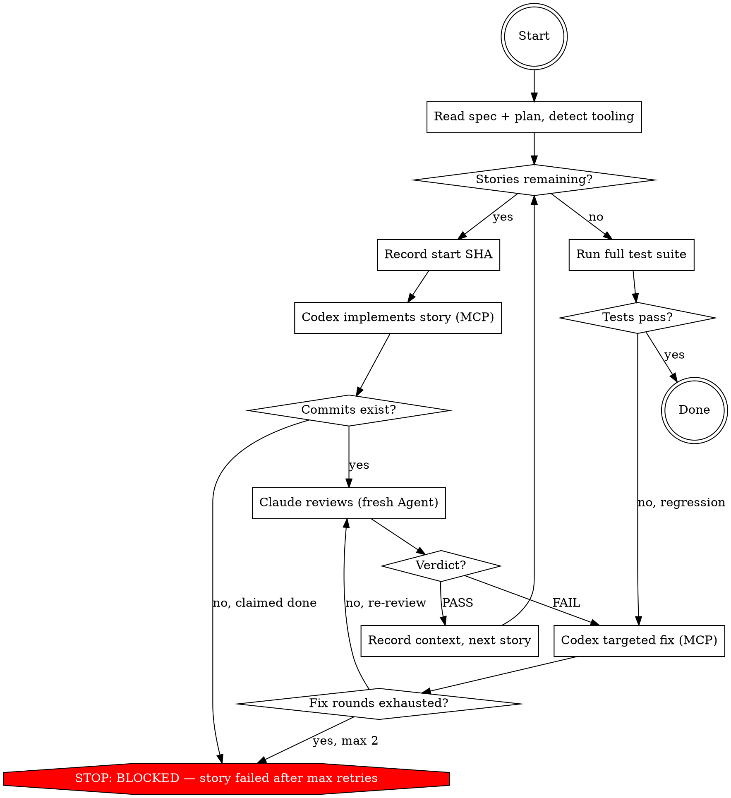

## Preamble (run first)

```bash
SHIP_SKILL_NAME=dev source ${CLAUDE_PLUGIN_ROOT}/scripts/preflight.sh
```

# Ship: Implement

Execute implementation stories from a plan. Each story: Codex implements
via MCP, Claude reviews spec compliance + code correctness, targeted
fix on failure. Stories run sequentially; review must pass before the
next story starts.

## Principal Contradiction

**The code's actual behavior vs the spec's expected behavior.**

Implementation fails not because code "looks wrong" but because it
behaves differently from what the spec requires. The adversary is the
gap between what was written and what was intended. Codex generates,
Claude discriminates — different models, different blind spots.

## Core Principle

```
CODEX GENERATES, CLAUDE DISCRIMINATES.
EVERY FINDING NEEDS FILE:LINE + EVIDENCE.
```

Separation of concerns: Codex implements with only the story context
it needs. Claude reviews without having watched the implementation
happen — no accumulated leniency, no rationalization.

## Process Flow



## Roles

| Role | Who | Why |
|------|-----|-----|
| Orchestrator | **You (Claude)** | Coordinate stories, never write code |
| Implementor | **Codex** (via MCP) | Fresh session per story, code generation |
| Reviewer | **Claude Agent** (fresh per review) | Different model = different blind spots |
| Targeted fixer | **Codex** (via MCP) | Surgical fixes, not re-implementation |

**Why different models for implement vs review:** This is the GAN
architecture — generator and discriminator must have different
cognitive biases to catch each other's blind spots. Same-model
review degrades to self-review.

## Hard Rules

1. You never write code, read diffs for review, or run tests yourself. Coordination metadata (git rev-parse, git diff --name-only, git status) is allowed.
2. Codex implements via MCP, not CLI. One story per session.
3. Claude Agent reviews fresh each time — no accumulated context.
4. Every review finding must include file:line + reproducible evidence.
5. Stories run sequentially. No parallelism. No skipping review.
6. FAIL means targeted fix, not full re-implementation.

## Quality Gates

| Gate | Condition | Fail action |
|------|-----------|-------------|
| Spec + plan read | Acceptance criteria extracted, TEST_CMD found | AskUserQuestion |
| Implement → Review | STORY_HEAD_SHA != STORY_START_SHA (commits exist) | BLOCKED |
| Review → Next story | Verdict is PASS or PASS_WITH_CONCERNS | Targeted fix (max 2) |
| All stories → Done | Full test suite passes | Targeted fix for regression |

No story advances without passing its gate.

---

## Phase 1: Setup

1. Read **acceptance criteria** (from spec file, or derived from user request).
2. Read **implementation stories** (from plan file, or single story for small tasks).
   Accept any heading format: `## Story N`, `## Step N`, `## N. Title`,
   or numbered/bulleted lists. Normalize as ordered stories.
3. Detect the repo's test command by inspecting project root:
   - `Makefile` → `make test`
   - `package.json` → `npm test` / `pnpm test` / `yarn test`
   - `pytest.ini` / `pyproject.toml` → `pytest`
   - `go.mod` → `go test ./...`
   - `Cargo.toml` → `cargo test`
   - `mix.exs` → `mix test`
   - `build.gradle` / `pom.xml` → `./gradlew test` / `mvn test`
   - `.csproj` / `.sln` → `dotnet test`
   - `Gemfile` → `bundle exec rspec`
   Also check `CLAUDE.md`/`AGENTS.md` and CI configs. If none found,
   AskUserQuestion. Record as `TEST_CMD`.
4. Extract code conduct from `CLAUDE.md`, `AGENTS.md`, lint/formatter
   configs, and existing code patterns. Record as `CODE_CONDUCT`.

### Locating input

1. **Caller provides paths** → use them directly.
2. **Caller provides a task directory** → look for spec/plan files inside.
3. **No formal plan or spec exists** → investigate:
   - Read the user's request and relevant source files
   - Derive acceptance criteria
   - Present to user via AskUserQuestion for confirmation
   - Break into stories if multi-file; single story if atomic

   Do not ask the user to write a plan. Derive what you need.

## Phase 2: Per-Story Loop

```
For each story i/N:
  1. Record STORY_START_SHA = current HEAD
  2. Codex implements (MCP) → commit(s)
  3. Record STORY_HEAD_SHA = current HEAD
  4. ⛔ MANDATORY: Dispatch fresh Claude Agent reviewer → verdict
     PASS → step 5
     PASS_WITH_CONCERNS → record concerns → step 5
     FAIL → targeted fix (max 2 rounds) → re-review
     *** DO NOT skip this step. Implementation ≠ completion. ***
  5. Record cross-story context → next story
```

### Step A: Implement

Record `STORY_START_SHA`:
```bash
git rev-parse HEAD
```

Dispatch Codex via MCP using the prompt template in `implementer-prompt.md`.
Fill all placeholders (story text, acceptance criteria, prior stories,
CODE_CONDUCT, TEST_CMD) before dispatch.

```
mcp__codex__codex({
  prompt: <filled implementer prompt>,
  approval-policy: "never",
  cwd: <repo root>
})
```

After Codex returns, save the `threadId` for potential targeted fixes.
1. Record `STORY_HEAD_SHA=$(git rev-parse HEAD)`
2. If `STORY_HEAD_SHA == STORY_START_SHA` and status is DONE → treat as
   BLOCKED (claimed done but made no commits).
3. If BLOCKED or NEEDS_CONTEXT → escalate to caller.
4. If DONE_WITH_CONCERNS → log concerns.

**⛔ MANDATORY GATE — DO NOT ADVANCE TO NEXT STORY**

Implementation complete does NOT mean story complete.
You MUST now dispatch a fresh Claude Agent reviewer (Step B).
A story is only complete when the reviewer returns PASS.

```
Story complete = implement ✓ AND review PASS ✓
Story complete ≠ implement ✓ alone
```

Skipping review is the #1 failure mode of this skill. If you are
about to move to the next story without dispatching a reviewer Agent,
STOP. You are making a mistake.

### Step B: Review (MANDATORY)

Dispatch a fresh Claude Agent using the prompt template in `reviewer-prompt.md`.
Fill all placeholders (story number, SHAs, TEST_CMD, spec requirements,
story text) before dispatch.

After Reviewer returns, read the verdict:
- **PASS** → proceed to Step D.
- **PASS_WITH_CONCERNS** → append concerns to `concerns.md`. Proceed to Step D.
- **FAIL** → proceed to Step C. Max 2 rounds.
  If 2 rounds exhausted and still FAIL → escalate as BLOCKED.
- **No recognized verdict** → re-dispatch a fresh Reviewer once.
  If still unparseable → treat as FAIL.

### Step C: Targeted Fix

On FAIL, first verify repo state:

```bash
git rev-parse HEAD
git status --short
```

If uncommitted partial changes exist, stash or discard (warn the user).

Continue on the **same Codex thread** from Step A using `codex-reply`.
The implementer already has full context of what it built.

```
mcp__codex__codex-reply({
  threadId: <threadId from Step A>,
  prompt: "A code reviewer found these issues. Fix them.

    ## Issues to Fix
    <Reviewer's FAIL findings, verbatim>

    ## Rules
    - Fix ONLY the issues listed above. Do not refactor or improve other code.
    - Run the full test suite after fixes: <TEST_CMD>
    - If a fix requires a new test, add it.
    - Commit using Conventional Commits.
    Do NOT re-implement the story. Make surgical fixes."
})
```

After fix commits:
1. Update `STORY_HEAD_SHA=$(git rev-parse HEAD)`
2. Return to **Step B** with fresh Reviewer using updated commit range.

### Step D: Record Context

After each story completes (PASS or PASS_WITH_CONCERNS), record:

```
Story <i>: "<title>"
  Commits: <STORY_START_SHA>..<STORY_HEAD_SHA> (<N> commits)
  Files: <list of ALL files changed across all commits in range>
  Concerns: <any PASS_WITH_CONCERNS notes, or "none">
```

Use `git diff --name-only <STORY_START_SHA>..<STORY_HEAD_SHA>` to get
the complete file list. Pass this summary to the next story's prompt
in the "Prior Stories Completed" section.

## Phase 3: Cross-Story Regression

After all stories pass, dispatch Codex MCP to run the full test suite:

```
mcp__codex__codex({
  prompt: "Run the full test suite: <TEST_CMD>. Report PASS or FAIL with output.",
  approval-policy: "never",
  cwd: <repo root>
})
```

If tests fail, dispatch a targeted fix via Codex MCP and re-verify.

---

## Progress Reporting

Use `[Implement]` prefix for all status output:

```
[Implement] Starting — 5 stories, test cmd: make test
[Implement] Story 1/5: "Add user model" → implementing...
[Implement] Story 1/5: implemented (3 files, 1 commit). Reviewing...
[Implement] Story 1/5: PASS.
[Implement] Story 2/5: "Wire API endpoints" → implementing...
[Implement] Story 2/5: FAIL — missing input validation. Fixing (1/2)...
[Implement] Story 2/5: fix applied. Re-reviewing...
[Implement] Story 2/5: PASS (2 rounds).
...
[Implement] All 5 stories complete. 1 concern recorded.
```

## Artifacts

```text
.ship/tasks/<task_id>/
  concerns.md   — recorded PASS_WITH_CONCERNS notes (if any)
```

## Error Handling

| Condition | Action |
|-----------|--------|
| Reviewer FAIL, rounds < 2 | Targeted fix → fresh re-review |
| Reviewer FAIL, rounds exhausted | Escalate BLOCKED with findings |
| Reviewer malformed output | Re-dispatch fresh Reviewer once, then FAIL |
| Codex BLOCKED or NEEDS_CONTEXT | Escalate to caller |
| Codex DONE_WITH_CONCERNS | Log concerns, proceed to review |
| Codex crash (exit != 0) | Check HEAD + working tree; stash if dirty; retry once; then BLOCKED |
| Agent dispatch failure | Retry once, then BLOCKED |

## Example Workflow

```
[Implement] Starting — 3 stories, test cmd: npm test

── Story 1/3: "Add user model" ──────────────────────────

[Implement] Story 1/3: recording start SHA...
  STORY_START_SHA = abc1234

[Implement] Story 1/3: dispatching Codex via MCP...
  mcp__codex__codex({ prompt: <filled implementer-prompt.md>, ... })
  Codex returns: DONE (threadId: thread_abc)

[Implement] Story 1/3: checking commits...
  STORY_HEAD_SHA = def5678
  abc1234 != def5678 → commits exist ✓  (GATE PASSED)

[Implement] Story 1/3: dispatching fresh Claude Agent reviewer...
  Agent({ prompt: <filled reviewer-prompt.md> })
  Reviewer returns: PASS

[Implement] Story 1/3: PASS. Recording context:
  Story 1: "Add user model"
    Commits: abc1234..def5678 (2 commits)
    Files: src/models/user.ts, tests/user.test.ts
    Concerns: none

── Story 2/3: "Wire API endpoints" ──────────────────────

[Implement] Story 2/3: recording start SHA...
  STORY_START_SHA = def5678

[Implement] Story 2/3: dispatching Codex via MCP...
  Codex returns: DONE (threadId: thread_def)

[Implement] Story 2/3: checking commits...
  STORY_HEAD_SHA = ghi9012
  def5678 != ghi9012 → commits exist ✓  (GATE PASSED)

[Implement] Story 2/3: dispatching fresh Claude Agent reviewer...
  Reviewer returns: FAIL
    - Missing input validation on POST /users (spec requires email format check)
    - No error response for duplicate usernames

[Implement] Story 2/3: FAIL — targeted fix (round 1/2)...
  mcp__codex__codex-reply({
    threadId: thread_def,
    prompt: "Fix these issues: <reviewer findings verbatim>..."
  })
  Codex applies fix, commits.

[Implement] Story 2/3: fix applied. Updating SHA...
  STORY_HEAD_SHA = jkl3456

[Implement] Story 2/3: re-reviewing with FRESH Claude Agent...
  Reviewer returns: PASS

[Implement] Story 2/3: PASS (2 rounds). Recording context.

── Story 3/3: "Add auth middleware" ─────────────────────

[Implement] Story 3/3: recording start SHA...
  STORY_START_SHA = jkl3456

[Implement] Story 3/3: dispatching Codex via MCP...
  Codex returns: DONE_WITH_CONCERNS ("jwt secret should be env var, currently hardcoded in test fixtures")

[Implement] Story 3/3: checking commits...
  STORY_HEAD_SHA = mno7890
  jkl3456 != mno7890 → commits exist ✓  (GATE PASSED)

[Implement] Story 3/3: DONE_WITH_CONCERNS — logging concern, proceeding to review...

[Implement] Story 3/3: dispatching fresh Claude Agent reviewer...
  Reviewer returns: PASS_WITH_CONCERNS (test fixtures use hardcoded secret)

[Implement] Story 3/3: PASS_WITH_CONCERNS. Appending to concerns.md.

── Phase 3: Cross-Story Regression ──────────────────────

[Implement] All stories complete. Running full test suite...
  mcp__codex__codex({ prompt: "Run: npm test. Report PASS or FAIL." })
  Codex returns: PASS (47 tests, 0 failures)

[Implement] DONE_WITH_CONCERNS — 3/3 stories implemented, reviewed, committed. 1 concern recorded.
```

### What This Shows

| Principle | How the example enforces it |
|-----------|---------------------------|
| **Never skip commit check** | Every story shows SHA comparison before review |
| **Never skip review** | Every story dispatches a fresh Agent reviewer |
| **Fresh reviewer each time** | Re-review after fix uses a NEW Agent, not the same one |
| **Targeted fix, not re-implement** | FAIL → `codex-reply` on same thread with surgical instructions |
| **Sequential stories** | Story 2 starts only after Story 1 is PASS |
| **Gate enforcement** | Each gate check shown explicitly with ✓ |
| **Concerns are logged, not ignored** | DONE_WITH_CONCERNS → recorded → review still happens |
| **Cross-story regression** | Full test suite runs after all stories, not just the last |

## Completion

Report one of:
- **DONE** — all stories implemented, reviewed, committed.
- **DONE_WITH_CONCERNS** — all stories pass, concerns recorded.
- **BLOCKED** — a story failed after max retries.
- **NEEDS_CONTEXT** — missing information needed from user.

<Bad>
- **ADVANCING TO NEXT STORY WITHOUT DISPATCHING A REVIEWER AGENT** ← #1 failure mode
- Treating Codex returning DONE as "story complete" — it is NOT, review is still required
- Skipping review because "Codex's self-review looked good"
- Skipping review because "the implementation looks straightforward"
- Skipping review because "we're running low on context"
- Starting the next story before the current story's review returns PASS
- Writing code yourself instead of dispatching Codex
- Reading the diff yourself instead of dispatching a fresh Agent reviewer
- Running tests yourself instead of letting Codex/reviewer handle it
- Falling back to "I'll just do it myself" when Codex is slow — report BLOCKED
- Running multiple implementation dispatches in parallel
- Doing a full re-implementation on FAIL instead of a targeted fix
- Letting Codex modify tests to make them pass instead of fixing code
- Accepting "close enough" on spec checklist — any FAIL item is FAIL
- Omitting prior stories context from the implementor prompt
- Retrying after crash without checking HEAD for partial changes
</Bad>
