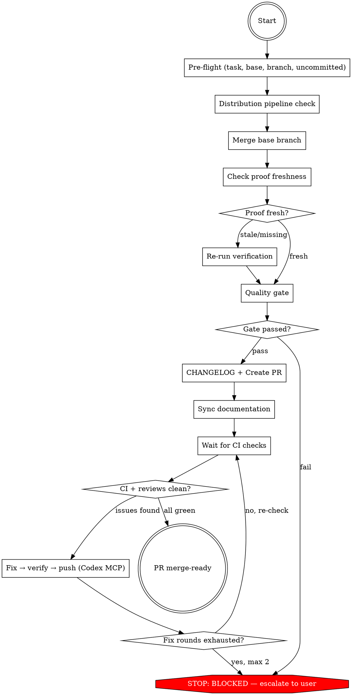

## Preamble (run first)

```bash
SHIP_SKILL_NAME=handoff source ${CLAUDE_PLUGIN_ROOT}/scripts/preflight.sh
```

### Auth Gate

If `SHIP_AUTH: not_logged_in`: AskUserQuestion — "Ship requires authentication to use all skills. Login now? (A: Yes / B: Not now)". A → run `ship auth login`, verify with `ship auth status --json`, proceed if logged_in, stop if failed. B → stop.
If `SHIP_AUTO_LOGIN: true`: skip AskUserQuestion, run `ship auth login` directly.
If `SHIP_TOKEN_EXPIRY` ≤ 3 days: warn user their token expires soon.

# Ship: Handoff

No routine confirmations. Escalates to user only for judgment decisions
(architectural review comments, missing release pipeline). Run straight
through — create PR, fix CI, address reviews, resolve conflicts — and
output the merge-ready PR URL.

## Principal Contradiction

**AI's closed verification environment vs the real world's open verification.**

Implement, review, and QA all ran in a controlled local environment.
Handoff is where those results meet reality: CI runs in a different
environment, human reviewers bring a different perspective, and the
base branch may have drifted. This is the second round of practice —
taking what was validated internally and subjecting it to external
verification. The gap between "passed locally" and "accepted by the
real world" is what handoff exists to close.

## Core Principle

```
PR CREATED ≠ DONE.
CI GREEN + REVIEWS ADDRESSED + NO CONFLICTS = DONE.
```

Creating a PR and stopping is shipping half the work. Always enter the
post-PR loop. The goal: user says `/ship:handoff`, next thing they see is a
merge-ready PR URL.

## Process Flow



## Roles

| Role | Who | Why |
|------|-----|-----|
| Orchestrator | **You (Claude)** | Coordinate the full handoff flow |
| CI/review fixer | **Codex** (via MCP) | Write code fixes for CI failures and review comments |
| Verification | **Claude Agent** (fresh) | Re-run tests/lint after fixes |
| PR management | **gh CLI** | Create PR, poll CI, read comments |

## Hard Rules

1. Never push without fresh verification evidence. Code changed → re-run tests.
2. Never force push. Use regular `git push` only.
3. Never skip the fix loop. PR created is not done.
4. Never ask for trivial confirmations. Just do it.
5. After 2 fix rounds → escalate, do not loop forever.

## Quality Gates

| Gate | Condition | Fail action |
|------|-----------|-------------|
| Pre-flight → Merge base | Feature branch exists, no uncommitted changes | Auto-create branch, auto-commit |
| Proof → Quality gate | All proof files match current HEAD | Re-verify |
| Quality gate → PR | Required artifacts exist and non-empty | Go back to owning phase or escalate |
| Fix → Push | Tests pass after code changes | Re-run tests, do not push failing code |
| CI → Merge-ready | All checks green, reviews addressed, no conflicts | Fix loop (max 2) |

---

## Phase 1: Pre-flight

### Step A: Find task directory
```
Bash("REPO_ROOT=$(git rev-parse --show-toplevel) && TASK_DIR=$(find $REPO_ROOT/.ship/tasks -type d -name plan -maxdepth 2 2>/dev/null | head -1 | xargs dirname 2>/dev/null) && echo \"TASK_DIR: $TASK_DIR\"")
```
If no task dir found, create a minimal one from the current branch name.

### Step B: Detect base branch
1. `gh pr view --json baseRefName -q .baseRefName` — if PR already exists
2. `gh repo view --json defaultBranchRef -q .defaultBranchRef.name` — fallback
3. `main` — last resort

### Step C: Branch check
If on base branch → auto-create feature branch: `git checkout -b ship/<task_id>`

### Step D: Uncommitted changes
`git status` (never use `-uall`). If uncommitted changes exist, auto-commit:
```
Bash("git add -A && git commit -m 'chore: include uncommitted changes for handoff'")
```

### Step E: Understand the diff
```
Bash("git diff <base>...HEAD --stat && git log <base>..HEAD --oneline")
```

Output: `[Ship] Handoff starting — task: <task_id>, base: <branch>, <N> commits, <N> files changed`

## Phase 2: Distribution Pipeline Check

If the diff introduces a new standalone artifact (CLI binary, library package, tool),
verify that a distribution pipeline exists.

1. Check for new entry points:
   ```
   Bash("git diff <base> --name-only | grep -E '(cmd/.*/main\.go|bin/|Cargo\.toml|setup\.py|package\.json)' | head -5")
   ```
2. If detected, check for release workflow:
   ```
   Bash("ls .github/workflows/ 2>/dev/null | grep -iE 'release|publish|dist'")
   ```
3. No release pipeline + new artifact → AskUserQuestion:
   - A) Add a release workflow now
   - B) Defer — note in PR body
   - C) Not needed — internal/web-only
4. Release pipeline exists or no new artifact → continue silently.

## Phase 3: Merge Base Branch

Fetch and merge the base branch so all subsequent checks run on the merged state:
```
Bash("git fetch origin <base> && git merge origin/<base> --no-edit")
```

- Already up to date → continue silently.
- Merge conflicts → auto-resolve (dispatch Codex MCP if complex). Commit resolved merge.

Output: `[Ship] Base branch merged.` or `[Ship] Already up to date.`

## Phase 4: Check Proof Freshness

```
Bash("HEAD=$(git rev-parse HEAD) && echo \"HEAD: $HEAD\" && for f in .ship/tasks/<task_id>/proof/current/*.txt; do [ -f \"$f\" ] && echo \"$(basename $f): $(head -1 $f)\"; done")
```

Compare each `HEAD_SHA=` against current HEAD.

- All files present + all SHA match → `proof_status: fresh`, skip to Phase 6
- Some files missing or SHA mismatch → `proof_status: stale`, proceed to Phase 5
- No proof dir at all → `proof_status: missing`, proceed to Phase 5

Output: `[Ship] Proof status: <fresh|stale|missing>`

## Phase 5: Re-verify

Only runs if proof is stale or missing. Dispatch verification subagent:

```
Agent(prompt="Run tests, linter, and type checker in <repo path>.
Write evidence files to .ship/tasks/<task_id>/proof/current/ (overwrite if they exist):
- tests.txt — first line: HEAD_SHA=<sha>, then full output
- lint.txt — first line: HEAD_SHA=<sha>, then full output
- coverage.txt — first line: HEAD_SHA=<sha>, then coverage summary (if applicable)

If spec.md exists: verify each acceptance criterion against the diff.
If no spec.md: verify tests pass and lint is clean.

Write results to .ship/tasks/<task_id>/verify.md.",
subagent_type="general-purpose")
```

If verify fails → fix and re-verify (max 2 rounds, then escalate).

Output: `[Ship] Re-verification complete.`

## Phase 6: Quality Gate

Check required artifacts exist and are non-empty:
- `plan/spec.md`, `plan/plan.md` — if task dir has `plan/` (skip for standalone)
- `review.md` — if task dir has it (skip for standalone)
- `verify.md`
- `qa/` — QA reports (browser-report.md, api-report.md, cli-report.md) — only if code files changed
- `simplify.md` — only if code files changed

If any required artifact missing → go back to the phase that owns it, or escalate.

Output: `[Ship] Quality gate passed.`

## Phase 7: CHANGELOG and Create PR

### Step A: CHANGELOG (auto-generate)

`[ -f CHANGELOG.md ] || echo 'NO_CHANGELOG'`
- No CHANGELOG.md → skip silently.

If CHANGELOG.md exists:
1. Read header to learn the format
2. Generate entry from: `git log <base>..HEAD --oneline`
3. Categorize: Added / Changed / Fixed / Removed
4. Insert after header, dated today
5. Commit: `git add CHANGELOG.md && git commit -m "docs: update CHANGELOG"`

### Step B: Create PR

Build proof bundle from these sources:

| Check | Source file | How to read |
|-------|------------|-------------|
| tests | `proof/current/tests.txt` | First line: `HEAD_SHA=<sha>` |
| lint | `proof/current/lint.txt` | First line: `HEAD_SHA=<sha>` |
| coverage | `proof/current/coverage.txt` | First line: `HEAD_SHA=<sha>` |
| verify | `verify.md` | First line: `<!-- VERIFY_RESULT: PASS\|FAIL -->` |
| qa | `qa/` | QA reports exist (browser-report.md, api-report.md, or cli-report.md) |

PR body template:
```markdown
## Summary
<bullet points from git log and diff>

## Ship Proof Bundle
HEAD: `<sha>`

| Check | Status | Fresh |
|-------|--------|-------|
| tests | PASS/FAIL | Yes/Stale |
| lint | PASS/WARN | Yes/Stale |
| coverage | PASS/SKIP | Yes/Stale |
| verify | PASS/FAIL | Yes/Stale |
| qa | PASS/FAIL/SKIP | Yes/Stale |

## Test Plan
- [x] All tests pass (<N> tests)
- [x] Lint clean
- [x] Spec compliance verified
```

Push and create:
1. `git push -u origin HEAD`
2. `gh pr create --title "<title>" --body "<proof bundle>"`
3. If PR already exists: `gh pr comment` with updated proof table

Output: `[Ship] PR created: <url>`

## Phase 8: Harness & Documentation Freshness Check

After PR is created, verify that harness and documentation still match
the code. Reference: `references/documentation.md` for the full workflow.

**Treat stale docs as a PR-blocking finding, not background noise.**

### Step A: Map the change

Read the diff and list which truths changed:
```
Bash("git diff <base>...HEAD --name-only && git diff <base>...HEAD --stat")
```

Classify: did the diff change behavior, commands, config, naming,
architecture, file layout, API surface, or workflow?

If none of these changed → skip to Phase 9.

### Step B: Check harness files

For each changed truth, check if harness files reference it:

1. **AGENTS.md** — grep for changed file paths, module names, commands,
   config keys. Read any matching sections. Still accurate?
2. **`.ship/rules/CONVENTIONS.md`** — grep for changed paths in `Scope:`
   fields. Do the constraints still apply?
3. **README.md** — grep for changed commands, setup steps, file paths.
4. **Nearest local docs** — if the change is in a subsystem, check
   the nearest local README or doc.

Do NOT scan every `.md` in the repo. Only check docs that the diff
touches or that reference the changed area.

### Step C: Fix or flag

- **Mechanical staleness** (wrong path, renamed command, deleted file
  referenced in docs) → fix immediately, commit, push
- **Semantic staleness** (architecture description no longer matches,
  convention may not apply) → fix if confident, otherwise flag in PR
  body as doc debt
- **No staleness found** → continue silently

### Step D: Record result

Add to PR body or comment:
```
## Documentation Check
- [x] AGENTS.md: checked, <updated | no update needed>
- [x] CONVENTIONS.md: checked, <updated | no update needed | n/a>
- [x] README.md: checked, <updated | no update needed>
```

## Phase 9: Wait for CI

Poll CI checks until all complete:
```
Bash("gh pr checks --watch")
```

If `--watch` not available, poll with `gh pr checks` every 60s (max 45 min).

Also check for review comments:
```
Bash("gh pr view --json reviewRequests,reviews,comments --jq '{reviews: [.reviews[] | {state: .state, author: .author.login}], comments: .comments | length}'")
```

Output: `[Ship] CI complete — <N> passed, <N> failed. <N> review comments.`

## Phase 10: Fix Loop

If CI failures, review comments, or merge conflicts exist, fix them.
Max 2 rounds — after that, escalate.

### Step A: CI failures

1. Read failed check logs: `gh pr checks` to identify failures
2. Read CI log output: `gh run view <run_id> --log-failed`
3. Dispatch fix via Codex MCP:
   ```
   mcp__codex__codex({
     prompt: "Fix the following CI failures.
       ## CI Failure Log
       <failed check output>
       ## Rules
       - Fix ONLY the CI failures. Do not refactor.
       - Run tests after fixing: <TEST_CMD>
       - Commit with conventional commits.",
     approval-policy: "never",
     cwd: <repo root>
   })
   ```

### Step B: Review comments

1. Read comments: `gh pr view --comments`
2. Classify each comment:
   - **Mechanical** (typo, naming, missing test, lint) → dispatch Codex MCP to fix
   - **Judgment** (architecture, security trade-off, design choice) → escalate to user
   - **Bot/automated** → ignore
3. Commit mechanical fixes
4. If any judgment comments exist → escalate with comment summary

The distinction matters: CI failures are environment gaps (auto-fixable).
Review comments may reflect human perspective that AI lacks (not always
auto-fixable). Blindly "fixing" a design concern can make things worse.

### Step C: Merge conflicts

1. `git fetch origin <base> && git merge origin/<base>`
2. Auto-resolve conflicts (dispatch Codex MCP if complex)
3. Commit resolved merge

### Verification gate — BEFORE every push

If ANY code changed during this fix round, re-run tests before pushing.
- "Should work now" → RUN IT.
- "It's a trivial change" → Trivial changes break production.

After verification passes → `git push` → go back to Phase 9.

Output: `[Ship] Fix round <i>/2 — <what was fixed>. Tests pass. Re-checking CI...`

---

## Artifacts

```text
.ship/tasks/<task_id>/
  proof/current/
    tests.txt      — test output with HEAD_SHA
    lint.txt       — lint output with HEAD_SHA
    coverage.txt   — coverage summary with HEAD_SHA
  verify.md        — verification report
```

## Retry Limits

| Trigger | Fix path | Max |
|---------|----------|-----|
| CI failure | read logs → fix → push → re-check | 2 |
| Review comments | read → fix → push → re-check | 2 |
| Merge conflicts | fetch base → resolve → push | 2 |
| Proof stale/missing | re-run verification | 2 |
| Quality gate fail | go back to owning phase | 1 |

## Completion

**PR merge-ready:**
```
[Ship] PR merge-ready: <url>
CI: all green
Reviews: addressed
Conflicts: none
```

**Escalate (after 2 fix rounds):**
```
[Ship] BLOCKED — PR not merge-ready after 2 fix rounds.
REMAINING: <what's still failing>
ATTEMPTED: <what was fixed>
RECOMMENDATION: <what user should do>
PR: <url>
```

### Only stop for
- CI failures after 2 fix rounds exhausted
- Review comments requiring user judgment (architecture, security — not style)
- Quality gate artifacts missing with no owning phase to re-run

### Never stop for
- On the base branch (auto-create feature branch)
- Stale or missing proof (auto re-verify)
- CI failures within retry limits (read logs, fix, re-push)
- Simple review comments (auto-address and push)
- Merge conflicts (auto-resolve)

<Bad>
- Stopping at PR creation without entering the fix loop
- Pushing without re-running tests after code changes
- Force pushing
- Asking "Ready to push?" or "Create PR?" — just do it
- Skipping the fix loop because "CI will probably pass"
- Manually reading/fixing CI failures instead of dispatching Codex
- Looping more than 2 rounds without escalating
- Leaving quality gate artifacts missing
</Bad>
