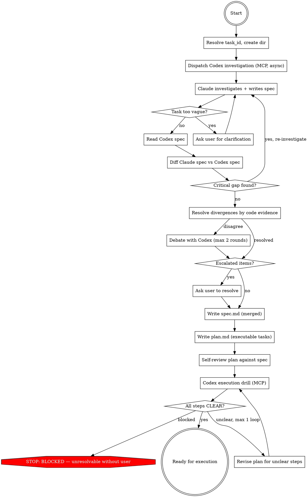

## Preamble (run first)

```bash
SHIP_SKILL_NAME=plan source ${CLAUDE_PLUGIN_ROOT}/scripts/preflight.sh
```

### Auth Gate

If `SHIP_AUTH: not_logged_in`: AskUserQuestion — "Ship requires authentication to use all skills. Login now? (A: Yes / B: Not now)". A → run `ship auth login`, verify with `ship auth status --json`, proceed if logged_in, stop if failed. B → stop.
If `SHIP_AUTO_LOGIN: true`: skip AskUserQuestion, run `ship auth login` directly.
If `SHIP_TOKEN_EXPIRY` ≤ 3 days: warn user their token expires soon.

# Ship: Plan

You ARE the planner. You read code, investigate, write spec and plan.
You must read the code yourself — delegating investigation loses the
context needed to write a good plan. Codex investigates independently
and produces its own spec for adversarial comparison.

## Process Flow



## Roles

| Phase | Who | Why |
|-------|-----|-----|
| Investigation (read code, trace paths) | **You + Codex (parallel)** | Independent investigation catches different blind spots |
| Write spec (Claude's version) | **You** | Investigation context must not be lost |
| Write spec (Codex's version) | **Codex** (via MCP) | Independence requires separation |
| Diff & verify divergences | **You** | You have the context + code access to judge |
| Write plan.md | **You** | Spec context must flow into plan |
| Execution Drill | **Codex** (via MCP, new session) | Fresh eyes test implementability |

## Hard Rules

1. You read all code you reference. No citing files you haven't opened.
2. Codex never sees your spec when producing its own. Independence is sacred.
3. Codex receives the same investigation instructions you follow.
4. Divergences are resolved by code evidence. When evidence alone isn't conclusive, debate with Codex (max 2 rounds, both sides cite file:line).
5. Disk artifacts are truth. Prior conversation is reference only.
6. The execution drill must pass before any plan is marked ready.
7. spec.md has no rigid template — sections scale to task complexity.
8. plan.md has no placeholders — every step has complete code and commands.

## Quality Gates

| Gate | Condition | Fail action |
|------|-----------|-------------|
| Investigation → Spec | All claims trace to file:line you read | Re-investigate |
| Spec → Diff | spec.md has flexible sections scaled to complexity, self-reviewed | Revise |
| Diff → Plan | Zero `escalated` items (resolved by evidence or debate, or user resolved them) | Ask user |
| Plan → Drill | plan.md has TDD tasks, checkbox steps, complete code, no placeholders | Revise |
| Drill → Ready | Zero BLOCKED steps, zero UNCLEAR steps | Revise plan (max 1 loop) |

No artifact passes to the next phase without meeting its gate.

---

## Phase 1: Init

- Resolve task_id, create `.ship/tasks/<task_id>/plan/` directory.
- If resuming, read existing artifacts and determine current state.
- Collect branch name and HEAD SHA.

### Task ID

1. If invoked by /ship:auto, the task_id is provided.
2. If invoked standalone, generate `task_id` using the shared script:
   ```bash
   TASK_ID=$(bash ${CLAUDE_PLUGIN_ROOT}/scripts/task-id.sh "<description>")
   ```

Artifacts go to `.ship/tasks/<task_id>/plan/`. The Write tool creates
directories automatically — no mkdir needed.

### Existing spec.md detection

Check if `spec.md` already exists with content:
```bash
[ -s .ship/tasks/<task_id>/plan/spec.md ] && echo 'SPEC_EXISTS' || echo 'NO_SPEC'
```

If `SPEC_EXISTS`:
- Read `spec.md`. This was written by an upstream skill (e.g. refactor).
- Check if spec records a HEAD SHA. If it does and it differs from
  current HEAD, treat spec as stale — proceed as `NO_SPEC`.
- **Do not overwrite it.** Use it as your investigation input.
- Your job narrows: investigate to validate the spec's claims, then
  produce only `plan.md`. You may append an `## Investigation` section
  to the existing spec if it lacks one, but preserve all existing sections.
- Skip Codex parallel investigation — spec already exists and was
  validated upstream. No `codex-spec.md` or `diff-report.md` produced.
- Skip to Phase 5 (Write Plan) with the spec as your starting context.
- The execution drill (Phase 6) still runs — plan.md always gets validated.

If `NO_SPEC`: proceed normally — Phase 2 investigates, Phase 3 writes
spec.md, Phase 4 resolves divergences, then Phase 5 writes plan.md.

## Phase 2: Investigate (Parallel)

**This is the most important phase. Do not rush it.**

### Step A: Dispatch Codex

Kick off Codex MCP **before** you start investigating. Codex works
in parallel while you read code.

Read `independent-investigator.md` for the MCP call parameters and
prompt template. Fill in the task description, task_id, and repo root.
Save the returned `threadId` as `INVESTIGATION_THREAD_ID` — needed
for debate in Phase 4.

#### When Codex is unavailable

If MCP call fails, self-produce the second spec:
1. Run a second-pass review of your spec using only: placeholder scan,
   contradiction scan, coverage scan, ambiguity scan
2. Search for code paths, callers, or consumers you did not trace
3. Write `codex-spec.md` with any changed conclusions or additions
4. Add a warning: `WARNING: Second spec was self-generated, not independent`

### Step B: Your investigation

Read the codebase systematically. Before writing the spec, you must
have recorded: entrypoint files, traced caller chain, traced consumer
chain, affected data structures/interfaces, existing tests, and
unresolved assumptions — each with file:line evidence.

#### For bug fixes — trace the full data/call path:

1. **Start at the symptom.** Find the function that produces the wrong
   output or behavior. Read it.
2. **Trace BACKWARD (callers).** Who calls this function? With what
   arguments? Trace up to 2 levels up (stop if graph terminates).
   Use `grep -rn "functionName"` to find all call sites. Read each one.
3. **Trace FORWARD (consumers).** Who uses the output? At least 2 levels
   down (stop if graph terminates). Read those too.
4. **Search for existing defenses.** Before proposing a new guard or
   fix, search for code that already handles this problem:
   `grep -rn "relatedKeyword"`. If you find existing defenses, explain
   why they are insufficient — or reconsider your root cause.
5. **Check for the fix already applied upstream.** The most common
   planning error is finding a gap in function A, without noticing that
   function A's caller already compensates for it. Trace the full path.

#### For new features — map the integration surface:

1. **Find analogous features.** Search for similar existing features.
   How are they wired in? What files do they touch?
2. **Trace the integration path.** Follow a similar feature from config →
   registration → runtime → UI/API surface. Every file it touches is a
   candidate for your plan.
3. **Check for existing infrastructure.** Does the foundation you need
   already exist? Don't reinvent what's there.

#### For all tasks:

- **Verify file existence** before proposing to create new files
  (`test -f "path"`). If it exists, propose extending it.
- **Search for existing tests** that assert the current behavior you
  plan to change (`grep -rn "oldValue" --include="*.test.*"`). These
  tests will break — list them in your plan.
- **Cross-reference all consumers** when defining schemas or interfaces.
  Grep for the type name and every field name. Build a complete
  inventory, not a partial one.

### Task too vague?

After investigation, check if any of these are missing from the task
description AND could not be inferred from code:
- **Target behavior** — what should change
- **Target surface** — which files, endpoints, or components
- **Success condition** — how to know it's done

If any are missing, ask user via AskUserQuestion before writing spec.

## Phase 3: Write Spec (Design)

Write your spec.md following brainstorming style — **flexible sections
scaled to the task's complexity.** A small bugfix gets a few paragraphs.
An architectural change gets full sections.

### What to include (pick what's relevant)

- **Problem/Motivation** — what's broken, missing, or suboptimal
- **Design approach** — how you'll solve it and why this approach
- **Investigation findings** — what you traced, file:line refs, what
  existing code you found, what assumptions remain unverified
- **Changes by file** — which files are affected and what changes
- **Acceptance criteria** — concrete, testable conditions for "done"
- **Test plan** — what tests exist, what breaks, what's needed
- **Risks / unknowns** — anything you couldn't verify from code alone

### Spec self-review

After writing, run this checklist:

1. **Placeholder scan:** Any "TBD", "TODO", incomplete sections? Fix them.
2. **Internal consistency:** Do sections contradict each other?
3. **Scope check:** Focused enough for a single plan?
4. **Ambiguity check:** Could any requirement be interpreted two ways?
   If so, pick one and make it explicit.

Fix issues inline. No need to re-review.

## Phase 4: Diff & Verify

Read `codex-spec.md` (written by the Codex MCP call dispatched in Phase 2).
Compare it against your `spec.md`.

### For each divergence point:

1. **Identify the divergence** — what does your spec say vs Codex's?
2. **Verify against code** — read the actual code to determine which
   is correct. Do NOT resolve by reasoning about which "sounds better."
3. **If still disagree — debate with Codex.** Use `mcp__codex__codex-reply`
   with `threadId: INVESTIGATION_THREAD_ID`. Present your code evidence
   and ask Codex to present its counter-evidence. Maximum 2 debate rounds.
   Both sides must cite file:line references — no abstract arguments.
4. **Assign disposition after debate:**
   - **patched** → Your spec updated based on evidence. Show the diff.
   - **proven-false** → Codex's claim is wrong. Cite the code evidence.
   - **conceded** → Codex convinced you with code evidence. Update spec.
   - **escalated** → 2 debate rounds exhausted, still unresolved. Needs user input.

### Record in diff-report.md

Only record divergences and their resolutions. If both specs agree on
something, there's nothing to record — move on.

For each divergence, write what happened: what each side claimed, what
code evidence was cited during debate, and the final disposition
(patched / proven-false / conceded / escalated).

### After diff resolution:

- Update `spec.md` with all `patched` and `conceded` items.
- If any `escalated` items exist:
  - **Standalone mode:** ask user via AskUserQuestion before proceeding.
    Record the user's ruling in diff-report.md with disposition
    `user-resolved` and what they decided. Update spec.md accordingly.
  - **/ship:auto mode:** do NOT ask user. Treat escalated items as BLOCKED
    and return. Auto owns the only user-approval gate.
- If diff reveals a critical investigation gap (e.g., Codex found
  important code you missed entirely), go back to Phase 2 for
  targeted re-investigation. Maximum 1 re-investigation loop.

## Phase 5: Write Plan

Translate the validated spec.md into an executable plan.md following
the writing-plans format.

### plan.md structure

```markdown
# <Task Title> Implementation Plan

> **For agentic workers:** Use /ship:dev to implement this plan
> task-by-task. Steps use checkbox syntax for tracking.

**Goal:** [One sentence — what this builds]

**Architecture:** [2-3 sentences about approach]

**Tech Stack:** [Key technologies/libraries]

---

### Task 1: [Component Name]

**Files:**
- Create: `exact/path/to/file.ext`
- Modify: `exact/path/to/existing.ext:123-145`
- Test: `tests/exact/path/to/test.ext`

- [ ] **Step 1: Write the failing test**

<complete test code>

- [ ] **Step 2: Run test to verify it fails**

Run: `<exact test command>`
Expected: FAIL with "<specific error>"

- [ ] **Step 3: Write minimal implementation**

<complete implementation code>

- [ ] **Step 4: Run test to verify it passes**

Run: `<exact test command>`
Expected: PASS

- [ ] **Step 5: Commit**

`git commit -m "feat: <description>"`

### Task 2: ...
```

### Plan self-review

After writing, check against spec.md:

1. **Spec coverage:** Every acceptance criterion in spec.md has a task
   that implements it. List any gaps.
2. **Placeholder scan:** Search for "TBD", "TODO", vague steps. Fix them.
3. **Type consistency:** Do types, function names, and signatures match
   across tasks? A function called `clearLayers()` in Task 2 but
   `clearFullLayers()` in Task 5 is a bug.

Fix issues inline.

## Phase 6: Execution Drill (via MCP)

The final gate. Give Codex the plan and ask it to validate every step
is implementable.

Read `execution-drill.md` for the MCP call parameters, role, and
prompt template. Use a **new** MCP session, not the investigation thread.
Save the returned `threadId` as `DRILL_THREAD_ID` — needed for
revision reruns.

#### When Codex is unavailable

If MCP call fails, dispatch a fresh Agent to perform the drill instead.
The Agent gets the same prompt from `execution-drill.md` — it reads
spec.md and plan.md with no prior context, providing independent review.
Add a warning to the output: `WARNING: Drill was Agent-performed, not Codex`

### After the drill:

- **All CLEAR** → Plan is ready for execution.
- **UNCLEAR items** → Revise plan.md to make each step unambiguous.
  Then re-run ONLY the unclear steps:
  - If drill was Codex: use `mcp__codex__codex-reply` with
    `threadId: DRILL_THREAD_ID` and prompt: "Tasks N, M were revised.
    Re-read plan.md and re-evaluate ONLY those tasks using the same
    criteria. Report CLEAR/UNCLEAR/BLOCKED."
  - If drill was Agent fallback: dispatch a fresh Agent with the same
    `execution-drill.md` prompt scoped to the revised tasks only.
  Maximum 1 revision loop.
- **BLOCKED items** → If resolvable by investigation, investigate and
  fix. If not, escalate to user or mark plan as `blocked`.

---

## Artifacts

```text
.ship/tasks/<task_id>/
  plan/
    spec.md          — final merged spec (flexible sections, brainstorming style)
    codex-spec.md    — Codex's independent spec (for diff comparison)
    plan.md          — how to build it (TDD tasks, writing-plans style)
    diff-report.md   — Claude spec vs Codex spec divergences and resolutions
```

## Timeouts

- Maximum 10 minutes for investigation
- Maximum 20 minutes total
- On timeout: preserve artifacts, summarize honestly, mark as blocked

## Error Handling

| Error | Action |
|-------|--------|
| Codex MCP unavailable | Self-produce second spec + Agent-drill with warning |
| Codex output unparseable | Retry once with format reminder, then fall back to Agent drill |
| Timeout | Abort, preserve artifacts, summarize honestly |
| Re-investigation needed | Maximum 1 loop back to Phase 2 |
| Drill revision needed | Maximum 1 revision loop |

## Completion

### Only stop for
- Task too vague to plan → ask user via AskUserQuestion
- Execution drill blockers that require user input → `blocked`
- Timeout → preserve artifacts, summarize honestly

### Never stop for
- Codex unavailable (self-produce second spec with warning)
- Codex output parse failure (retry once, then Agent fallback)

### Detecting invocation mode

- **Standalone** (`/ship:plan`): the user invoked plan directly.
- **From /ship:auto**: the calling prompt contains a task_id.
  /ship:auto is waiting for artifacts to exist.

### Standalone completion

```
[Plan] Planning complete for "<task title>".

## Summary
- Investigation: <N> files traced, <M> existing defenses found
- Independent replication: <M> divergences resolved (<N> by evidence, <N> by debate)
- Execution drill: <N>/<total> steps CLEAR

## Artifacts
- spec.md: .ship/tasks/<task_id>/plan/spec.md
- plan.md: .ship/tasks/<task_id>/plan/plan.md
- diff-report.md: .ship/tasks/<task_id>/plan/diff-report.md

## What's next?
1. **Implement now** — run /ship:dev to execute this plan
2. **Review the plan** — read the artifacts and give feedback
3. **Re-plan** — discard this plan and start over
```

### /ship:auto completion

Do NOT ask the user. /ship:auto is waiting for artifacts. Just:

1. Verify `spec.md` and `plan.md` are non-empty on disk.
2. Output: `[Plan] Design complete — spec.md and plan.md ready.`
3. Return.

### Blocked (both modes)

```
[Plan] BLOCKED
REASON: <what failed and why>
ATTEMPTED: <what was tried>
UNRESOLVED: <escalated items from diff or drill>
RECOMMENDATION: <what the user should do next>
```

<Bad>
- Delegating investigation to a sub-agent (you must read the code yourself)
- Writing plan.md with vague steps ("update the handler", "add tests")
- Writing plan.md with placeholders (TBD, TODO, "similar to Task N")
- Claiming "function X is not called" without tracing all callers
- Proposing a fix without searching for existing defenses that already handle it
- Proposing to create a file without checking if it already exists
- Changing a value without grepping tests that assert the old value
- Marking plan ready when drill has BLOCKED items
- Skipping the drill because "the plan looks solid"
</Bad>
