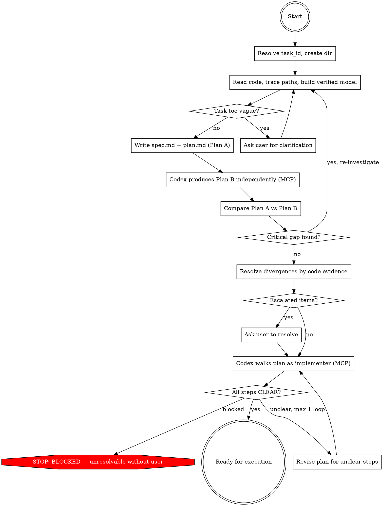

## Preamble (run first)

```bash
SHIP_SKILL_NAME=ship-plan source ${CLAUDE_PLUGIN_ROOT}/scripts/preflight.sh
```

# Ship: Plan

You ARE the planner. You read code, investigate, write spec and plan.
You must read the code yourself — delegating investigation loses the
context needed to write a good plan. Codex produces an independent plan,
not a critique of yours.

## Principal Contradiction

**The plan's model of the code vs the code's actual reality.**

Plans fail not because of bad reasoning, but because of unverified
assumptions about what the code does. The adversary is not another AI —
it is reality itself. Every mechanism in this skill exists to close the
gap between what the planner believes and what the code actually does.

## Core Principle

```
NO INVESTIGATION, NO PLAN.
PRACTICE IS THE CRITERION OF TRUTH.
```

Every claim in spec.md and plan.md must be backed by code evidence you
personally verified. Plans are validated against code reality and
execution rehearsal, not by debate or persuasion.

## Process Flow



## Roles

| Phase | Who | Why |
|-------|-----|-----|
| Investigation (read code, trace paths) | **You** | You need the context to write a good plan |
| Write spec.md + plan.md (Plan A) | **You** | Investigation context must not be lost |
| Independent Plan B | **Codex** (via MCP) | Independence requires separation |
| Diff & verify divergences | **You** | You have the context + code access to judge |
| Execution Drill | **Codex** (via MCP) | Fresh eyes test implementability |

## Hard Rules

1. You read all code you reference. No citing files you haven't opened.
2. Codex never sees Plan A when producing Plan B. Independence is sacred.
3. Divergences are resolved by code evidence, not argument.
4. Disk artifacts are truth. Prior conversation is reference only.
5. The execution drill must pass before any plan is marked ready.

## Quality Gates

| Gate | Condition | Fail action |
|------|-----------|-------------|
| Investigation → Write | All claims trace to file:line you read | Re-investigate |
| Write → Plan B | spec.md has Background + Investigation sections, plan.md has concrete steps | Revise |
| Diff → Drill | Zero `escalated` items (or user resolved them) | Ask user |
| Drill → Ready | Zero BLOCKED steps, zero UNCLEAR steps | Revise plan (max 1 loop) |

No artifact passes to the next phase without meeting its gate.
Defects are caught at source, never passed downstream.

---

## Phase 1: Init

- Resolve task_id, create `.ship/tasks/<task_id>/plan/` directory.
- If resuming, read existing artifacts and determine current state.
- Collect branch name and HEAD SHA.

### Task ID

1. If invoked by ship:auto, the task_id is provided.
2. If invoked standalone, generate `task_id` using the shared script:
   ```bash
   TASK_ID=$(bash ${CLAUDE_PLUGIN_ROOT}/scripts/task-id.sh "<description>")
   ```

Artifacts go to `.ship/tasks/<task_id>/plan/`. The Write tool creates
directories automatically — no mkdir needed.

### Existing spec.md detection

Check if `spec.md` already exists with content:
```bash
[ -s .ship/tasks/<task_id>/plan/spec.md ] && echo 'SPEC_EXISTS' || echo 'NO_SPEC'
```

If `SPEC_EXISTS`:
- Read `spec.md`. This was written by an upstream skill (e.g. refactor).
- **Do not overwrite it.** Use it as your investigation input.
- Your job narrows: investigate to validate the spec's claims, then
  produce only `plan.md`. You may append an `## Investigation` section
  to the existing spec if it lacks one, but preserve all existing sections.
- Skip to Phase 2 with the spec as your starting context.

If `NO_SPEC`: proceed normally — you produce both `spec.md` and `plan.md`.

## Phase 2: Investigate

**This is the most important phase. Do not rush it.**

Read the codebase systematically before writing any plan. Your goal is
to build a verified mental model of the relevant code, so that every
claim in your plan traces back to something you actually read.

### For bug fixes — trace the full data/call path:

1. **Start at the symptom.** Find the function that produces the wrong
   output or behavior. Read it.
2. **Trace BACKWARD (callers).** Who calls this function? With what
   arguments? Go at least 2 levels up. Use `grep -rn "functionName"` to
   find all call sites. Read each one.
3. **Trace FORWARD (consumers).** Who uses the output? At least 2 levels
   down. Read those too.
4. **Search for existing defenses.** Before proposing a new guard or
   fix, search for code that already handles this problem:
   `grep -rn "relatedKeyword"`. If you find existing defenses, explain
   why they are insufficient — or reconsider your root cause.
5. **Check for the fix already applied upstream.** The most common
   planning error is finding a gap in function A, without noticing that
   function A's caller already compensates for it. Trace the full path.

### For new features — map the integration surface:

1. **Find analogous features.** Search for similar existing features.
   How are they wired in? What files do they touch?
2. **Trace the integration path.** Follow a similar feature from config →
   registration → runtime → UI/API surface. Every file it touches is a
   candidate for your plan.
3. **Check for existing infrastructure.** Does the foundation you need
   already exist? Don't reinvent what's there.

### For all tasks:

- **Verify file existence** before proposing to create new files
  (`test -f "path"`). If it exists, propose extending it.
- **Search for existing tests** that assert the current behavior you
  plan to change (`grep -rn "oldValue" --include="*.test.*"`). These
  tests will break — list them in your plan.
- **Cross-reference all consumers** when defining schemas or interfaces.
  Grep for the type name and every field name. Build a complete
  inventory, not a partial one.

### Record your investigation

Write an `## Investigation` section in spec.md with:
- What you traced (call chain / data flow / integration path — file:line)
- What existing relevant code you found (guards, validators, analogous features)
- What you verified and how
- What assumptions remain unverified (flag these explicitly)

**A spec.md without an Investigation section is incomplete.**
**A plan.md that references code you haven't read is invalid.**

## Phase 3: Write Plan A

If `SPEC_EXISTS` (from Phase 1): spec.md already has content from an
upstream skill. Append your `## Investigation` section to it if missing,
but do not rewrite existing sections. Then write only `plan.md`.

If `NO_SPEC`: write both `spec.md` and `plan.md` from scratch.

### spec.md structure

```markdown
## Background
**Goal:** [One sentence — what this task achieves for the user/system]
**Problem:** [What's broken, missing, or suboptimal — from the user's perspective]
**Why now:** [What triggered this work — user report, tech debt, new requirement]
**Context:** [2-3 sentences on how this fits into the broader system/product]

## Investigation
### What was traced
- [call chain / data flow / integration path with file:line refs]

### Existing relevant code
- [guards, validators, analogous features found — with file:line]

### Unverified assumptions
- [anything you could not confirm from code alone]

## Requirements
[derived from the task + your investigation findings]

## Non-goals
[what this task explicitly does NOT do — prevents implementor over-building]

## Acceptance Criteria
[concrete, testable criteria]
```

**A spec.md without a Background section is incomplete.** The implementer
needs to understand WHY they are building this, not just WHAT to build.
Without background, the implementer makes wrong tradeoff decisions
because they don't know what problem they're solving.

### plan.md structure

Implementation steps with:
- Specific file paths and line numbers (from your investigation)
- What to change and why
- Tests that will break and how to update them
- New tests needed

Each step must be concrete enough that an implementer can execute it
without inventing decisions. If a step requires a choice, make the
choice explicit in the plan.

## Phase 4: Codex Independent Plan B (via MCP)

Call Codex via MCP to produce an independent plan for the same task.
**Codex must NOT see Plan A.** Send only the original task description
and point Codex at the repo.

Read `independent-planner.md` for the MCP call parameters, role, and prompt template.

### When Codex is unavailable

If MCP call fails, perform self-critique as Plan B:
1. Re-read your Plan A as if seeing it for the first time
2. Deliberately look for what you might have missed
3. Produce a Plan B section in the same format
4. Add a warning: `⚠ Plan B was self-generated, not independent`

## Phase 5: Diff & Verify

Compare Plan A and Plan B. Categorize every divergence.

### For each divergence point:

1. **Identify the divergence** — what does Plan A say vs Plan B?
2. **Verify against code** — read the actual code to determine which
   is correct. Do NOT resolve by reasoning about which "sounds better."
3. **Assign disposition:**
   - **patched** → Plan A updated based on evidence. Show the diff.
   - **proven-false** → Codex's claim is wrong. Cite the code evidence.
   - **escalated** → Cannot resolve from code alone. Needs user input.

### Convergence points (both plans agree):

Mark as **confirmed** — independent replication increases confidence.

### Record in diff-report.md

```markdown
## Convergence Points
- [What both plans independently agreed on]

## Divergences

### D1: <short title>
- **Plan A says:** ...
- **Plan B says:** ...
- **Code evidence:** file:line — <what the code actually shows>
- **Disposition:** patched | proven-false | escalated
- **Action taken:** <diff or escalation reason>

### D2: ...

## Summary
- Confirmed: N points
- Patched: N (Plan A updated)
- Proven-false: N (Codex was wrong)
- Escalated: N (needs user input)
```

### After diff resolution:

- Update `spec.md` and `plan.md` with all `patched` items.
- If any `escalated` items exist:
  - **Standalone mode:** ask user via AskUserQuestion before proceeding.
  - **ship:auto mode:** do NOT ask user. Treat escalated items as BLOCKED
    and return. Auto owns the only user-approval gate (Phase 3).
- If diff reveals a critical investigation gap (e.g., Plan B found
  important code Plan A missed entirely), go back to Phase 2 for
  targeted re-investigation. Maximum 1 re-investigation loop.

## Phase 6: Blind Execution Drill (via MCP)

The final gate. Give Codex the merged plan and ask it to act as an
implementer. Its job: walk through the plan steps and flag every place
it would need to guess.

Read `execution-drill.md` for the MCP call parameters, role, and prompt template.
Use a **new** MCP session, not the Plan B thread.

### After the drill:

- **All CLEAR** → Plan is ready for execution.
- **UNCLEAR items** → Revise plan.md to make each step unambiguous.
  Then re-run ONLY the unclear steps through a follow-up drill
  (use `mcp__codex__codex-reply` on the drill thread).
  Maximum 1 revision loop.
- **BLOCKED items** → If resolvable by investigation, investigate and
  fix. If not, escalate to user or mark plan as `blocked`.

---

## Artifacts

```text
.ship/tasks/<task_id>/
  plan/
    spec.md          — what to build (investigation + requirements)
    plan.md          — how to build it (steps with file:line refs)
    diff-report.md   — Plan A vs Plan B divergences and resolutions
```

## Timeouts

- Maximum 10 minutes for investigation
- Maximum 20 minutes total
- On timeout: preserve artifacts, summarize honestly, mark as blocked

## Error Handling

| Error | Action |
|-------|--------|
| Codex MCP unavailable | Self-produce Plan B + self-drill with warning |
| Codex output unparseable | Retry once with format reminder, then skip with warning |
| Timeout | Abort, preserve artifacts, summarize honestly |
| Re-investigation needed | Maximum 1 loop back to Phase 2 |
| Drill revision needed | Maximum 1 revision loop |

## Completion

### Only stop for
- Task too vague to plan → ask user via AskUserQuestion
- Execution drill blockers that require user input → `blocked`
- Timeout → preserve artifacts, summarize honestly

### Never stop for
- Codex unavailable (self-produce Plan B with warning)
- Codex output parse failure (retry once, then skip with warning)

### Detecting invocation mode

- **Standalone** (`/ship-plan`): the user invoked plan directly.
- **From ship:auto**: the calling prompt contains a task_id.
  Ship:auto is waiting for artifacts to exist.

### Standalone completion

```
[Plan] Planning complete for "<task title>".

## Summary
- Investigation: <N> files traced, <M> existing defenses found
- Independent replication: <N> convergences, <M> divergences resolved
- Execution drill: <N>/<total> steps CLEAR

## Artifacts
- spec.md: .ship/tasks/<task_id>/plan/spec.md
- plan.md: .ship/tasks/<task_id>/plan/plan.md
- diff-report.md: .ship/tasks/<task_id>/plan/diff-report.md

## What's next?
1. **Implement now** — run /ship-dev to execute this plan
2. **Review the plan** — read the artifacts and give feedback
3. **Re-plan** — discard this plan and start over
```

### Ship:auto completion

Do NOT ask the user. Ship:auto is waiting for artifacts. Just:

1. Verify `spec.md` and `plan.md` are non-empty on disk.
2. Output: `[Plan] Design complete — spec.md and plan.md ready.`
3. Return.

### Blocked (both modes)

```
[Plan] BLOCKED
REASON: <what failed and why>
ATTEMPTED: <what was tried>
UNRESOLVED: <escalated items from diff or drill>
RECOMMENDATION: <what the user should do next>
```

<Bad>
- Delegating investigation to a sub-agent (you must read the code yourself)
- Writing spec.md without an Investigation section
- Citing a file you haven't actually read
- Claiming "function X is not called" without tracing all callers (at least 2 levels)
- Proposing a fix without searching for existing defenses that already handle it
- Proposing to create a file without checking if it already exists
- Changing a value without grepping tests that assert the old value
- Listing schema/interface fields without cross-referencing all consumers
- Letting Codex see Plan A when producing Plan B (breaks independence)
- Resolving divergences by "which sounds better" instead of code evidence
- Marking plan ready when drill has BLOCKED items
- Skipping the drill because "the plan looks solid"
- Self-judging closure without code evidence for each disposition
</Bad>
