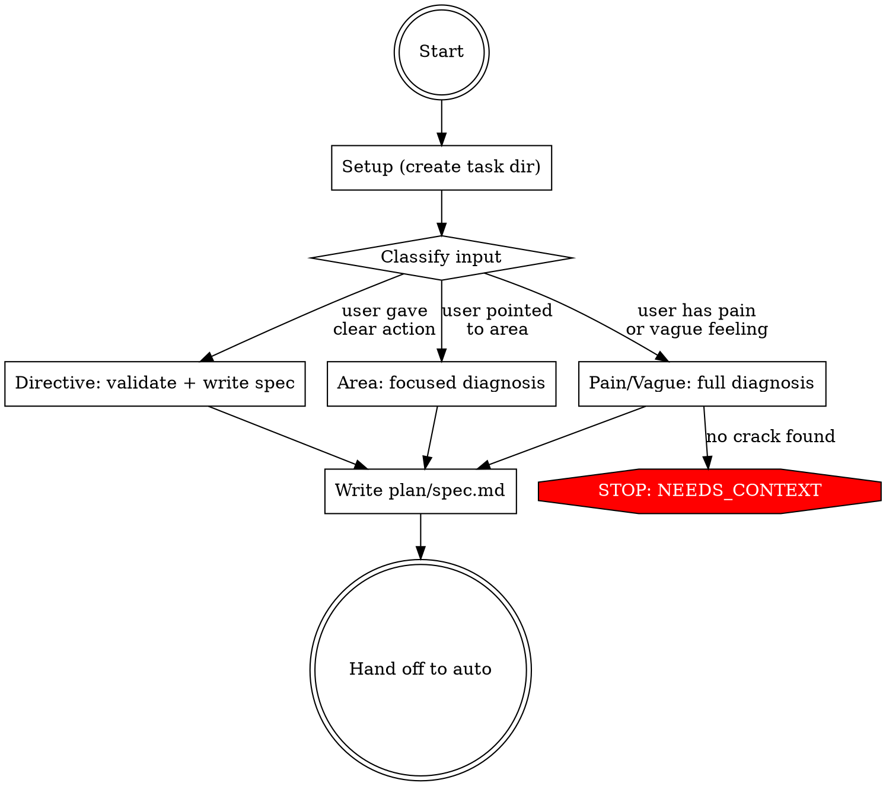

# Ship: Refactor

Diagnose the structural crack, write a spec, hand off to auto.

Refactor's only job is diagnosis — understanding WHY the current
structure causes friction. Everything else (plan, implement, review,
verify, QA, handoff) is auto's job. The diagnosis is written to
`plan/spec.md`, the same artifact auto reads. No special mode,
no separate directory, no pipeline changes.

## Principal Contradiction

**The code's structural boundaries vs the change patterns they must serve.**

Structure fails not because code "looks messy" but because its boundaries
force unnecessary coupling, indirection, or cross-cutting when the team
works on real tasks. The adversary is the gap between how code is organized
and how it is actually used. Diagnosis reveals the gap; restructuring
closes it.

## Core Principle

```
CLASSIFY FIRST, THEN DIAGNOSE AT THE RIGHT DEPTH.
DIAGNOSIS IS THE ONLY THING REFACTOR DOES.
EVERYTHING ELSE IS AUTO'S JOB.
```

Not every refactor needs deep diagnosis. A user who says "extract auth
from UserService" already has the answer. A user who says "this code
is a mess" needs help finding the question. Match diagnosis depth to
what the user actually needs.

## Process Flow



## Roles

| Role | Who | Why |
|------|-----|-----|
| Diagnostician | **You (Claude)** | Requires holistic understanding — reading code, tracing dependencies, synthesizing structural argument |
| Everything else | **Auto** | Plan, implement, review, verify, QA, handoff — all solved problems |

## Hard Rules

1. Classify before diagnosing. Match depth to input.
2. Every claim in the diagnosis must be backed by code evidence you read.
3. The spec must include "behavior must not change" as an acceptance criterion.
4. Do not implement, review, or verify. Hand off to auto.
5. Do not create `refactor/` directories. Write to `plan/spec.md`.

## Quality Gates

| Gate | Condition | Fail action |
|------|-----------|-------------|
| Classify → Diagnose | Input type determined | AskUserQuestion |
| Diagnose → Spec | Crack identified (or directive validated) | Adjust depth or NEEDS_CONTEXT |
| Spec → Auto | Spec has acceptance criteria + "behavior must not change" | Revise spec |

---

## Phase 1: Setup

Generate task_id:
```bash
TASK_ID=$(bash ${CLAUDE_PLUGIN_ROOT}/bin/task-id.sh "<description>")
mkdir -p .ship/tasks/$TASK_ID/plan
```

Output: `[Refactor] Task "<title>" created (task_id: <task_id>).`

## Phase 2: Classify Input

Read the user's request and classify:

| Type | Signal | Example | Diagnosis depth |
|------|--------|---------|----------------|
| **Directive** | User gives a clear structural action | "extract auth from UserService", "split this file into 3", "move utils to shared/" | Light — validate, then spec |
| **Area** | User points to a location but not an action | "refactor the auth module", "refactor this file", "this file is too big" | Medium — focused diagnosis on that area |
| **Pain** | User describes friction but not the cause | "every time I add an API I touch 5 files", "changing billing always breaks auth" | Full — 4-step diagnosis |
| **Vague** | User has a feeling, no specifics | "this code is a mess", "refactor the codebase", "clean this up" | Full — but ask for pain first |

Output: `[Refactor] Input type: <directive|area|pain|vague>`

---

## Phase 3: Diagnose

### Path A: Directive (light)

The user already knows what to do. Your job: validate it makes sense,
then write the spec.

1. **Read the code** the user is pointing at. Understand what exists.
2. **Validate the action** — does the directive make structural sense?
   Does it introduce new problems (circular deps, broken interfaces)?
3. **If valid** → write spec (Phase 4) with the user's directive as
   the target structure.
4. **If questionable** → tell the user what you found, suggest
   alternative. Do not silently override.

Output: `[Refactor] Directive validated. Writing spec...`

### Path B: Area (medium)

The user pointed to a location. Diagnose what's wrong with it.

1. **Read the area** — the file(s) or module the user pointed at.
2. **Trace last pain** — from the user's request or git history,
   find the most recent change that was harder than it should have been:
   ```bash
   git log --since="3 months ago" --name-only --pretty=format:"%s" -- <area paths> | head -40
   ```
3. **Follow the pain** — pick the hardest recent change. Trace what
   files it touched and why. What forced the cross-cutting?
4. **Identify the crack** — why does this area's structure not match
   how it's used?
5. **Counterfactual check** — if this crack didn't exist, would the
   last painful change have been simpler? If no → wrong crack, dig deeper.

Output: `[Refactor] Crack identified: <1-line summary>`

### Path C: Pain / Vague (full)

The user has friction but doesn't know the structural cause.

**If vague**: first ask via AskUserQuestion:
> What specific task felt harder than it should have been recently?

Then proceed with the full diagnosis:

#### Step 1: Trace the last painful change

Don't map abstract structure. Start from a **concrete instance** of the pain:

> User says "every time I add an API I touch 5 files"
> → "Show me the last API you added. Which commit?"
> → Or find it: `git log --all --oneline --grep="add.*endpoint\|add.*api\|new.*route" | head -10`

Read that commit. Trace exactly which files changed and why each
one had to change.

#### Step 2: Trace the dependency chain

From the painful change, trace backward and forward:

1. **Why did file A have to change?** → because it imports X from file B
2. **Why does file A import X?** → because the boundary forces this dependency
3. **Could file A have avoided this change?** → only if the boundary were different

Trace at least 2 levels in each direction. Use Grep to find all
import/dependency connections.

#### Step 3: Analyze patterns (is this one-off or systemic?)

```bash
# Do these files always change together?
git log --since="3 months ago" --name-only --pretty=format:"---" -- <files from step 1> \
  | awk '/^---$/{if(NR>1)print ""; next}{printf "%s ",$0}' \
  | sort | uniq -c | sort -rn | head -10
```

If the co-change pattern is consistent → systemic structural issue.
If it's a one-off → maybe not worth a refactor.

#### Step 4: Identify the crack + counterfactual

Synthesize into a diagnosis:

> The pain is [PAIN]. This happens because [STRUCTURAL CAUSE].
> Specifically, [CURRENT BOUNDARY] forces [UNNECESSARY COUPLING]
> when the actual change pattern is [OBSERVED PATTERN].

**Counterfactual check**: if this crack didn't exist (structure were
ideal), would the painful change in Step 1 have been simpler?
If yes → crack confirmed. If no → wrong crack, go back to Step 2.

#### Step 5: Multiple cracks? Find the main contradiction

If multiple structural issues surface, determine priority:

> Does fixing crack A also resolve or ease crack B?
> Does fixing crack B also resolve or ease crack A?

If A→B but not B→A, then A is the main contradiction. Fix A first.

**If you cannot identify a concrete structural cause, STOP.**
Escalate NEEDS_CONTEXT: the pain may not be structural, or more
information is needed.

Output: `[Refactor] Crack identified: <1-line summary>`

## Phase 4: Write Spec

Write to `.ship/tasks/<task_id>/plan/spec.md`.

### For Directive path:

```markdown
## Task
[The user's directive — what to extract/split/move]

## Current State
[What exists now — file:line evidence from validation]

## Target Structure
[What it looks like after the directive is executed]

## Acceptance Criteria
- Behavior must not change — same inputs produce same outputs,
  same side effects, same error behavior
- [Structural criteria from the directive]

## Non-goals
- No new features or behavior changes
- No cleanup outside the directive's scope
```

### For Area / Pain / Vague paths:

```markdown
## Pain
[What triggered this refactor — the concrete friction]

## Current Structure
[Dependency chain traced from the painful change — file:line evidence]

## Change Patterns
[Co-change analysis — systemic or one-off]

## Crack
[The structural cause — specific misalignment between boundaries and usage]

## Target Structure
[What the structure should look like — derived from the crack]

## Acceptance Criteria
- Behavior must not change — same inputs produce same outputs,
  same side effects, same error behavior
- [Structural criterion]: e.g. "Adding a new API endpoint touches
  at most 2 files instead of 5"
- [Structural criterion]: e.g. "Changes to billing do not require
  changes to auth module"

## Non-goals
- No new features or behavior changes
- No cosmetic cleanup outside the crack's blast radius
```

Criteria must be concrete and testable.
NOT vague: "code is cleaner", "better separation of concerns".

Output: `[Refactor] Spec written. Handing off to auto...`

## Phase 5: Hand Off to Auto

```
Agent(prompt="You MUST call Skill('auto') as your first and only action.
Task description: Refactor — <1-line crack summary>.
task_id: <task_id>
task_dir: .ship/tasks/<task_id>

Context: plan/spec.md already exists with a refactor diagnosis.
Auto should proceed to its Design phase, which will invoke plan.
Plan will detect the existing spec.md and use it as input —
it will produce plan.md without overwriting the diagnosis.")
```

What happens next (for your understanding, not action):
1. Auto bootstraps → detects spec.md exists but plan.md does not → `NO_PLAN`
2. Auto dispatches plan → plan detects existing spec.md → preserves it, produces plan.md
3. Auto presents plan to user for approval (user approval gate)
4. Implement → Review → Verify → QA → Simplify → Handoff

Refactor's job ends here. Auto owns the rest including user approval.

---

## Progress Reporting

Use `[Refactor]` prefix:

```
[Refactor] Task "split-user-service" created.
[Refactor] Input type: pain
[Refactor] Tracing last painful change — commit abc123 "add billing webhook"
[Refactor] Dependency chain: billing/handler.go → auth/user.go → db/models.go
[Refactor] Co-change pattern: billing/ and auth/ change together in 80% of commits
[Refactor] Crack identified: User model owns both auth and billing concerns
[Refactor] Counterfactual: confirmed — with separate models, webhook would touch 2 files not 5
[Refactor] Spec written. Handing off to auto...
```

## Artifacts

```text
.ship/tasks/<task_id>/
  plan/
    spec.md       ← refactor writes this (diagnosis + acceptance criteria)
    plan.md       ← auto/plan writes this (migration stories)
  review.md       ← auto writes
  verify.md       ← auto writes
  qa/qa.md        ← auto writes
  simplify.md     ← auto writes
```

## Error Handling

| Condition | Action |
|-----------|--------|
| Input is vague, no pain | AskUserQuestion for concrete friction |
| Directive doesn't make structural sense | Tell user, suggest alternative |
| Cannot trace dependency chain | Narrow scope, focus on one connection |
| No git history (new repo) | Skip pattern analysis, rely on static tracing |
| Cannot identify structural cause | NEEDS_CONTEXT — pain may not be structural |
| Co-change is one-off, not systemic | Tell user this may not need a refactor |
| Multiple cracks, can't prioritize | AskUserQuestion which pain is most blocking |
| Auto fails after handoff | Auto handles its own retries and escalation |

## Completion

Report one of:
- **HANDED_OFF** — diagnosis complete, spec written, auto dispatched. Auto will handle user approval and execution.
- **NEEDS_CONTEXT** — cannot identify structural cause.
- **NOT_STRUCTURAL** — pain exists but cause is not structural (suggest auto/debug).

### Only stop for
- Cannot identify a concrete structural crack (NEEDS_CONTEXT)
- User's pain is not structural (NOT_STRUCTURAL)
- Directive is invalid and user declines alternative (NEEDS_CONTEXT)

### Never stop for
- Auto failures (auto handles its own retry and escalation)
- Imperfect git history (skip pattern analysis, use static tracing)
- Vague input (ask user to clarify, then proceed)

<Bad>
- Applying full diagnosis to a clear directive ("extract X into Y")
- Skipping diagnosis for vague input ("this is messy")
- Writing spec without reading the actual code
- Mapping the entire codebase instead of tracing from the pain
- Designing target structure without evidence from dependency tracing
- Including acceptance criteria that are vague ("cleaner", "better separation")
- Implementing, reviewing, or verifying yourself instead of handing off to auto
- Creating a refactor/ directory instead of writing to plan/spec.md
- Refactoring code outside the diagnosed crack's blast radius
- Accepting the first crack you find without counterfactual validation
- Silently overriding a user's directive when validation fails (tell them)
</Bad>
