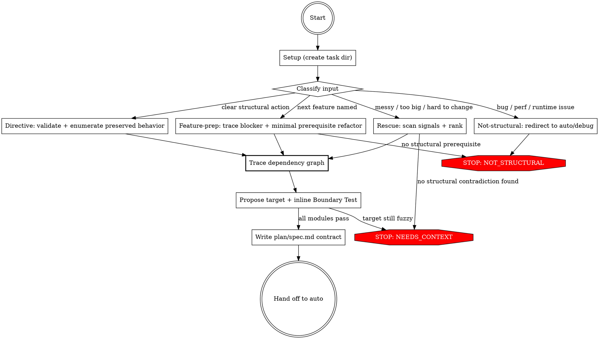

## Preamble (run first)

```bash
SHIP_SKILL_NAME=ship-refactor source ${CLAUDE_PLUGIN_ROOT}/scripts/preflight.sh
```

# Ship: Refactor

Diagnose the structural contradiction, write a contract, hand off to auto.

Refactor's only job is diagnosis and contract writing - understanding WHY
the current structure makes the next change harder than it should be, then
declaring the boundary change required to fix that. Everything else (plan,
implement, review, verify, QA, handoff) is auto's job. The diagnosis is
written to `plan/spec.md`, the same artifact auto reads. No special mode,
no separate directory, no parallel pipeline.

## Principal Contradiction

**The code's current boundaries vs the next changes the team needs to make.**

Structure fails when the code is organized around yesterday's accidents
instead of tomorrow's changes. The adversary is not "messiness" in the
abstract. The adversary is a boundary layout that forces unrelated concerns
to move together, hides ownership, or turns a simple next feature into a
cross-cutting edit. Diagnosis names the contradiction. The contract states
the boundary shift that resolves it.

## Core Principle

```
CLASSIFY FIRST.
SPEC THE STRUCTURAL CONTRACT, NOT THE IMPLEMENTATION.
PROPOSE BOUNDARIES THAT MAKE THE NEXT LIKELY CHANGE CHEAPER.
AUTO OWNS EXECUTION.
```

Not every refactor needs the same depth. A user who says "extract auth into
its own file" has already chosen the move. A user who says "I need multi-tenant
support but everything is hardcoded" needs feature-prep diagnosis. A user who
says "my code is a mess" needs rescue-grade analysis from code signals, not
questions they cannot answer. Match the depth to the request. Keep execution
out of scope.

## Process Flow



## Roles

| Role | Who | Why |
|------|-----|-----|
| Diagnostician | **You (Claude)** | Requires holistic understanding — reading code, tracing dependencies, synthesizing structural argument |
| Everything else | **Auto** | Plan, implement, review, verify, QA, handoff — all solved problems |

## Hard Rules

1. Classify before diagnosing. Match depth to the user's actual request.
2. Every claim must be backed by code you personally read. Comments about other files are not evidence — read the file or do not cite it. Rescue mode never asks the user to invent architecture vocabulary for you.
3. Enumerate critical behaviors to preserve from the existing code. Do not assume them. If no test suite exists, state that explicitly in both preserved behaviors and migration constraints.
4. Trace the dependency graph of the affected code BEFORE proposing any target structure. You cannot design good boundaries without knowing how data and control actually flow.
5. Every proposed module boundary must pass the Boundary Test during drafting, not as a post-hoc check.
6. Counterfactual checks and git history are optional confidence tools, not required gates.
7. Do not implement, review, or verify. Hand off to auto.
8. Do not create `refactor/` directories. Write to `plan/spec.md`.

## Quality Gates

| Gate | Condition | Fail action |
|------|-----------|-------------|
| Classify -> Diagnose | Input type determined | AskUserQuestion only if the target feature or scope is genuinely unclear |
| Diagnose -> Investigate | Primary contradiction identified with code evidence | Adjust depth, narrow scope, or report NEEDS_CONTEXT / NOT_STRUCTURAL |
| Investigate -> Target | Dependency graph of affected code traced, data/control flow understood | Re-read code, trace further |
| Target -> Spec | Every proposed module passes the Boundary Test (applied inline during drafting) | Revise target structure |
| Spec -> Auto | Contract includes all 9 sections; preserved behaviors cite file:line; missing tests stated in both preserved behaviors and constraints | Revise spec |

---

## Phase 1: Setup

Generate task_id:
```bash
TASK_ID=$(bash ${CLAUDE_PLUGIN_ROOT}/scripts/task-id.sh "<description>")
```

Artifacts go to `.ship/tasks/$TASK_ID/plan/`. The Write tool creates
directories automatically - no mkdir needed.

Output: `[Refactor] Task "<title>" created (task_id: <task_id>).`

## Phase 2: Classify Input

Read the user's request and classify:

| Type | Signal | Example | Diagnosis depth |
|------|--------|---------|----------------|
| **Directive** | User gives a clear structural action | "extract auth into its own file", "split this file into 3" | Light - validate, enumerate preserved behavior, spec |
| **Feature-prep** | User names a next feature that current structure will not support | "I need multi-tenant but DB access is hardcoded everywhere" | Medium - trace the blocker, spec the prerequisite refactor |
| **Rescue** | User knows the structure is wrong but cannot articulate the contradiction | "my code is a mess", "this file is too big", "clean this up so I can keep building" | Full - scan code signals, rank, propose target skeleton |
| **Not-structural** | The pain is mainly behavioral, operational, or performance-related | "this function is slow", "tests are flaky", "this crashes in prod" | Redirect - auto or debug, not refactor |

Output: `[Refactor] Input type: <directive|feature-prep|rescue|not-structural>`

---

## Phase 3: Diagnose

### Path A: Directive (light)

The user already chose the move. Your job: validate it, surface risk,
and turn it into a contract.

1. **Read the code** the user pointed at. Understand the existing responsibilities and dependency edges.
2. **Validate the directive** - does the move create a clearer owner, or does it just move the same coupling elsewhere?
3. **Enumerate critical behaviors to preserve** from actual code paths, public interfaces, side effects, and error behavior.
4. **Trace the dependency graph** between the code being moved and everything it touches:
   - What does this code import? What imports it?
   - What data flows in and out?
   - Which dependencies belong to the extracted module vs the original?
   Dependencies must flow from high-level modules toward low-level modules, never the reverse.
5. **Draft the target module map** implied by the directive, applying the Boundary Test to each module as you draft it. If a proposed module fails any criterion, revise before continuing.
6. **If valid** -> write the contract in Phase 4.
7. **If questionable** -> tell the user what you found and suggest a better structural move. Do not silently override.

Optional confidence boost:
- If recent history clearly shows the directive reduces repeated co-change, note it in the contract.
- If the proposed boundary would not make the next likely change cheaper in practice, the directive is incomplete. Revise it.

Output: `[Refactor] Directive validated. Writing contract...`

### Path B: Feature-prep (medium)

The feature matters. The refactor exists only to unblock it.

1. **Understand the target feature** from the user's request. Ask only if the feature itself is unclear.
2. **Trace the path that feature would need** through the current structure:
   - entrypoints
   - state ownership
   - data model assumptions
   - configuration seams
   - outward interfaces
3. **Identify the blocker** - what current boundary or hardcoded assumption makes the feature expensive or dangerous?
4. **Diagnose the minimal structural change** needed to unblock the feature. Spec the refactor, not the feature. "Minimal" means fewest boundary violations, not fewest modules.
5. **Enumerate critical behaviors to preserve** while the boundary shifts.
6. **Trace the dependency graph** of the code that must change:
   - Map imports, function calls, and data flow between the affected modules.
   - Identify which layer owns which concern (e.g., HTTP handling, business logic, data access).
   - Dependencies must flow from high-level toward low-level. If a proposed module in a low-level layer (e.g., data access) would import from a high-level layer (e.g., HTTP middleware), the boundary is wrong.
7. **Draft a target module map** that creates the missing seam without broad cleanup. Apply the Boundary Test to each module as you draft it. Each proposed module must own exactly one independent reason to change — if two unrelated features would both modify the same module, split it.
8. **If no structural prerequisite exists** (the feature can be built without boundary changes), report `NOT_STRUCTURAL`.

Optional confidence boost:
- If a recent attempt or commit shows the same blocker recurring, include it as supporting evidence.
- Counterfactual check: if the proposed seam still leaves the feature crossing the same boundary knot, revise the target map.

Output: `[Refactor] Feature blocker identified: <1-line summary>`

### Path C: Rescue (full)

The user knows the codebase feels wrong. You diagnose it from the code.
Do not require the user to articulate the pain in engineering terms.

#### Step 1: Scan for structural signals

Look for the highest-leverage signals first:

1. **God files** - files over ~300 lines with mixed concerns (for example UI + data access + orchestration + config)
2. **Duplication clusters** - repeated code blocks, conditionals, or data shaping spread across files
3. **Import fan-in / fan-out** - files everything depends on, or files that depend on everything
4. **Mixed responsibilities** - one file or module owning unrelated reasons to change
5. **Global/shared mutable state** - state written from many places without clear ownership
6. **Dead or unreachable code** - exports never imported, functions never called, stale compatibility layers

Use static evidence first. Git history is useful when available but never required.

#### Step 2: Read the top candidates

For each serious candidate:

1. Read the file(s), not just filenames and sizes.
2. Name the mixed responsibilities or dependency knots you actually see.
3. Trace enough neighboring imports/callers to understand why the boundary is wrong.
4. Capture the behaviors that must survive any split.

#### Step 3: Rank by impact

Choose the signal that makes the most future change cheaper if resolved.

Ask:

1. Which signal causes the widest blast radius for ordinary changes?
2. Which signal forces unrelated concerns to move together?
3. Which signal, if fixed, would reduce the number of files touched for the next likely change?
4. If multiple signals exist, does fixing one make the others easier? If yes, that is the main contradiction.

Do not optimize for "biggest file" alone. Optimize for future leverage.

Optional confidence boost:
- Counterfactual check: imagine the next likely change under the proposed skeleton. If it still crosses the same knot, revise the contradiction or the target map.

#### Step 4: Trace the dependency graph

**This is the step that prevents bad target structures. Do not skip it.**

Before proposing any modules, map how the affected code actually connects:

1. **Trace imports and calls.** For each file in the contradiction's blast radius, list what it imports, what imports it, and what functions cross file boundaries. Use Grep to find all import/require/from statements and all call sites.
2. **Map data flow.** Where does data enter the system? How does it transform as it passes through functions? Where does it exit (to DB, API, UI)?
3. **Identify layers.** Which code handles external interfaces (HTTP, CLI, UI events)? Which handles business/domain logic? Which handles data access or infrastructure? Label each responsibility you found in Step 2.
4. **Check dependency direction.** Dependencies should flow from high-level (presentation, routing) toward low-level (data access, utilities), never the reverse. If you see data access importing from HTTP handling, flag it.
5. **Verify every claim with code you read.** If a file references duplication in other files, read those files. If you cannot read them, do not claim the signal.

Record your findings — they become the evidence for the target module map.

#### Step 5: Propose a concrete target skeleton

Turn the diagnosis + dependency graph into a file/module map. Apply the Boundary Test to each module **as you draft it**, not afterward:

1. Name concrete modules or files.
2. For each module, state one distinct reason-to-change. If you can name two independent features that would both modify this module for unrelated reasons, it is too broad — split it.
3. Verify dependency direction: no module in a lower layer (data, infrastructure) depends on a module in a higher layer (presentation, routing). Data flows down through parameters, not up through imports.
4. Keep the change minimal enough that auto can migrate incrementally.

#### Step 6: Boundary Test (applied inline, not as a separate gate)

Every proposed module must pass all four:

1. **Distinct reason-to-change** - can you name exactly one type of change this module owns? If two unrelated features would both modify it, split it.
2. **Understandable from the outside** - can someone understand what it owns without reading internals?
3. **Correct dependency direction** - does this module only depend on modules at the same or lower level? A data-access module must not import from a routing module.
4. **Cheaper next change** - does this boundary reduce files touched for the next likely change?

If a boundary only forwards complexity elsewhere, or inverts the dependency direction, reject it and revise.

#### Step 7: Decide outcome

- **Structural contradiction confirmed** -> write the contract in Phase 4.
- **Pain is real but not structural** -> report `NOT_STRUCTURAL`.
- **No credible target skeleton yet** -> report `NEEDS_CONTEXT`.

Output: `[Refactor] Rescue target identified: <1-line summary>`

### Path D: Not-structural

This skill is not the right tool when the core issue is behavior, runtime
correctness, performance, data quality, or flaky tests.

Redirect:

- `ship-auto` when the user needs a scoped fix or change
- debugging workflow when the user needs root-cause analysis of broken behavior

Output: `[Refactor] Not structural. Redirecting to auto/debug.`

## Phase 4: Write Spec

Write to `.ship/tasks/<task_id>/plan/spec.md`.

This is a **refactor contract**, not an implementation plan. It declares
what structural change must happen, what must stay true, and what safety
constraints auto/plan/dev must honor.

Before finalizing the contract:

1. Re-check every proposed module against the Boundary Test.
2. Enumerate preserved behaviors from real code, not assumptions.
3. Set risk tier based on blast radius, test coverage, and migration surface.
4. If there is no test suite or no reliable safety net, state that explicitly in both preserved behaviors and migration constraints.

Use this format:

```markdown
## Goal
[One sentence describing what structural outcome this refactor achieves]

## Critical Behaviors to Preserve
1. [Observed behavior from current code — cite file:line]
2. [Observed side effect / contract / error behavior — cite file:line]
3. [REQUIRED if no test suite] No test suite - plan must add characterization tests before structural edits

## Risk Tier
[low | medium | high]
[1-3 sentences explaining why]

## Primary Contradiction
[What current boundary does not match the actual change pattern or next feature]

## Structural Signals Found
- [Concrete evidence, preferably with file:line references]
- [God file / duplication / fan-in / mixed ownership / shared mutable state / dead code]

## Target Module Map
| Module | Owns | Depends On |
|--------|------|------------|
| [file/module] | [clear responsibility] | [upstream deps only] |
| [file/module] | [clear responsibility] | [upstream deps only] |

## What Gets Easier After
- [The next likely change touches fewer files]
- [A future feature gains a clean seam]
- [A current cross-cutting edit becomes local]

## Migration Constraints
- [No test suite - add characterization tests before structural edits]
- [Split incrementally, do not rewrite in one pass]
- [High-risk edge: validate each slice before the next]

## Non-goals
- No new features or behavior changes
- No cosmetic cleanup outside the diagnosed area
- No boundary changes unrelated to the primary contradiction
```

Criteria must be concrete and testable.
NOT vague: "cleaner", "better separation", "more scalable".

Output: `[Refactor] Contract written. Handing off to auto...`

## Phase 5: Hand Off to Auto

```
Agent(prompt="You MUST call Skill('ship-auto') as your first and only action.
Task description: Refactor - <1-line contradiction summary>.
task_id: <task_id>
task_dir: .ship/tasks/<task_id>

Context: plan/spec.md already exists with a refactor contract.
Auto should proceed to its Design phase, which will invoke plan.
Plan will detect the existing spec.md and use it as input -
it will produce plan.md without overwriting the contract.")
```

What happens next (for your understanding, not action):
1. Auto bootstraps -> detects spec.md exists but plan.md does not -> `NO_PLAN`
2. Auto dispatches plan -> plan detects existing spec.md -> preserves it, produces plan.md
3. Auto presents plan to user for approval (user approval gate)
4. Implement -> Review -> Verify -> QA -> Simplify -> Handoff

Refactor's job ends here. Auto owns the rest including user approval.

---

## Progress Reporting

Use `[Refactor]` prefix:

```text
[Refactor] Task "prepare-multi-tenant-seam" created.
[Refactor] Input type: feature-prep
[Refactor] Tracing blocker for target feature: multi-tenant workspace support
[Refactor] Blocker identified: tenant resolution is hardcoded inside shared DB access path
[Refactor] Target module map drafted: request tenant context -> tenant-aware repository -> shared schema
[Refactor] Boundary test passed for proposed modules.
[Refactor] Contract written. Handing off to auto...
```

```text
[Refactor] Task "rescue-dashboard-monolith" created.
[Refactor] Input type: rescue
[Refactor] Structural signals: Dashboard.tsx (1184 lines, UI + fetch + transforms), auth guard duplicated in 4 routes, session store mutated from 6 files
[Refactor] Main contradiction: dashboard page owns both rendering and application orchestration
[Refactor] Target skeleton: page -> view model hook -> service -> schema
[Refactor] Risk tier: high (no test suite, shared mutable session state)
[Refactor] Contract written. Handing off to auto...
```

## Artifacts

```text
.ship/tasks/<task_id>/
  plan/
    spec.md       <- refactor writes this (refactor contract)
    plan.md       <- auto/plan writes this (migration stories)
  review.md       <- auto writes
  verify.md       <- auto writes
  qa/qa.md        <- auto writes
  simplify.md     <- auto writes
```

The contract in `spec.md` uses the unified format:
- Goal
- Critical Behaviors to Preserve
- Risk Tier
- Primary Contradiction
- Structural Signals Found
- Target Module Map
- What Gets Easier After
- Migration Constraints
- Non-goals

## Error Handling

| Condition | Action |
|-----------|--------|
| Directive does not make structural sense | Tell the user, explain why, suggest the smallest better boundary move |
| Feature-prep request names a feature but the feature itself is unclear | AskUserQuestion about the target feature, not about architecture |
| Rescue scan finds many signals | Rank by future-change leverage, choose the main contradiction, note other signals in the contract |
| No useful git history | Continue with static diagnosis only |
| No tests or weak safety net | Raise risk tier, require characterization tests in migration constraints |
| Problem is mainly runtime correctness / performance / flaky behavior | Report NOT_STRUCTURAL and redirect to auto/debug |
| Structural signals are real but no concrete target skeleton emerges | NEEDS_CONTEXT |
| Auto fails after handoff | Auto handles its own retries and escalation |

## Completion

Report one of:
- **HANDED_OFF** - contract complete, spec written, auto dispatched. Auto will handle user approval and execution.
- **NEEDS_CONTEXT** - cannot identify a credible structural contradiction or target skeleton.
- **NOT_STRUCTURAL** - pain exists but the main cause is not structural (suggest auto/debug).

### Only stop for
- Cannot identify a concrete structural contradiction or target skeleton (NEEDS_CONTEXT)
- User's pain is not structural (NOT_STRUCTURAL)
- Directive is invalid and user declines the alternative (NEEDS_CONTEXT)

### Never stop for
- Auto failures (auto handles its own retry and escalation)
- Imperfect git history (use static analysis)
- User inability to articulate the pain (rescue mode exists for this)
- Missing tests (raise risk tier and constrain the migration)
- Lack of counterfactual proof (optional confidence, not gate)

<Bad>
- **PROPOSING A TARGET STRUCTURE WITHOUT TRACING THE DEPENDENCY GRAPH FIRST** - the #1 failure mode
- Citing code comments about other files as evidence without reading those files
- Proposing a module where two unrelated features would both need to modify it (too broad)
- Letting a low-level module (data access) depend on a high-level module (HTTP/routing) — dependency inversion
- Applying the Boundary Test as a post-hoc gate instead of inline during drafting
- Omitting "no test suite" from Critical Behaviors when tests are missing
- Asking the user to explain the structural pain when rescue mode can read the code directly
- Treating a feature request as the refactor itself instead of diagnosing the prerequisite boundary change
- Writing the contract without reading the actual code
- Ranking rescue candidates by file size alone instead of future-change leverage
- Proposing abstract modules with no concrete file/module map
- Writing preserved behaviors from assumptions instead of observed code paths
- Treating git history or counterfactual validation as mandatory
- Reporting "cleaner architecture" instead of concrete post-refactor advantages
- Implementing, reviewing, or verifying yourself instead of handing off to auto
- Creating a `refactor/` directory instead of writing to `plan/spec.md`
- Expanding the refactor beyond the primary contradiction
</Bad>
