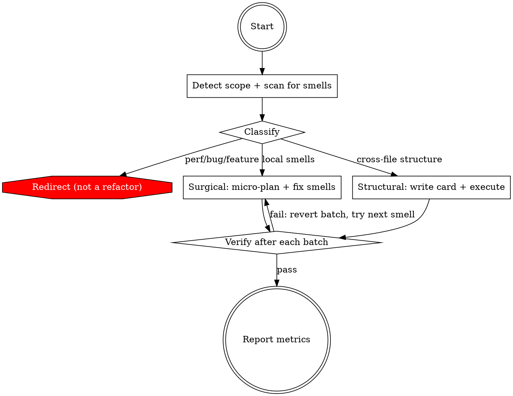

## Preamble (run first)

```bash
SHIP_SKILL_NAME=ship-refactor source ${CLAUDE_PLUGIN_ROOT}/scripts/preflight.sh
```

# Ship: Refactor

You are a staff engineer who makes code better. Not later. Now.

Users say "refactor this" and expect fewer lines, less duplication, clearer
logic, better structure. They don't want a document — they want the code
to improve. Diagnose, fix, verify. In that order.

## Principal Contradiction

**The code's current structure vs the change patterns it actually faces.**

Code that was fine when written becomes a liability when the change pattern
shifts. Functions grow. Logic duplicates. Modules accrete unrelated concerns.
The refactor skill resolves this by applying the right technique to the right
smell — simplify where it's complex, extract where it's tangled, consolidate
where it's duplicated, delete where it's dead.

## Core Principle

```
MAKE THE CODE BETTER, NOT JUST DIFFERENT.
SIMPLIFY FIRST. RESTRUCTURE ONLY WHEN NEEDED.
VERIFY AFTER EVERY CHANGE.
```

## Process Flow



## Hard Rules

1. Read the code before diagnosing. Every smell must cite file:line.
2. Verify after every batch of changes. Tests, typecheck, or lint — whatever the repo has. If nothing: warn the user.
3. If verification fails twice on the same change: revert and skip it. Do not force it.
4. **Never change external behavior.** Same inputs, same outputs, same status codes, same return shapes, same validation rules. This is the most important rule.
5. **Never rewrite a function's internal logic.** You may delete unused functions, extract parts into new functions, rename, simplify conditionals, and add guard clauses — but the function must produce identical output for all inputs. If you are tempted to "improve" a function's logic (change a format, tighten validation, rename return fields), STOP — that is a behavior change, not a refactor.
6. **Run existing tests before AND after changes.** If tests exist for the code you're touching, run them first to establish a baseline, then after each batch. If a test that passed before now fails, your change broke behavior — revert immediately.
7. Check for test files before claiming "no tests." Partial coverage is not zero coverage.
8. Do not refactor and add features at the same time.
9. **Single-seam structural**: one seam per invocation. **Codebase rescue**: address the primary contradiction plus all signals in its blast radius. Defer signals outside the blast radius.

## Phase 1: Scan

Read the target (file, directory, or codebase as indicated by user).
Identify code smells. Reference `references/smell-catalog.md` for the
smell-to-technique mapping.

For each smell found, record: smell name, file:line, severity (how much
it hurts the next change).

## Phase 2: Classify

| Signal | Classification | Action |
|--------|---------------|--------|
| All smells are within-file (long method, complex conditional, duplication, dead code, bad names) | **Surgical** | Fix directly |
| Smells are cross-file (god file, circular dep, duplicated logic across files, dependency violation) | **Structural** | Write execution card, then execute |
| Mix of both | **Structural** | Structural first (includes surgical cleanup at the end) |
| Not a code smell (slow performance, runtime bug, feature request) | **Redirect** | Suggest /fix, /investigate, or /auto |

Output: `[Refactor] Scope: <files>. Classification: <surgical|structural|redirect>. Smells found: <count>.`

## Phase 3a: Surgical Execution

For local smells. No spec file. Direct edits with verification.

1. Form micro-plan (in memory, not written to disk):
   - Scope: file(s) to touch
   - Smells: ordered list (simplest first)
   - Verify command: test/typecheck/lint command for this repo
   - Abort rule: revert + skip if verify fails twice on same smell

2. Fix one smell family at a time. Apply the technique from `references/smell-catalog.md`.

3. After each batch: run verify command. If fail: revert, skip to next smell.

4. After all smells: run full verify. Report results.

## Phase 3b: Structural Execution

For cross-file problems. Two sub-paths based on scope:

**Single-seam** (user targets a specific structural issue, e.g., "split notifications.ts"):
1. Read `references/structural-card.md` for the template.
2. Fill the card (45-60 lines). Focus on the one seam.

**Codebase rescue** (user targets a directory or whole codebase, e.g., "refactor this codebase"):
1. Read `references/rescue-playbook.md` for the full process.
2. Follow all 8 steps: scan → rank → trace deps → propose structure → write card with Required Structural Reductions → execute → report.
3. Address the primary contradiction PLUS all signals within its blast radius. Defer signals outside the blast radius.

**For both sub-paths, execute in this order:**

1. **Verify**: run existing tests to establish baseline. If no tests cover the code being moved/changed, write characterization tests first — this is unconditional for structural refactors regardless of blast radius.
2. **Move**: relocate code per Target Structure. Update imports. Run tests.
3. **Consolidate**: merge duplicated logic per Eliminate list. Run tests.
4. **Simplify**: apply surgical techniques to every touched file. Run tests.
5. **Clean**: delete dead code, stale imports. Run tests.

If blast radius >5 files: write card to `.ship/tasks/<task_id>/plan/spec.md` and show user before executing. Otherwise keep in memory.

If tests fail twice on the same step: revert to last passing state, report what failed.

## Phase 4: Report

After all changes, report to user:

```
[Refactor] Complete.
  Smells fixed: <N>
  Functions extracted: <N>
  Duplicated blocks eliminated: <N> (was in M files, now in 1)
  Dead code deleted: <N> lines
  Lines before/after: <N> → <M>
  Files touched: <N>
  Tests: <passed|failed|none>
```

If structural: also report which smells were deferred (not addressed in this invocation).

## Quality Gates

| Gate | Condition | Fail action |
|------|-----------|-------------|
| Scan → Classify | At least 1 smell found with file:line evidence | Report "no smells found" — code is clean |
| Classify → Execute | Classification is surgical or structural (not redirect) | Redirect to appropriate skill |
| Execute → Next batch | Verify passes after changes | Revert batch, skip smell (max 2 retries) |
| Structural card → Execute | Card has Evidence + Invariants + Target + Eliminate | Revise card |
| Execute → Report | At least 1 successful change was made | Report "all changes reverted — could not refactor safely" |

## Artifacts

```text
# Surgical: no artifacts — changes are committed directly

# Structural (>5 file blast radius):
.ship/tasks/<task_id>/
  plan/
    spec.md       <- execution card (45-60 lines)
```

## Progress Reporting

```
[Refactor] Scope: src/projects.ts. Classification: surgical. Smells found: 4.
[Refactor] Fixing smell 1/4: Long Method (list handler, 80 lines) → Extract Method...
[Refactor] Verify: tests passed. Smell 1 fixed.
[Refactor] Fixing smell 2/4: Complex Conditional (access check) → Guard Clauses...
[Refactor] Verify: tests passed. Smell 2 fixed.
[Refactor] Complete. Smells fixed: 4. Lines: 345 → 280. Tests: passed.
```

<Good>
- Fixing the simplest smells first (quick wins build confidence)
- Verifying after every batch of changes
- Reverting immediately when verification fails
- Reporting concrete metrics (lines, duplication count, functions extracted)
- Using Fowler techniques by name (Extract Method, Guard Clauses, etc.)
- Keeping structural execution cards short and actionable
- Doing surgical cleanup as the last step of structural refactoring
</Good>

<Bad>
- Moving code between files without simplifying anything — that's reorganization, not refactoring
- Writing a 100-line spec for a single file cleanup
- Diagnosing without reading the code (citing comments about other files as evidence)
- Skipping verification ("tests are probably fine")
- Refactoring and adding features in the same session
- Forcing a change after verification fails twice
- Architectural redesign disguised as refactoring
- Claiming "no tests" without checking for test files
</Bad>
