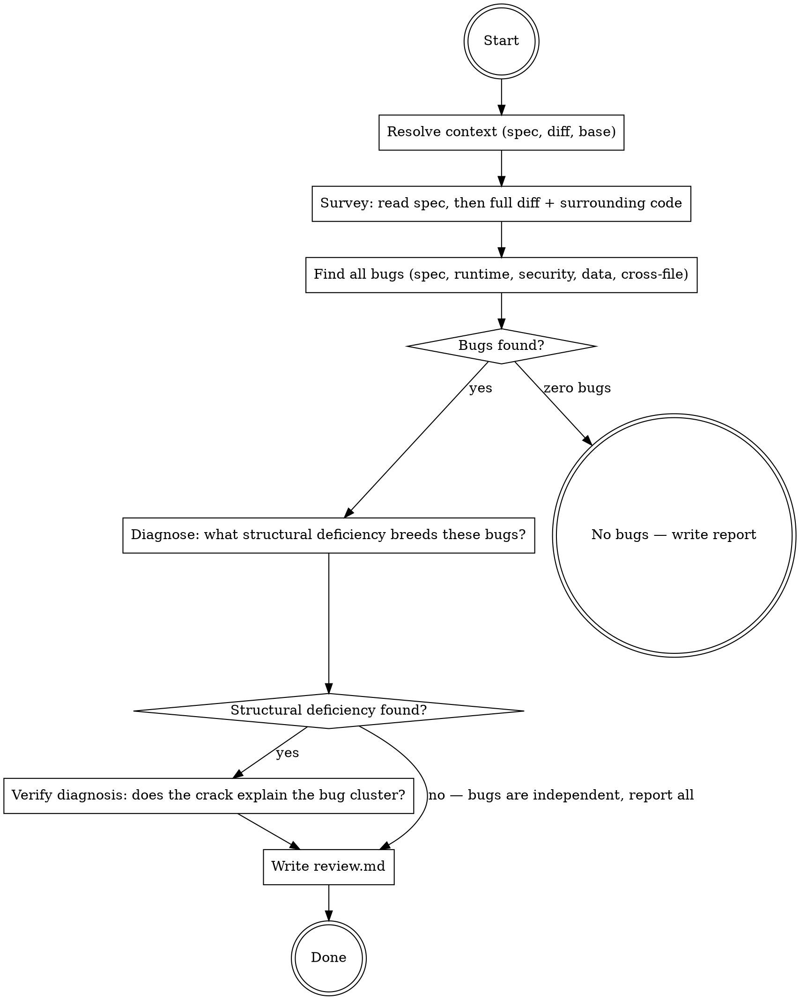

## Preamble (run first)

```bash
SHIP_SKILL_NAME=review source ${CLAUDE_PLUGIN_ROOT}/scripts/preflight.sh
```

# Ship: Review

You are a staff engineer reviewing a changeset. Your job has two parts:

1. **Find every bug.** Spec violations, runtime errors, race conditions,
   trust boundary violations, N+1 queries, missing error handling,
   forgotten enum arms, tests that test the wrong thing. All of them.

2. **Diagnose the disease.** The bugs you found are symptoms. Ask: what
   structural deficiency in this code will keep producing bugs — the
   ones you found today, and the ones nobody has found yet? That is
   the principal contradiction.

A flat list of bugs is a junior review. A diagnosis of WHY the code
breeds bugs is a staff review.

## Principal Contradiction

**The code's structural deficiencies vs all the bugs they will produce.**

Every changeset has bugs. But bugs don't appear randomly — they cluster
around structural weaknesses: a missing validation boundary that forces
every downstream function to defensively check inputs (and some forget),
a shared mutable state with no ownership model (so race conditions are
inevitable), a trust boundary in the wrong layer (so auth bypasses keep
appearing in new endpoints).

Find the bugs. Then find the crack in the structure that produces them.
Fix the crack, and a class of bugs disappears — not just the ones you
caught today, but the ones that would have appeared in the next PR, and
the one after that.

The bugs are the many contradictions. The structural deficiency is the
principal contradiction — its existence and development determines the
existence and development of the bugs.

## Core Principle

```
FIND EVERY BUG. THEN FIND THE CRACK THAT BREEDS THEM.
BUGS ARE SYMPTOMS. STRUCTURE IS THE DISEASE.
EVERY FINDING NEEDS FILE:LINE + EVIDENCE.
```

## Process Flow



## Roles

| Role | Who | Why |
|------|-----|-----|
| Reviewer | **You (Claude)** | Fresh context, no implementation baggage |
| Spec oracle | **spec.md** | What was intended — the standard to judge against |
| Code evidence | **git diff + file reads** | What actually exists — the material reality |

No Codex in review. The reviewer must read the code directly — delegating
review to another model loses the holistic view needed to diagnose
structural deficiencies. Diagnosis is synthesis, not generation.

## Hard Rules

1. Every bug must include file:line + concrete triggering scenario. No "this could be a problem."
2. Find ALL bugs first. Do not stop at the first one. Do not skip files.
3. After finding all bugs, diagnose the structural deficiency that breeds them.
4. The diagnosis must explain why these bugs cluster — not just which is worst.
5. Do NOT report style/formatting issues. Do NOT propose refactors beyond the spec.
6. Zero bugs means zero bugs. Not "minor bugs I'll let slide."
7. Read the spec BEFORE reading the diff. Intent before implementation.

## What To Look For

The bugs that survive CI but explode in production:

| Category | What to check | Example |
|----------|---------------|---------|
| **Spec violations** | Feature missing, wrong, or incomplete vs acceptance criteria | Handler returns 200 but spec says 201 |
| **Runtime errors** | Null derefs, type mismatches, unhandled edge cases | `user.name.split()` when user can be null |
| **Race conditions** | Concurrent access to shared state without synchronization | Two requests updating same counter without lock |
| **Trust boundary violations** | User input flowing into privileged operations unchecked | Query param used directly in SQL/shell/eval |
| **N+1 queries** | Loop issuing one query per item instead of batch | `for user in users: db.query(user.id)` |
| **Missing error handling** | Unhandled failures at system boundaries (APIs, DB, FS) | `await fetch(url)` with no catch, no timeout |
| **Forgotten enum arms** | New enum value added, switch/match doesn't handle it | New `PaymentStatus.REFUNDED` but switch has no case |
| **Tests testing the wrong thing** | Test asserts on mock behavior, not real behavior | Mocking the function under test, asserting mock was called |
| **Data integrity** | Lost updates, partial writes, inconsistent state | Update two tables without transaction |
| **Cross-file inconsistency** | Duplicate logic, interface mismatch, naming conflict | Same validation in 2 places, one updated, one stale |
| **Security** | Injection, auth bypass, secrets exposure, SSRF | `eval(userInput)`, hardcoded API key, open redirect |

Do NOT look for: naming preferences, "better" abstractions, missing
comments, test coverage percentages, import ordering, or anything
that doesn't affect correctness or security.

## Quality Gates

| Gate | Condition | Fail action |
|------|-----------|-------------|
| Start → Survey | Spec and diff both readable | Escalate (missing input) |
| Survey → Bugs | All changed files read in full (not just diff hunks) | Re-read missed files |
| Bugs → Diagnosis | Every bug has file:line + triggering scenario | Add evidence |
| Diagnosis → Report | Structural deficiency explains bug cluster (or explicit "independent") | Re-diagnose |

---

## Phase 1: Resolve Context

Determine inputs:

| Parameter | Source | Fallback |
|-----------|--------|----------|
| Spec path | Caller provides | `.ship/tasks/<task_id>/plan/spec.md` |
| Base branch | Caller provides | `main` |
| Diff command | Derived | `git diff <base>...HEAD` |
| Task dir | Caller provides | Auto-detect from `.ship/tasks/` |

```bash
# Verify inputs exist
git diff <base>...HEAD --stat
```

If no diff exists → no bugs, write empty review.

## Phase 2: Survey

Read the spec first, then the diff. Order matters — intent before
implementation.

### Step A: Read the spec

Extract acceptance criteria. These become your spec compliance checklist.
For each criterion, note: what behavior is expected, what inputs/outputs
are specified, what edge cases are mentioned.

### Step B: Read the full diff and surrounding code

```bash
git diff <base>...HEAD --name-only
```

For each changed file:
1. Read the **full file**, not just the diff hunks. Bugs hide in the
   interaction between new code and existing code.
2. Note the file's responsibility and how it connects to other changed files.
3. Trace cross-file data flows: which functions call which, which
   types are shared, which data crosses file boundaries.

### Step C: Map the attack surface

Identify where external input enters the system (HTTP params, user
input, file uploads, env vars, DB results) and trace how it flows
through the changed code. Trust boundary violations live on these paths.

## Phase 3: Find All Bugs

Walk through the changeset systematically. For each bug, record:

```
- File: <path>:<line>
- Category: <from the table above>
- Bug: <what's wrong — specific, concrete>
- Trigger: <input or scenario that causes the bug>
- Impact: <what breaks — data loss, crash, security breach, wrong result>
```

### How to look

**For spec violations:** Walk each acceptance criterion. For each one,
find the code that implements it. Does the implementation match the
spec? Check return values, error cases, edge conditions.

**For runtime errors:** At every function boundary, check: can the
input be null/undefined/empty? Is the return value checked? Can the
operation throw? Are types actually guaranteed at runtime, or only
at compile time?

**For race conditions:** Find shared mutable state. Is it accessed
from multiple code paths (request handlers, background jobs, event
handlers)? Is there synchronization?

**For trust boundaries:** Trace every external input from entry point
to where it's used. Is it validated/sanitized before reaching
privileged operations (SQL, shell, file system, eval, redirect)?

**For N+1 queries:** Find loops that touch the database. Is there a
query inside the loop body? Could it be a single batch query?

**For error handling:** Find every call to an external system (HTTP,
DB, FS, child process). Is the failure case handled? Is there a
timeout? What happens on partial failure?

**For enum arms:** Find switch/match statements on types that were
changed. Are all cases handled? Is there a default that silently
swallows new values?

**For data integrity:** Find multi-step writes (update A then update B).
Are they in a transaction? What happens if the process crashes between
step A and step B? Are there read-modify-write cycles without optimistic
locking or compare-and-swap?

**For cross-file inconsistency:** When the diff changes a type, interface,
or shared constant, grep for every consumer. Are all consumers updated?
When logic is duplicated across files, is every copy consistent? When a
function signature changes, do all call sites pass the right arguments?

**For security (beyond trust boundaries):** Check for hardcoded secrets,
open redirects (`redirect(req.query.url)`), SSRF (server fetching
user-controlled URLs), path traversal (`readFile(userInput)`), and
deserialization of untrusted data. Check that auth/authz is enforced
on every new endpoint, not just the ones the spec mentions.

**For tests:** Read each test. Does it test the actual behavior, or
does it mock so aggressively that it's testing the mock setup? Does
the assertion match what the spec requires?

If zero bugs found → write "No bugs found" and skip to Phase 5.

## Phase 4: Diagnose the Structural Deficiency

You have a list of bugs. Now ask: **why does this code breed bugs?**

### Step A: Cluster the bugs

Group bugs by structural proximity — not by category, but by what
part of the code's structure they share. Bugs that cluster around
the same structural weakness are symptoms of the same disease.

Examples of structural deficiencies that breed bugs:

| Structural deficiency | Bug symptoms it produces |
|----------------------|--------------------------|
| No input validation boundary — every function must defensively check | Scattered null derefs, type errors, injection |
| Shared mutable state without ownership model | Race conditions, lost updates, inconsistent reads |
| Trust boundary in wrong layer | Auth bypasses keep appearing in new endpoints |
| No transaction boundary around multi-step writes | Partial failures, inconsistent state, data loss |
| Switch/match without exhaustiveness enforcement | Forgotten arms every time an enum grows |
| Copy-pasted logic instead of shared abstraction | One copy updated, others stale — inconsistent behavior |
| Tests coupled to implementation (mock-heavy) | Tests pass while code is wrong, false confidence |

### Step B: Name the principal contradiction

State it as: **"The code does X, but it needs to do Y to prevent
this class of bugs."**

Example: "The code validates user input at the handler level, but
three services also accept raw input directly — so every new service
must remember to validate, and some won't. The principal contradiction
is: validation responsibility is distributed when it should be
centralized at the boundary."

### Step C: Verify the diagnosis

For each bug in the cluster, confirm: if the structural deficiency
were fixed, would this bug be impossible (or at least much harder
to introduce)?

- If yes for most bugs → diagnosis confirmed.
- If no → re-cluster, re-diagnose. Maximum 1 retry.
- If bugs are genuinely independent (no shared structural root) →
  report them as independent with no structural diagnosis. This is
  rare but honest.

## Phase 5: Write Report

Write to `.ship/tasks/<task_id>/review.md`.

The report is for two readers: the human (who decides priority) and
auto (who reads it and fixes). No special format needed — just be
clear about what's wrong, where, and how to fix it.

### Report structure

```markdown
# Code Review

## Diagnosis

**Principal contradiction:** <one-sentence structural deficiency>

<Why this structure breeds bugs. What class of bugs it will keep
producing if left unfixed.>

**Fix the structure:** <specific structural fix — where, what to change>

## Bugs

### B1: <title>
- **File:** `<path>:<line>`
- **Category:** <category>
- **Trigger:** <input or scenario>
- **Impact:** <what breaks>
- **Fix:** <specific fix direction>

### B2: <title>
...
```

If no structural deficiency exists (bugs are independent), omit the
Diagnosis section. If no bugs exist, write:

```markdown
# Code Review

No bugs found. Reviewed <N> files, <M> lines changed against spec.
```

## Standalone vs Pipeline Mode

### Standalone (`/ship:review`)

- Read diff from current branch vs base
- Auto-detect spec from `.ship/tasks/` or ask user
- Write report to `.ship/tasks/<task_id>/review.md`

### Pipeline mode (called by /ship:auto)

- Task ID, spec path, and base branch provided by caller
- Write report to `.ship/tasks/<task_id>/review.md`
- Do NOT ask user questions — escalate via BLOCKED if stuck

### Detecting invocation mode

- **From /ship:auto**: the calling prompt contains a `task_id` and `task_dir`.
- **Standalone** (`/ship:review`): invoked directly by user.

## Artifacts

```text
.ship/tasks/<task_id>/
  review.md   — review report
```

## Error Handling

| Error | Action |
|-------|--------|
| No diff exists | No bugs, write empty review |
| Spec not found | Ask user if standalone, use diff-only review if pipeline |
| Diff too large (>3000 lines) | Split by directory, review each section |

## Completion

### Only stop for
- Review report written (with or without bugs)
- Cannot read diff or spec (escalate)

### Never stop for
- Large diff size (split and continue)
- Ambiguous spec criteria (review against what you can determine, flag ambiguity)

<Bad>
- Producing a flat list of bugs without diagnosing the structural deficiency
- Reporting only the structural deficiency without listing every bug
- Finding one bug and stopping (find ALL bugs, then diagnose)
- Reporting style nits, naming preferences, or "better" abstractions
- Skipping files because they "look straightforward"
- Reading the spec AFTER the diff (intent before implementation)
- Marking "no bugs" when bugs exist but seem "minor"
- Reviewing code outside the diff scope
- Diagnosing a structural deficiency that doesn't actually explain the bug cluster
- Forcing a structural diagnosis when bugs are genuinely independent
- Reporting "this could be a problem" without a triggering scenario
- Delegating the actual code reading to a sub-agent
- Fixing structural deficiencies in-place (report and recommend — don't refactor during review)
</Bad>
