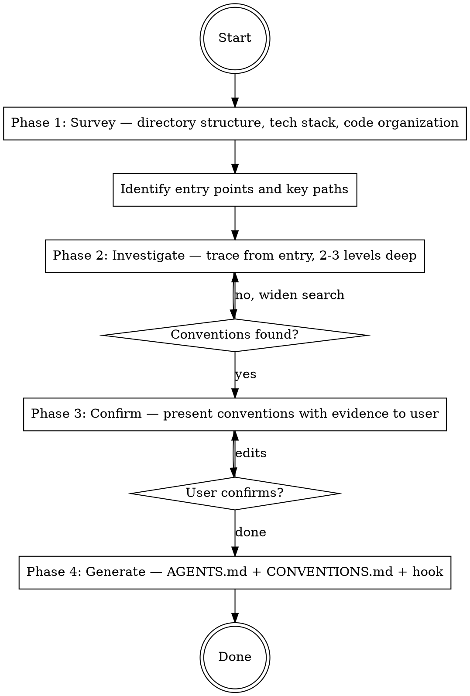

# Ship: Setup Harness

Read the project. Discover conventions linters can't cover. Make them
enforceable via AI.

## Principal Contradiction

**The project's implicit conventions vs. mechanically enforceable rules.**

Every project has conventions — in error handling, in validation patterns,
in module boundaries. Most exist only in the team's collective memory or
scattered across code review comments. Setup-harness makes them explicit,
machine-readable, and enforceable.

Linters and formatters handle syntax and style. This skill handles
everything else — the architectural and design patterns that require
understanding code intent.

## Core Principle

```
NO INVESTIGATION, NO RIGHT TO SPEAK.
READ THE CODE BEFORE WRITING ANY RULES.
```

Rules that don't come from the actual codebase are dogma. Every rule
must trace back to a pattern you observed in the code, with file:line
evidence. If you can't point to where the pattern exists, the rule
doesn't belong.

## Process Flow



## Hard Rules

1. Read the code before writing any rules.
2. Every rule must have file:line evidence.
3. Every convention must be observed in 3+ files to qualify.
4. Skip conventions already enforced by the project's linter/formatter.
5. Two user interactions max: convention confirmation (Phase 3) and existing file replacement (Phase 4).

---

## Phase 1: Survey

Do NOT read file contents yet.

### Step A: Directory structure

List the project's file tree (excluding .git, build output, dependency
directories, and other generated files). Limit to ~200 files.

Record: languages (file extensions), code organization (flat/layered/modular/monorepo), source vs config vs tests vs docs.

### Step B: Monorepo detection

If Step A reveals multiple sub-projects (each with their own manifest
file, separate language, or independent directory structure), this is
a monorepo.

For monorepos, identify sub-projects and their recent activity:

```bash
# Count commits per top-level directory in the last 30 days
git log --since="30 days ago" --name-only --pretty=format: | \
  grep -v '^$' | cut -d/ -f1-2 | sort | uniq -c | sort -rn | head -10
```

Record each sub-project: path, language, manifest file, commit count.

### Step C: Project manifest

**Single repo:** read the main manifest file.
**Monorepo:** read the manifest for each active sub-project.

Record per sub-project: frameworks, linter/formatter, test framework, commands.

### Step D: Identify entry points

**Single repo:** record main entry file and key call paths.
**Monorepo:** record entry point per active sub-project.

### Step E: Check existing config

Look for linter/formatter config, project documentation, and AI
instruction files in the repo root and in each sub-project directory.

Record as a list: `<tool/file>: <what it enforces>`. This list is used
in Phase 2 filtering and Phase 3 "skipped" display.

---

## Phase 2: Investigate

Trace from entry points 2-3 levels deep. Find conventions that
linters can't cover.

**Monorepo:** investigate each active sub-project independently.
Each sub-project may have different conventions.

### Method

Start at the entry point. Follow calls inward 2-3 levels. Record any
pattern repeated across 3+ files.

Read each file fully. Stop when you stop finding new patterns.

**Fallback prompts** (use only if fewer than 2 patterns found after
tracing 2-3 levels):
- Error handling, validation, module boundaries, naming
- Logging, API contracts, data access, security

### Filter

For each pattern: could the project's existing linter enforce this?
- Yes → skip silently. Don't include in findings or output.
- No → this is a harness convention

### Record

```
Sub-project: <path or "root"> (monorepo only)
Convention: <name>
Evidence: <file1:line>, <file2:line>, <file3:line>
Consistency: <N files follow / M files checked>
Description: <one sentence>
```

---

## Phase 3: Confirm

Use AskUserQuestion:

**Single repo:**
```
I read your codebase and found these conventions that linters can't cover:

  ✓ [1] <name>
        Evidence: <file1:line>, <file2:line> (<N/M files>)

  ✓ [2] <name>
        Evidence: <file1:line>, <file2:line> (<N/M files>)

Anything else AI should know about this project? (conventions,
gotchas, boundaries, or context not visible in the code)
```

**Monorepo:**
```
I detected a monorepo and investigated active sub-projects:

  [go-services/] (N commits in 30 days)
    ✓ [1] <name>
          Evidence: <file1:line>, <file2:line> (<N/M files>)
    ✓ [2] <name>
          Evidence: ...

  [frontend/] (N commits in 30 days)
    ✓ [3] <name>
          Evidence: ...

  Not investigated (inactive):
    - app/ (0 commits)
    - shipcli-ts/ (0 commits)

Anything else AI should know? Want me to investigate any inactive sub-project?
```

Options:
- A) Generate as shown
- B) I want to toggle or edit (specify which numbers and changes)
- C) Cancel — do not generate anything

If B: apply edits, re-present once with AskUserQuestion. Max two rounds.

If user adds a convention via free text that was not observed in code,
investigate it: search the codebase for evidence. If evidence found,
add it. If not, tell the user no evidence was found and ask if they
still want to include it as a user-defined rule (no file:line evidence).

If user provides additional context (gotchas, boundaries, etc.),
incorporate it into AGENTS.md (Gotchas, Boundaries, or Architecture
sections as appropriate) and into CONVENTIONS.md if it describes an
enforceable convention.

---

## Phase 4: Generate

### Step A: Generate AGENTS.md

Read `references/agents-md.md` for structure. Fill from Phase 1-2 findings.
Omit sections with no content. Keep under 200 lines per file.

AGENTS.md includes ALL discovered conventions.

**Single repo:** generate or update root `AGENTS.md`.

**Monorepo:** update each sub-project's local `AGENTS.md` with that
sub-project's conventions. If a local AGENTS.md doesn't exist, create it.
Root AGENTS.md gets repo-wide conventions only (commit format, shared
tooling, cross-project boundaries). Sub-project-specific conventions
go in the sub-project's AGENTS.md.

**If an `AGENTS.md` already exists**, use AskUserQuestion:

```
AGENTS.md already exists. Here's what would change:

<show diff summary: sections added/changed/removed>
```

Options:
- A) Replace with new version
- B) Merge — add new sections, keep existing content
- C) Skip — don't touch AGENTS.md

For monorepos, ask once per file that needs changes (batch into one
AskUserQuestion if possible).

### Step B: Generate CONVENTIONS.md

Write to `.ship/rules/semantic/CONVENTIONS.md`. Only conventions that
linters can't cover (the ones confirmed in Phase 3).

Format per convention:

```markdown
## <Convention name>
Scope: <glob pattern>
Description: <one sentence>
Correct (from <file:line>):
\`\`\`
<actual code from the codebase>
\`\`\`
Incorrect:
\`\`\`
<constructed counter-example showing what NOT to do>
\`\`\`
Rationale: <one sentence>
```

- Correct examples must come from the codebase
- Incorrect examples are constructed counter-examples (not from codebase)

**If `CONVENTIONS.md` already exists**, use AskUserQuestion:

```
CONVENTIONS.md already exists with <N> conventions.
```

Options:
- A) Replace entirely with new conventions
- B) Merge — add new conventions, keep existing ones
- C) Skip — don't touch CONVENTIONS.md

### Step C: Register hook

Use AskUserQuestion to choose where to register the hook:

```
Where should the convention enforcement hook be registered?
```

Options:
- A) Project shared (`.claude/settings.json`) — all team members get enforcement
- B) Project local (`.claude/settings.local.json`) — only you, not committed
- C) User global (`~/.claude/settings.json`) — all your projects
- D) Skip — don't register a hook

Read the chosen settings file (create `{}` if missing).
Add this entry to `hooks.PreToolUse` array, preserving existing entries:

```json
{
  "matcher": "Write|Edit",
  "hooks": [
    {
      "type": "command",
      "command": "bash ${CLAUDE_PLUGIN_ROOT}/scripts/check-conventions.sh",
      "statusMessage": "Reviewing coding conventions..."
    }
  ]
}
```

The script is part of the ship plugin (`scripts/check-conventions.sh`). It:
1. Reads hook input JSON from stdin
2. Checks if the file matches any scope in CONVENTIONS.md
3. Sends the code + conventions to `claude -p` (Haiku, print mode)
4. Exit 0 = pass, exit 2 = violation (stderr has details)

Skip if an identical hook entry already exists.

### Step D: Update .gitignore

Add `.ship/tasks/` and `.ship/audit/` if not present.
Do NOT gitignore `.ship/rules/`.

If user chose project shared hook (Step C option A) and `.claude/` is
fully gitignored, change to:
```
.claude/*
!.claude/settings.json
```

### Step E: Commit

Stage AGENTS.md, CONVENTIONS.md, .gitignore, and the chosen settings
file (if project shared was selected in Step C). Skip settings file
if user chose local, global, or skip.

```bash
git add AGENTS.md .ship/rules/semantic/CONVENTIONS.md .gitignore
# Only if project shared hook was chosen:
git add .claude/settings.json
git commit -m "feat(harness): generate AGENTS.md and coding conventions

AGENTS.md: AI handbook with commands, repo map, and conventions.
CONVENTIONS.md: <N> conventions for semantic enforcement hook."
```

---

## Completion

After commit, output:

**Single repo:**
```
[Harness] Setup complete.

AGENTS.md: <generated | merged | skipped>
CONVENTIONS.md: <N> conventions
  1. <name> — <evidence summary>
  2. <name> — <evidence summary>
  ...
Hook: registered in .claude/settings.json
```

**Monorepo:**
```
[Harness] Setup complete.

Sub-projects investigated: <list>
  [go-services/] AGENTS.md: <merged>, <N> conventions
  [frontend/] AGENTS.md: <generated>, <N> conventions
Not investigated: <list>

CONVENTIONS.md: <total N> conventions across <M> sub-projects
Hook: registered in .claude/settings.json
```

---

## What This Skill Does NOT Do

- Install linters, formatters, or pre-commit hooks (use /ship:setup-infra)
- Generate shell scripts or structural check scripts
- Read the entire codebase (targeted investigation only)

<Bad>
- Writing rules without reading the code first
- Generating rules from templates or presets
- Reading every file in the project
- Including a convention observed in fewer than 3 files
- Generating a convention without file:line evidence
- Including a pattern the linter already enforces
- Asking the user more than twice
</Bad>
