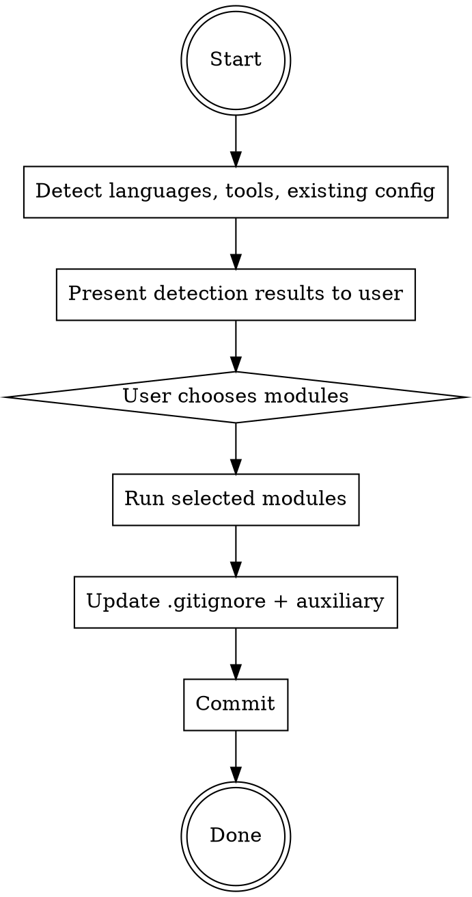

# Ship: Setup Infra

One command. Repo goes from bare tooling to fully configured
infrastructure. Idempotent.

## Principal Contradiction

**Missing tooling slows development vs installing tools the project
didn't choose.**

Setup-infra detects what exists and fills gaps. It never invents a
default stack when the repo already picked one.

## Core Principle

```
DETECT FIRST, NEVER ASSUME, RESPECT EXISTING CONFIG.
```

## Process Flow



## Hard Rules

1. Detect first, never assume. Never invent a default stack.
2. One user interaction: module selection. Do not ask repeatedly.
3. Execute ONLY the modules the user selected.
4. Respect existing config. Show diff and ask before replacing.

## Quality Gates

| Gate | Condition | Fail action |
|------|-----------|-------------|
| Pre-flight → Detect | git available, cwd is repo (or init) | Stop with message |
| Detect → Choose | At least one language detected | AskUserQuestion for manual config |
| Choose → Modules | User made a selection | Wait for response |
| Modules → Done | Selected modules committed | Verify commits exist |

---

## Phase 1: Detect (automatic)

No user interaction in this phase.

### Step A: Pre-flight

- Check `git` is available. If missing, stop.
- Check whether cwd is a git repo with `git rev-parse --is-inside-work-tree`.
- If not a repo, run `git init`.

### Step B: Language + Package Manager

Scan repo files, then verify package manager / build tool exists on PATH.

| Language | File markers | Package manager / tool check |
|---|---|---|
| TypeScript / JavaScript | `package.json`, `tsconfig.json`, `*.ts`, `*.tsx`, `*.js`, `*.jsx` | `npm`, `pnpm`, `yarn`, `bun` |
| Python | `pyproject.toml`, `requirements*.txt`, `setup.py`, `*.py` | `uv`, `poetry`, `pip`, `pip3` |
| Java | `pom.xml`, `build.gradle*`, `*.java` | `mvn`, `gradle` |
| C# | `*.csproj`, `*.sln`, `*.cs` | `dotnet` |
| Go | `go.mod`, `*.go` | `go` |
| Rust | `Cargo.toml`, `*.rs` | `cargo` |
| PHP | `composer.json`, `*.php` | `composer` |
| Ruby | `Gemfile`, `*.rb` | `bundle`, `gem` |
| Kotlin | `build.gradle*`, `settings.gradle*`, `*.kt` | `gradle`, `mvn` |
| Swift | `Package.swift`, `*.swift`, `*.xcodeproj` | `swift`, `xcodebuild` |
| Dart / Flutter | `pubspec.yaml`, `*.dart` | `dart`, `flutter` |
| Elixir | `mix.exs`, `*.ex`, `*.exs` | `mix` |
| Scala | `build.sbt`, `*.scala` | `sbt`, `mill` |
| C / C++ | `CMakeLists.txt`, `Makefile`, `*.c`, `*.cc`, `*.cpp`, `*.h`, `*.hpp` | `cmake`, `make`, detected compiler |

### Step C: Toolchain Detection

For each detected language, scan all mainstream tools by category:
linter, formatter, type checker, test runner.

Status per tool:
- `ready`: executable and config are usable as-is
- `missing`: repo has no configured tool for that category
- `broken`: config references unavailable or misconfigured tool

Reference: `references/toolchain-matrix.md` for the full detection matrix.

### Step D: Existing Configuration

Check and store:
- `.gitignore`
- `.github/workflows/*.yml`
- `.github/dependabot.yml`
- Pre-commit config (`.husky/`, `.pre-commit-config.yaml`, `lint-staged` in package.json)

## Phase 2: Choose (1 user decision)

Use AskUserQuestion after detection. The prompt must show:

- Detection results by language and tool, including `ready` / `missing` / `broken`
- Available modules:

```
Select modules to configure:

  1. [x] Install missing tools (linter, formatter, type checker)
  2. [x] Pre-commit hooks (lint + format on commit)
  3. [ ] CI/CD (GitHub Actions)
  4. [ ] Dependabot
  5. [ ] AI Code Review
```

Options:
- A) Install all recommended
- B) Custom selection (specify numbers)
- C) Skip — I'll configure manually

## Phase 3: Execute modules

**Hard rule:** Execute ONLY the modules the user selected.

| Module | Reference |
|---|---|
| Install Tools | `references/tooling.md` |
| Pre-commit Hooks | configure lint-staged + husky (JS/TS), pre-commit (Python), or equivalent for detected language |
| CI/CD | `references/ci.md` |
| Dependabot | generate `.github/dependabot.yml` |
| AI Code Review | `references/review.md` |

### Pre-commit hook configuration

For each detected language, set up pre-commit to run lint + format:

**JS/TS:** `lint-staged` + `husky`
```json
// package.json
"lint-staged": {
  "*.{ts,tsx,js,jsx}": ["oxlint --fix", "prettier --write"],
  "*.{json,md,yml}": ["prettier --write"]
}
```

**Python:** `.pre-commit-config.yaml` with ruff
**Go:** `.pre-commit-config.yaml` with golangci-lint + gofmt
**Rust:** `.pre-commit-config.yaml` with clippy + rustfmt

Use whatever linter/formatter the project already has configured.
Only add pre-commit wiring, not new tools (unless Install Tools
module was also selected).

After each module, commit atomically:
```
git add <changed files>
git commit -m "<conventional commit message>"
```

## Phase 4: Auxiliary

- Update `.gitignore` with language-specific ignores if not already present.
- Add `.ship/tasks/` and `.ship/audit/` to `.gitignore`.

```
git add .gitignore
git commit -m "chore: update .gitignore"
```

---

## Artifacts

```text
.github/
  workflows/       — CI/CD (if module selected)
  dependabot.yml   — dependency updates (if module selected)
.husky/ or .pre-commit-config.yaml — pre-commit hooks (if module selected)
.gitignore         — updated with language ignores
```

## Reference Files

- `references/toolchain-matrix.md` — full detection matrix for 14 languages
- `references/tooling.md` — tool installation instructions per language
- `references/ci.md` — GitHub Actions CI/CD generation
- `references/review.md` — AI code review workflow setup
- `references/runtime-install-guide.md` — platform-specific runtime installation

## Completion

```text
[Infra] Setup complete.

Modules configured:
  - <module name> — <what was done>
  ...

Next step: /ship:setup-harness to discover and enforce coding conventions.
```

## What This Skill Does NOT Do

- Generate AGENTS.md or CLAUDE.md (use /ship:setup-harness)
- Discover or enforce coding conventions (use /ship:setup-harness)
- Register Claude Code hooks (use /ship:setup-harness)
- Configure deployment or hosting
- Install global packages or use `sudo`
- Replace existing tool configs without asking

<Bad>
- Assuming a language or tool without detecting it
- Installing tools the user didn't select
- Replacing existing config without showing diff
- Generating AGENTS.md (not this skill's job)
- Generating coding convention rules (not this skill's job)
</Bad>
