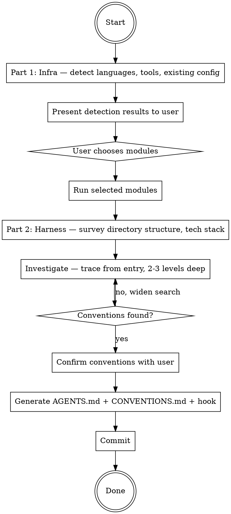

## Preamble (run first)

```bash
SHIP_SKILL_NAME=setup source ${CLAUDE_PLUGIN_ROOT}/scripts/preflight.sh
```

### Auth Gate

If `SHIP_AUTH: not_logged_in`: AskUserQuestion — "Ship requires authentication to use all skills. Login now? (A: Yes / B: Not now)". A → run `ship auth login`, verify with `ship auth status --json`, proceed if logged_in, stop if failed. B → stop.
If `SHIP_AUTO_LOGIN: true`: skip AskUserQuestion, run `ship auth login` directly.
If `SHIP_TOKEN_EXPIRY` ≤ 3 days: warn user their token expires soon.

# Ship: Setup

One command. Repo goes from bare tooling to fully configured infrastructure
with AI-enforced coding conventions. Idempotent.

## Principal Contradiction

**Missing tooling slows development vs installing tools the project didn't
choose.** And: **The project's implicit conventions vs. mechanically
enforceable rules.**

Setup detects what exists and fills gaps, then discovers conventions that
linters can't cover and makes them enforceable via AI.

## Core Principles

```
DETECT FIRST, NEVER ASSUME, RESPECT EXISTING CONFIG.
NO INVESTIGATION, NO RIGHT TO SPEAK. READ THE CODE BEFORE WRITING ANY RULES.
```

## Process Flow



## Hard Rules

1. Detect first, never assume. Never invent a default stack.
2. One user interaction for infra module selection.
3. Execute ONLY the modules the user selected.
4. Respect existing config. Show diff and ask before replacing.
5. Read the code before writing any convention rules.
6. CONVENTIONS.md is for semantic rules only — things that require AI
   judgment. Deterministic checks (regex/grep) go in the pre-commit hook.
7. Do not include style rules. The model follows project style by
   reading the code. Do not include rules the linter already enforces.
8. Three user interactions max for harness: convention confirmation,
   existing file replacement (only if AGENTS.md or CONVENTIONS.md exists),
   and hook location choice.

---

# Part 1: Infrastructure

## Phase 1: Detect (automatic)

No user interaction in this phase.

### Step A: Pre-flight

- Check `git` is available. If missing, stop.
- Check whether cwd is a git repo with `git rev-parse --is-inside-work-tree`.
- If not a repo, run `git init`.

### Step B: Language + Package Manager

Scan repo files, then verify package manager / build tool exists on PATH.

| Language | File markers | Package manager / tool check |
|---|---|---|
| TypeScript / JavaScript | `package.json`, `tsconfig.json`, `*.ts`, `*.tsx`, `*.js`, `*.jsx` | `npm`, `pnpm`, `yarn`, `bun` |
| Python | `pyproject.toml`, `requirements*.txt`, `setup.py`, `*.py` | `uv`, `poetry`, `pip`, `pip3` |
| Java | `pom.xml`, `build.gradle*`, `*.java` | `mvn`, `gradle` |
| C# | `*.csproj`, `*.sln`, `*.cs` | `dotnet` |
| Go | `go.mod`, `*.go` | `go` |
| Rust | `Cargo.toml`, `*.rs` | `cargo` |
| PHP | `composer.json`, `*.php` | `composer` |
| Ruby | `Gemfile`, `*.rb` | `bundle`, `gem` |
| Kotlin | `build.gradle*`, `settings.gradle*`, `*.kt` | `gradle`, `mvn` |
| Swift | `Package.swift`, `*.swift`, `*.xcodeproj` | `swift`, `xcodebuild` |
| Dart / Flutter | `pubspec.yaml`, `*.dart` | `dart`, `flutter` |
| Elixir | `mix.exs`, `*.ex`, `*.exs` | `mix` |
| Scala | `build.sbt`, `*.scala` | `sbt`, `mill` |
| C / C++ | `CMakeLists.txt`, `Makefile`, `*.c`, `*.cc`, `*.cpp`, `*.h`, `*.hpp` | `cmake`, `make`, detected compiler |
| Shell | `*.sh`, `*.bash` (no manifest) | `bash`, `shellcheck` (optional) |

If no language from the table above is detected, the repo may be
documentation-only, config-only, or use an unsupported language.
In that case: skip Install Tools and Pre-commit Hooks modules in
Phase 2 (mark as `n/a`), and proceed directly to Part 2 (Harness).

### Step C: Toolchain Detection

For each detected language, scan all mainstream tools by category:
linter, formatter, type checker, test runner.

Status per tool:
- `ready`: executable and config are usable as-is
- `missing`: repo has no configured tool for that category
- `broken`: config references unavailable or misconfigured tool

Reference: `references/toolchain-matrix.md` for the full detection matrix.

### Step D: Existing Configuration

Check and store:
- `.gitignore`
- `.github/workflows/*.{yml,yaml}`
- `.github/dependabot.yml`
- Pre-commit config: check `git config --get core.hooksPath`, `.ship/hooks/`;
  also detect legacy: `.husky/`, `.pre-commit-config.yaml`, `lint-staged` in package.json

## Phase 2: Choose (1 user decision)

Use AskUserQuestion after detection. The prompt must show:

- Detection results by language and tool, including `ready` / `missing` / `broken`
- Available modules (mark as `n/a` if no supported language detected):

```
Select modules to configure:

  1. [x] Install missing tools (linter, formatter, type checker)
  2. [x] Pre-commit hooks (lint + format on commit)
  3. [ ] CI/CD (GitHub Actions — workflow only, no Dependabot)
  4. [ ] Dependabot (dependency update PRs)
  5. [ ] AI Code Review
```

Options:
- A) Install all recommended
- B) Custom selection (specify numbers)
- C) Skip — I'll configure manually

## Phase 3: Execute modules

**Hard rule:** Execute ONLY the modules the user selected. Each module
is independent. CI/CD does NOT include Dependabot unless module 4 is
also selected.

| Module | Reference |
|---|---|
| Install Tools | `references/tooling.md` |
| Pre-commit Hooks | generate hook scripts in `.ship/hooks/`, set `core.hooksPath`, works across all worktrees |
| CI/CD | `references/ci.md` (generate workflow only, skip Dependabot/labeler sections unless those modules are also selected) |
| Dependabot | `references/ci.md` (Dependabot section only) |
| AI Code Review | `references/review.md` |

### Pre-commit hook configuration

Generate hook scripts in `.ship/hooks/` and set `core.hooksPath` so
hooks work across all worktrees and branches without per-worktree setup.

If `core.hooksPath` is already set to a path other than `.ship/hooks/`,
ask the user before overwriting it.

```bash
mkdir -p .ship/hooks
git config core.hooksPath .ship/hooks
```

Generate `.ship/hooks/pre-commit` with two sections:

1. **Deterministic safety checks** — grep/regex rules from Phase 5
   (type: deterministic). These catch things mechanically.
2. **Lint + format** — run the project's linter/formatter on staged files.

The script must be executable (`chmod +x`).

#### Section 1: Safety checks

Generate checks from Phase 5 deterministic findings. Common examples:

```bash
#!/usr/bin/env bash
set -e
STAGED=$(git diff --cached --name-only --diff-filter=ACM)

# Block secrets and sensitive files
if echo "$STAGED" | grep -qE '\.env$|\.env\.local$|credentials\.json$|\.pem$'; then
  echo "ERROR: Sensitive file staged. Remove it from the commit." >&2
  exit 1
fi

# Check for hardcoded secrets in staged content
if git diff --cached -U0 | grep -qiE '(password|secret|api_key)\s*=\s*["\x27][^"\x27]+["\x27]'; then
  echo "WARNING: Possible hardcoded secret detected. Review before committing." >&2
  exit 1
fi
```

Add project-specific deterministic checks based on Phase 5 findings
(e.g., protected file paths, forbidden SQL patterns, etc.).

#### Section 2: Lint + format

Use the linter/formatter the project already has configured. The
examples below are defaults when no existing tool is detected:

**JS/TS** (example — use the project's actual linter/formatter):
```bash
if command -v npx &>/dev/null && grep -q '"lint-staged"' package.json 2>/dev/null; then
  npx lint-staged
else
  npx oxlint --fix $(echo "$STAGED" | grep -E '\.(ts|tsx|js|jsx)$')
  npx prettier --write $(echo "$STAGED" | grep -E '\.(ts|tsx|js|jsx|json|md|yml)$')
  git add $(echo "$STAGED" | grep -E '\.(ts|tsx|js|jsx|json|md|yml)$')
fi
```

**Python** (example): `ruff check --fix` + `ruff format` on staged `.py` files
**Go** (example): `golangci-lint run` + `gofmt -w` on staged `.go` files
**Rust** (example): `cargo clippy --fix` + `cargo fmt` on staged `.rs` files
**Shell** (example): `shellcheck` on staged `.sh` files (if shellcheck is available)

Only add lint/format wiring, not new tools (unless Install Tools
module was also selected).

If the project already uses `.husky/` or `.pre-commit-config.yaml`,
migrate to `.ship/hooks/`: port the existing hook commands into the
generated script, then remove the legacy config. Ask the user before
removing legacy files.

After each module, commit atomically:
```
git add <changed files>
git commit -m "<conventional commit message>"
```

---

# Part 2: Harness

## Phase 3.5: Harness Audit (only if harness already exists)

Before generating anything, check if the project already has harness
files (AGENTS.md, `.ship/rules/CONVENTIONS.md`, DEVELOPMENT.md, README.md).

If no harness files exist → skip to Phase 4 (full init).

If harness files exist → audit them for freshness using
`references/harness-audit.md`, then present results to the user:

Options:
- A) Fix stale claims and keep accurate ones (recommended)
- B) Regenerate everything from scratch
- C) Skip — don't touch existing harness

If A: update only the stale parts, preserve everything that's still
accurate. Proceed to Phase 4-7 to discover any NEW conventions not
yet covered.

If B: treat as full init — proceed to Phase 4 as if no harness exists.

If C: skip Part 2 entirely.

## Phase 4: Survey

Do NOT read file contents yet. Reuse language/structure data from Part 1.

### Step A: Monorepo detection

If Part 1 revealed multiple sub-projects (each with their own manifest
file, separate language, or independent directory structure), this is
a monorepo.

For monorepos, identify sub-projects and their recent activity:

```bash
# Count commits per top-level directory in the last 30 days
git log --since="30 days ago" --name-only --pretty=format: | \
  grep -v '^$' | cut -d/ -f1-2 | sort | uniq -c | sort -rn | head -10
```

Record each sub-project: path, language, manifest file, commit count.

### Step B: Identify entry points

**Single repo with application code:** record main entry file and key call paths.
**Monorepo:** record entry point per active sub-project.
**No clear entry point** (library, plugin, config-only, shell scripts):
use the most-modified files in the last 30 days as starting points for
investigation. Run:
```bash
git log --since="30 days ago" --name-only --pretty=format: | \
  grep -v '^$' | sort | uniq -c | sort -rn | head -10
```

---

## Phase 5: Investigate

Find rules that **only AI can judge** — things where violating them
causes bugs, security issues, or architectural breakage, but a regex
or linter cannot detect the violation.

Do NOT look for code style patterns (naming, formatting, import order).
The model already understands those from reading the code. Instead, look
for **constraints that the model would violate because it lacks context**.

**Monorepo:** investigate each active sub-project independently.

### Method A: Code investigation

Trace from entry points (or most-active files) 2-3 levels deep.
Look for:

- **Hidden contracts** — functions that look simple but have
  preconditions, side effects, or ordering requirements not obvious
  from the signature
- **Architectural boundaries** — layers or modules that must not
  be bypassed, but the code doesn't enforce it (no linter rule)
- **Security-sensitive paths** — auth flows, permission checks,
  data sanitization where removing or simplifying would cause a
  vulnerability
- **Domain-specific traps** — business logic that looks like it
  could be simplified but cannot (e.g., price in cents not dollars,
  timezone handling, regulatory constraints)

### Method B: Git history investigation

Scan git history for evidence of past mistakes:

```bash
# Find reverted commits (things that were tried and failed)
git log --oneline --grep="revert" --since="6 months ago" | head -10

# Find bug fix commits (what went wrong before)
git log --oneline --grep="fix" --grep="bug" --all-match --since="6 months ago" | head -10

# Find files with the most bug fixes (error-prone areas)
git log --oneline --grep="fix" --since="6 months ago" --name-only --pretty=format: | \
  grep -v '^$' | sort | uniq -c | sort -rn | head -10
```

For interesting reverts or bug fixes, read the commit diff to
understand what constraint was violated.

### Filter

For each finding, apply this test:

1. **Can a regex/grep check catch this?** → put it in `.ship/hooks/pre-commit`
   as a deterministic check, NOT in CONVENTIONS.md
2. **Can the model figure this out by reading the code?** → skip it,
   the model doesn't need a rule for this
3. **Only AI with project context can judge this?** → this belongs in
   CONVENTIONS.md

Examples of what goes WHERE:

| Finding | Where | Why |
|---------|-------|-----|
| .env files must not be committed | pre-commit hook | grep can check |
| Don't modify RLS policies | pre-commit hook | grep for ALTER POLICY in SQL |
| Protected files list | pre-commit hook | path check |
| Don't remove auth checks to fix errors | CONVENTIONS.md | needs semantic understanding |
| This API has rate limit constraints | CONVENTIONS.md | model can't infer from code |
| Legacy module X is being migrated | CONVENTIONS.md | model would build on it |
| Price stored in cents not dollars | CONVENTIONS.md | model might "fix" it |

### Record

```
Sub-project: <path or "root"> (monorepo only)
Type: semantic | deterministic
Rule: <name>
Source: <code | git-history | user>
Evidence: <file1:line>, <file2:line>, <file3:line> (if from code)
          <commit-hash: summary> (if from git history)
Description: <one sentence>
Why: <what breaks if violated>
```

---

## Phase 6: Confirm

Use AskUserQuestion. Present findings separated by type. Also include
the hook location choice to minimize user interactions.

**Single repo:**
```
I investigated your codebase and git history. Here's what I found:

DETERMINISTIC CHECKS (will go in .ship/hooks/pre-commit):
  ✓ [D1] <name> — <what it checks>
  ✓ [D2] <name> — <what it checks>

SEMANTIC RULES (need AI judgment, will go in .ship/rules/CONVENTIONS.md):
  ✓ [S1] <name>
        Why: <what breaks if violated>
        Evidence: <source — code file:line or git commit hash>
  ✓ [S2] <name>
        Why: <what breaks if violated>
        Evidence: <source>

Where should the semantic convention hook be registered?
  H-A) Project shared (.claude/settings.json) — all team members
  H-B) Project local (.claude/settings.local.json) — only you
  H-C) User global (~/.claude/settings.json) — all your projects
  H-D) Skip — don't register a hook

Anything else AI should know about this project? Things that look
safe to change but aren't, constraints not visible in the code,
ongoing migrations, domain-specific traps?
```

**Monorepo:** same format, grouped by sub-project.

Options:
- A) Generate as shown
- B) I want to toggle or edit (specify which numbers and changes)
- C) Cancel — do not generate anything

If B: apply edits, re-present once with AskUserQuestion. Max two rounds.

If user adds a convention via free text that was not observed in code,
investigate it: search the codebase for evidence. If evidence found,
add it with file:line evidence. If not, tell the user no evidence was
found and ask if they still want to include it as a user-defined rule.
User-defined rules are allowed but must be labeled as such (see Phase 7
Step B format).

If user provides additional context (gotchas, boundaries, etc.),
incorporate it into AGENTS.md (Gotchas, Boundaries, or Architecture
sections as appropriate) and into `.ship/rules/CONVENTIONS.md` if it
describes an enforceable convention.

---

## Phase 7: Generate

### Step A: Generate AGENTS.md

Read `references/agents-md.md` for structure. Fill from Phase 4-6
findings (survey, investigation, and user-provided context).
Omit sections with no content. Keep under 200 lines per file.

AGENTS.md includes ALL discovered conventions.

**Single repo:** generate or update root `AGENTS.md`.

**Monorepo:** update each sub-project's local `AGENTS.md` with that
sub-project's conventions. If a local AGENTS.md doesn't exist, create it.
Root AGENTS.md gets repo-wide conventions only (commit format, shared
tooling, cross-project boundaries). Sub-project-specific conventions
go in the sub-project's AGENTS.md.

**If an `AGENTS.md` already exists**, use AskUserQuestion:

```
AGENTS.md already exists. Here's what would change:

<show diff summary: sections added/changed/removed>
```

Options:
- A) Replace with new version
- B) Merge — add new sections, keep existing content
- C) Skip — don't touch AGENTS.md

For monorepos, ask once per file that needs changes (batch into one
AskUserQuestion if possible).

### Step B: Generate CONVENTIONS.md

Write to `.ship/rules/CONVENTIONS.md`. This file contains ONLY rules
that require AI semantic judgment. Deterministic checks go in the
pre-commit hook, NOT here.

**Test before including:** "Could a regex or grep catch this violation?"
If yes, it belongs in the pre-commit hook. CONVENTIONS.md is for things
like "don't remove auth logic to fix a bug" — where understanding
intent is required.

Format:

```markdown
## <Rule name>
Scope: <glob pattern>
Constraint: <what must not happen>
Why: <what breaks — bug, security issue, data loss, etc.>
Source: <observed from code | git-history commit:hash | user-defined>
```

Examples of good CONVENTIONS.md rules:

```markdown
## Do not simplify auth flows to fix errors
Scope: src/auth/**
Constraint: Never remove or bypass authentication/authorization checks
  to resolve runtime errors. Fix the root cause instead.
Why: Removing auth checks creates security vulnerabilities. AI agents
  are known to delete validation logic to make errors go away.
Source: observed from code

## Price is stored in cents
Scope: src/billing/**
Constraint: All monetary values are integers representing cents, not
  floating-point dollars. Do not "fix" this to use decimals.
Why: Floating-point arithmetic causes rounding errors in financial
  calculations. This is an intentional design choice.
Source: user-defined

## Legacy payments module is being migrated
Scope: src/payments/v1/**
Constraint: Do not add new features or dependencies to v1 payments.
  All new payment logic goes in src/payments/v2/.
Why: v1 is scheduled for removal. New dependencies delay the migration.
Source: git-history commit:abc123
```

Do NOT include style rules (naming, formatting, import order). The
model already follows project style by reading the code.

**If `.ship/rules/CONVENTIONS.md` already exists**, use AskUserQuestion:

```
.ship/rules/CONVENTIONS.md already exists with <N> conventions.
```

Options:
- A) Replace entirely with new conventions
- B) Merge — add new conventions, keep existing ones
- C) Skip — don't touch CONVENTIONS.md

### Step C: Register hook

Use the hook location chosen by the user in Phase 6.

If the user chose **Skip (H-D)**, skip this entire step — do not copy
the script or register any hook.

Otherwise, copy the convention checker script into the repo so it
travels with the project (not tied to the plugin's install path):

```bash
mkdir -p .ship/scripts
cp "${CLAUDE_PLUGIN_ROOT}/scripts/check-conventions.sh" .ship/scripts/check-conventions.sh
```

Read the chosen settings file (create `{}` if missing).
Add this entry to `hooks.PreToolUse` array, preserving existing entries:

```json
{
  "matcher": "Write|Edit",
  "hooks": [
    {
      "type": "command",
      "command": "bash .ship/scripts/check-conventions.sh",
      "statusMessage": "Reviewing coding conventions..."
    }
  ]
}
```

The script (`.ship/scripts/check-conventions.sh`) is committed to the repo. It:
1. Reads hook input JSON from stdin
2. Checks if the file matches any scope in `.ship/rules/CONVENTIONS.md`
3. Sends the code + conventions to `claude -p` (Haiku, print mode)
4. Exit 0 = pass, exit 2 = violation (stderr has details)

Using a repo-local path (`.ship/scripts/`) instead of `${CLAUDE_PLUGIN_ROOT}`
ensures the hook works on any machine without the plugin installed.

Skip if an identical hook entry already exists.

### Step D: Update .gitignore

Generate a comprehensive `.gitignore` based on everything detected in
Phase 1 (languages, package managers, toolchains, IDEs, build tools).

Use your knowledge of each detected technology to add the standard
ignore patterns — caches, build output, virtual environments, IDE
config, OS files, dependency directories, log files, environment
variables, etc. Cover all detected languages and tools thoroughly.

**Always include these Ship-specific rules:**
```
# Ship runtime (tasks and audit are ephemeral)
.ship/tasks/
.ship/audit/
```

Do NOT gitignore `.ship/rules/`, `.ship/hooks/`, or `.ship/scripts/`.

**Always include Claude Code rules:**
```
.claude/*
!.claude/settings.json
```

**For existing repos:** read the current `.gitignore`, identify gaps
based on detected tech stack, and append missing sections. Do not
duplicate or reorder existing rules.

### Step E: Commit

Stage all files generated in previous steps. Do not hardcode file
paths — stage whatever was actually created or modified:

```bash
# Stage all generated/modified files. Examples:
git add AGENTS.md .ship/ .gitignore
# For monorepos, also stage sub-project AGENTS.md files:
# git add go-services/AGENTS.md frontend/AGENTS.md
# If project shared hook was chosen:
# git add .claude/settings.json
# If hook was skipped, do not stage .ship/scripts/
git commit -m "feat(setup): generate AGENTS.md and coding conventions

AGENTS.md: AI handbook with commands, repo map, and conventions.
.ship/rules/CONVENTIONS.md: <N> conventions for semantic enforcement hook."
```

---

## Completion

**Single repo:**
```
[Setup] Complete.

Infrastructure:
  - <module name> — <what was done>
  ...

Harness:
  AGENTS.md: <generated | merged | skipped>
  .ship/rules/CONVENTIONS.md: <N> conventions
    1. <name> — <evidence summary>
    2. <name> — <evidence summary>
    ...
  Hook: <registered in <chosen location> | skipped>
```

**Monorepo:**
```
[Setup] Complete.

Infrastructure:
  - <module name> — <what was done>
  ...

Harness:
  Sub-projects investigated: <list>
    [go-services/] AGENTS.md: <merged>, <N> conventions
    [frontend/] AGENTS.md: <generated>, <N> conventions
  Not investigated: <list>

  .ship/rules/CONVENTIONS.md: <total N> conventions across <M> sub-projects
  Hook: <registered in <chosen location> | skipped>
```

---

## Artifacts

```text
.github/
  workflows/       — CI/CD workflow (if CI/CD module selected)
  dependabot.yml   — dependency updates (if Dependabot module selected)
.ship/
  hooks/           — pre-commit hooks (if module selected), shared via core.hooksPath
  rules/CONVENTIONS.md — semantic enforcement rules
  scripts/check-conventions.sh — convention checker (if hook registered)
.gitignore         — comprehensive, based on detected tech stack
AGENTS.md          — AI handbook with conventions (per sub-project in monorepos)
.claude/settings.json — hook registration (if project shared chosen)
```

## Reference Files

- `references/agents-md.md` — AGENTS.md structure guide
- `references/toolchain-matrix.md` — full detection matrix for 14 languages
- `references/tooling.md` — tool installation instructions per language
- `references/ci.md` — GitHub Actions CI/CD generation
- `references/review.md` — AI code review workflow setup
- `references/runtime-install-guide.md` — platform-specific runtime installation
- `references/harness-audit.md` — harness freshness audit (Phase 3.5)

## What This Skill Does NOT Do

- Configure deployment or hosting
- Install global packages or use `sudo`
- Replace existing tool configs without asking
- Read the entire codebase (targeted investigation only)

<Bad>
- Assuming a language or tool without detecting it
- Installing tools the user didn't select
- Replacing existing config without showing diff
- Writing rules without reading the code first
- Generating rules from templates or presets
- Reading every file in the project
- Putting style rules (naming, formatting) in CONVENTIONS.md
- Putting deterministic checks (grep-able) in CONVENTIONS.md instead of pre-commit hook
- Including a pattern the linter already enforces
- Running Dependabot generation inside the CI/CD module
- Overwriting existing core.hooksPath without asking
</Bad>
