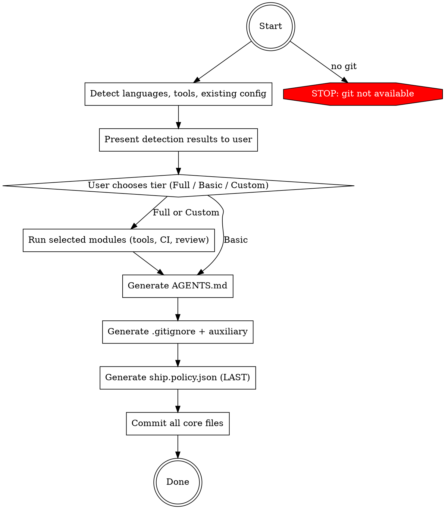

# Ship: Setup

One command. Repo goes from bare to AI-ready with Ship enforcement
active. Idempotent.

## Principal Contradiction

**Unconstrained AI's destructive potential vs constrained AI's productivity.**

Without a harness, the more capable the AI, the greater the risk —
it can modify secrets, skip quality checks, rewrite CI pipelines,
and produce code that ignores project conventions. Setup builds the
AI Harness: the constraint framework that channels AI capability into
safe, productive work. Policy is not the opposite of AI freedom — it
is the guarantee of AI trustworthiness.

## Core Principle

```
DISCIPLINE IS THE GUARANTEE OF FREEDOM.
DETECT FIRST, NEVER ASSUME, RESPECT EXISTING CONFIG.
```

Setup never invents a default stack when a repo already picked one.
It detects what exists, lets the user choose the level of enforcement,
and generates the harness accordingly.

## Process Flow



## Roles

| Role | Who | Why |
|------|-----|-----|
| Detector + generator | **You (Claude)** | Read the repo, generate config files |
| Decision maker | **User** | Choose tier and custom modules |

No Codex in setup. This is environment configuration, not code
implementation. There is no "correctness" to adversarially verify —
the harness either works or it doesn't.

## Hard Rules

1. Detect first, never assume. Never invent a default stack.
2. Only one user interaction (tier choice). Do not ask repeatedly.
3. Execute ONLY the modules the user selected. This is a gate.
4. Policy is generated LAST — it activates enforcement immediately.
5. Respect existing config. Show diff and ask before replacing.

## Quality Gates

| Gate | Condition | Fail action |
|------|-----------|-------------|
| Pre-flight → Detect | git available, cwd is repo (or init) | Stop with message |
| Detect → Choose | At least one language detected | AskUserQuestion for manual config |
| Choose → Modules | User made a tier selection | Wait for response |
| Modules → Core | Selected modules committed | Verify commits exist |
| Core → Done | policy.json + AGENTS.md exist and non-empty | Re-generate |

---

## Phase 1: Detect (automatic)

No user interaction in this phase.

### Step A: Pre-flight

- Check `git` is available. If missing, stop.
- Check whether cwd is a git repo with `git rev-parse --is-inside-work-tree`.
- If not a repo, run `git init`.
- Record whether the repo was newly initialized.

### Step B: Language + Package Manager

Scan repo files, then verify package manager / build tool exists on PATH.

| Language | File markers | Package manager / tool check |
|---|---|---|
| TypeScript / JavaScript | `package.json`, `tsconfig.json`, `*.ts`, `*.tsx`, `*.js`, `*.jsx` | `npm`, `pnpm`, `yarn`, `bun` |
| Python | `pyproject.toml`, `requirements*.txt`, `setup.py`, `*.py` | `uv`, `poetry`, `pip`, `pip3` |
| Java | `pom.xml`, `build.gradle*`, `*.java` | `mvn`, `gradle` |
| C# | `*.csproj`, `*.sln`, `*.cs` | `dotnet` |
| Go | `go.mod`, `*.go` | `go` |
| Rust | `Cargo.toml`, `*.rs` | `cargo` |
| PHP | `composer.json`, `*.php` | `composer` |
| Ruby | `Gemfile`, `*.rb` | `bundle`, `gem` |
| Kotlin | `build.gradle*`, `settings.gradle*`, `*.kt` | `gradle`, `mvn` |
| Swift | `Package.swift`, `*.swift`, `*.xcodeproj` | `swift`, `xcodebuild` |
| Dart / Flutter | `pubspec.yaml`, `*.dart` | `dart`, `flutter` |
| Elixir | `mix.exs`, `*.ex`, `*.exs` | `mix` |
| Scala | `build.sbt`, `*.scala` | `sbt`, `mill` |
| C / C++ | `CMakeLists.txt`, `Makefile`, `*.c`, `*.cc`, `*.cpp`, `*.h`, `*.hpp` | `cmake`, `make`, detected compiler |

### Step C: Toolchain Detection

For each detected language, scan all mainstream tools by category:
linter, formatter, type checker, test runner.

Status per tool:
- `ready`: executable and config are usable as-is
- `missing`: repo has no configured tool for that category
- `broken`: config references unavailable or misconfigured tool

Reference: `references/toolchain-matrix.md` for the full detection matrix.

### Step D: Existing Configuration

Check and store:
- `.ship/ship.policy.json`
- `AGENTS.md` and `CLAUDE.md`
- `.gitignore`
- `.github/workflows/*.yml`
- `.github/dependabot.yml`

## Phase 2: Choose (1 user decision)

Ask exactly one `AskUserQuestion` after detection. The prompt must show:

- Detection results by language and tool, including `ready` / `missing` / `broken`
- Which Ship policy gates will not work because required tools are missing or broken
- Three tiers:

| Tier | Selection |
|---|---|
| A | `Full setup (recommended)` — install missing tools, configure CI, generate policy + AGENTS.md |
| B | `Basic setup` — generate policy + AGENTS.md only, use repo's current toolchain |
| C | `Custom` — choose modules: `1.[x] Security policy`, `2.[x] AI handbook`, `3.[ ] Install missing tools`, `4.[ ] CI/CD`, `5.[ ] AI Code Review`. Include custom boundaries input |

At the bottom include:
- `Any special notes AI should know about this project? (optional, Enter to skip)`

## Phase 3: Modules (per tier)

**Why modules run BEFORE policy:** `ship.policy.json` activates
enforcement hooks the moment it exists. If CI/CD files or tooling
configs are written after the policy, the policy's own `read_only`
rules will block setup from completing. Therefore: write all files
first, generate the policy last.

Tier A runs all modules. Tier B skips all modules. Tier C runs only
checked modules.

**Hard rule:** Execute ONLY the modules the user selected. Never run
a module the user did not check.

| Module | Reference |
|---|---|
| Install Tools | `references/tooling.md` |
| CI/CD | `references/ci.md` |
| AI Code Review | `references/review.md` |

After each module, commit atomically:
```
git add <changed files>
git commit -m "<conventional commit message>"
```

## Phase 4: Core — generate policy and AGENTS.md last

Always run this phase for every tier. This is the final phase because
`ship.policy.json` activates enforcement hooks immediately on creation.

### Step A: Generate AGENTS.md

- Read `templates/agents-md.md`.
- Fill commands with actual detected (and newly installed) tools.
- Fill repo map, code style, boundaries, testing notes from repo inspection.
- Keep under 200 lines.
- If `AGENTS.md` or `CLAUDE.md` already exists, show diff and ask before replacing.

### Step B: Auxiliary

- Create `.ship/audit/`.
- Update `.gitignore` to include `.ship/tasks/` and `.ship/audit/`.
- Add language-specific ignores if not already present.

### Step C: Generate ship.policy.json — LAST

- Read `templates/ship.policy.json`.
- Fill `quality.pre_commit` with only `ready` tools.
  **Each entry MUST be an object** with `command` and `name` keys:
  ```json
  {"command": "uv run ruff check .", "name": "linter"}
  ```
  Do NOT use plain strings.
- Fill `quality.require_tests` patterns from detected source/test layout.
- Merge boundaries from chosen tier and custom boundaries input.
- If policy already exists, show diff and ask before overwriting.
- Use `jq` for all JSON manipulation.

### Step D: Commit

```
git add AGENTS.md .ship/ .gitignore
git commit -m "feat: generate ship policy and AGENTS.md"
```

---

## Artifacts

```text
.ship/
  ship.policy.json   — security policy + quality gates
  audit/             — audit log directory
  tasks/             — task artifacts (gitignored)
AGENTS.md            — AI handbook for this repo
.gitignore           — updated with Ship + language ignores
.github/workflows/   — CI/CD (if module selected)
```

## Reference Files

- `references/toolchain-matrix.md` — full detection matrix for 14 languages
- `references/tooling.md` — tool installation instructions per language
- `references/ci.md` — GitHub Actions CI/CD generation
- `references/review.md` — AI code review workflow setup
- `references/runtime-install-guide.md` — platform-specific runtime installation
- `templates/agents-md.md` — AGENTS.md generation template
- `templates/ship.policy.json` — policy template

## Completion

End with an outcome-oriented summary:

- `Security`: policy generated, boundaries active, audit path ready
- `Quality`: detected checks enforced, warnings for anything still missing
- `CI/CD`: include only if configured
- `Documentation`: AGENTS.md generated or updated
- Next step: `/ship:auto`

## What Setup Does NOT Do

- Scaffold empty repos beyond `git init`
- Configure deployment or hosting
- Modify source code outside setup artifacts
- Replace existing tool configs because Ship prefers a different stack
- Install global packages or use `sudo`

<Bad>
- Assuming a language or tool without detecting it
- Installing tools the user didn't select (tier gate violation)
- Generating policy before modules are written (blocks own setup)
- Replacing existing AGENTS.md or CLAUDE.md without showing diff
- Using plain strings in pre_commit entries (must be objects)
- Running modules for Tier B (Basic = policy + AGENTS.md only)
- Asking the user multiple questions (one tier choice only)
- Using sudo or installing global packages
</Bad>
