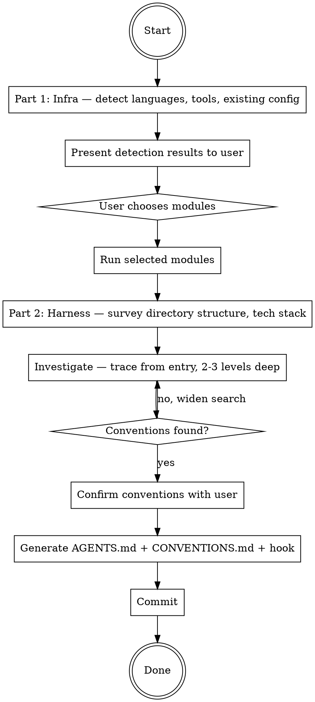

# Ship: Setup

One command. Repo goes from bare tooling to fully configured infrastructure
with AI-enforced coding conventions. Idempotent.

## Principal Contradiction

**Missing tooling slows development vs installing tools the project didn't
choose.** And: **The project's implicit conventions vs. mechanically
enforceable rules.**

Setup detects what exists and fills gaps, then discovers conventions that
linters can't cover and makes them enforceable via AI.

## Core Principles

```
DETECT FIRST, NEVER ASSUME, RESPECT EXISTING CONFIG.
NO INVESTIGATION, NO RIGHT TO SPEAK. READ THE CODE BEFORE WRITING ANY RULES.
```

## Process Flow



## Hard Rules

1. Detect first, never assume. Never invent a default stack.
2. One user interaction for infra module selection.
3. Execute ONLY the modules the user selected.
4. Respect existing config. Show diff and ask before replacing.
5. Read the code before writing any convention rules.
6. Every convention must have file:line evidence from 3+ files.
7. Skip conventions already enforced by the project's linter/formatter.
8. Two user interactions max for harness: convention confirmation and existing file replacement.

---

# Part 1: Infrastructure

## Phase 1: Detect (automatic)

No user interaction in this phase.

### Step A: Pre-flight

- Check `git` is available. If missing, stop.
- Check whether cwd is a git repo with `git rev-parse --is-inside-work-tree`.
- If not a repo, run `git init`.

### Step B: Language + Package Manager

Scan repo files, then verify package manager / build tool exists on PATH.

| Language | File markers | Package manager / tool check |
|---|---|---|
| TypeScript / JavaScript | `package.json`, `tsconfig.json`, `*.ts`, `*.tsx`, `*.js`, `*.jsx` | `npm`, `pnpm`, `yarn`, `bun` |
| Python | `pyproject.toml`, `requirements*.txt`, `setup.py`, `*.py` | `uv`, `poetry`, `pip`, `pip3` |
| Java | `pom.xml`, `build.gradle*`, `*.java` | `mvn`, `gradle` |
| C# | `*.csproj`, `*.sln`, `*.cs` | `dotnet` |
| Go | `go.mod`, `*.go` | `go` |
| Rust | `Cargo.toml`, `*.rs` | `cargo` |
| PHP | `composer.json`, `*.php` | `composer` |
| Ruby | `Gemfile`, `*.rb` | `bundle`, `gem` |
| Kotlin | `build.gradle*`, `settings.gradle*`, `*.kt` | `gradle`, `mvn` |
| Swift | `Package.swift`, `*.swift`, `*.xcodeproj` | `swift`, `xcodebuild` |
| Dart / Flutter | `pubspec.yaml`, `*.dart` | `dart`, `flutter` |
| Elixir | `mix.exs`, `*.ex`, `*.exs` | `mix` |
| Scala | `build.sbt`, `*.scala` | `sbt`, `mill` |
| C / C++ | `CMakeLists.txt`, `Makefile`, `*.c`, `*.cc`, `*.cpp`, `*.h`, `*.hpp` | `cmake`, `make`, detected compiler |

### Step C: Toolchain Detection

For each detected language, scan all mainstream tools by category:
linter, formatter, type checker, test runner.

Status per tool:
- `ready`: executable and config are usable as-is
- `missing`: repo has no configured tool for that category
- `broken`: config references unavailable or misconfigured tool

Reference: `references/toolchain-matrix.md` for the full detection matrix.

### Step D: Existing Configuration

Check and store:
- `.gitignore`
- `.github/workflows/*.yml`
- `.github/dependabot.yml`
- Pre-commit config (`.husky/`, `.pre-commit-config.yaml`, `lint-staged` in package.json)

## Phase 2: Choose (1 user decision)

Use AskUserQuestion after detection. The prompt must show:

- Detection results by language and tool, including `ready` / `missing` / `broken`
- Available modules:

```
Select modules to configure:

  1. [x] Install missing tools (linter, formatter, type checker)
  2. [x] Pre-commit hooks (lint + format on commit)
  3. [ ] CI/CD (GitHub Actions)
  4. [ ] Dependabot
  5. [ ] AI Code Review
```

Options:
- A) Install all recommended
- B) Custom selection (specify numbers)
- C) Skip — I'll configure manually

## Phase 3: Execute modules

**Hard rule:** Execute ONLY the modules the user selected.

| Module | Reference |
|---|---|
| Install Tools | `references/tooling.md` |
| Pre-commit Hooks | configure lint-staged + husky (JS/TS), pre-commit (Python), or equivalent for detected language |
| CI/CD | `references/ci.md` |
| Dependabot | generate `.github/dependabot.yml` |
| AI Code Review | `references/review.md` |

### Pre-commit hook configuration

For each detected language, set up pre-commit to run lint + format:

**JS/TS:** `lint-staged` + `husky`
```json
// package.json
"lint-staged": {
  "*.{ts,tsx,js,jsx}": ["oxlint --fix", "prettier --write"],
  "*.{json,md,yml}": ["prettier --write"]
}
```

**Python:** `.pre-commit-config.yaml` with ruff
**Go:** `.pre-commit-config.yaml` with golangci-lint + gofmt
**Rust:** `.pre-commit-config.yaml` with clippy + rustfmt

Use whatever linter/formatter the project already has configured.
Only add pre-commit wiring, not new tools (unless Install Tools
module was also selected).

After each module, commit atomically:
```
git add <changed files>
git commit -m "<conventional commit message>"
```

---

# Part 2: Harness

## Phase 4: Survey

Do NOT read file contents yet. Reuse language/structure data from Part 1.

### Step A: Monorepo detection

If Part 1 revealed multiple sub-projects (each with their own manifest
file, separate language, or independent directory structure), this is
a monorepo.

For monorepos, identify sub-projects and their recent activity:

```bash
# Count commits per top-level directory in the last 30 days
git log --since="30 days ago" --name-only --pretty=format: | \
  grep -v '^$' | cut -d/ -f1-2 | sort | uniq -c | sort -rn | head -10
```

Record each sub-project: path, language, manifest file, commit count.

### Step B: Identify entry points

**Single repo:** record main entry file and key call paths.
**Monorepo:** record entry point per active sub-project.

---

## Phase 5: Investigate

Trace from entry points 2-3 levels deep. Find conventions that
linters can't cover.

**Monorepo:** investigate each active sub-project independently.
Each sub-project may have different conventions.

### Method

Start at the entry point. Follow calls inward 2-3 levels. Record any
pattern repeated across 3+ files.

Read each file fully. Stop when you stop finding new patterns.

**Fallback prompts** (use only if fewer than 2 patterns found after
tracing 2-3 levels):
- Error handling, validation, module boundaries, naming
- Logging, API contracts, data access, security

### Filter

For each pattern: could the project's existing linter enforce this?
- Yes → skip silently. Don't include in findings or output.
- No → this is a harness convention

### Record

```
Sub-project: <path or "root"> (monorepo only)
Convention: <name>
Evidence: <file1:line>, <file2:line>, <file3:line>
Consistency: <N files follow / M files checked>
Description: <one sentence>
```

---

## Phase 6: Confirm

Use AskUserQuestion:

**Single repo:**
```
I read your codebase and found these conventions that linters can't cover:

  ✓ [1] <name>
        Evidence: <file1:line>, <file2:line> (<N/M files>)

  ✓ [2] <name>
        Evidence: <file1:line>, <file2:line> (<N/M files>)

Anything else AI should know about this project? (conventions,
gotchas, boundaries, or context not visible in the code)
```

**Monorepo:**
```
I detected a monorepo and investigated active sub-projects:

  [go-services/] (N commits in 30 days)
    ✓ [1] <name>
          Evidence: <file1:line>, <file2:line> (<N/M files>)
    ✓ [2] <name>
          Evidence: ...

  [frontend/] (N commits in 30 days)
    ✓ [3] <name>
          Evidence: ...

  Not investigated (inactive):
    - app/ (0 commits)
    - shipcli-ts/ (0 commits)

Anything else AI should know? Want me to investigate any inactive sub-project?
```

Options:
- A) Generate as shown
- B) I want to toggle or edit (specify which numbers and changes)
- C) Cancel — do not generate anything

If B: apply edits, re-present once with AskUserQuestion. Max two rounds.

If user adds a convention via free text that was not observed in code,
investigate it: search the codebase for evidence. If evidence found,
add it. If not, tell the user no evidence was found and ask if they
still want to include it as a user-defined rule (no file:line evidence).

If user provides additional context (gotchas, boundaries, etc.),
incorporate it into AGENTS.md (Gotchas, Boundaries, or Architecture
sections as appropriate) and into CONVENTIONS.md if it describes an
enforceable convention.

---

## Phase 7: Generate

### Step A: Generate AGENTS.md

Read `references/agents-md.md` for structure. Fill from Phase 4-5 findings.
Omit sections with no content. Keep under 200 lines per file.

AGENTS.md includes ALL discovered conventions.

**Single repo:** generate or update root `AGENTS.md`.

**Monorepo:** update each sub-project's local `AGENTS.md` with that
sub-project's conventions. If a local AGENTS.md doesn't exist, create it.
Root AGENTS.md gets repo-wide conventions only (commit format, shared
tooling, cross-project boundaries). Sub-project-specific conventions
go in the sub-project's AGENTS.md.

**If an `AGENTS.md` already exists**, use AskUserQuestion:

```
AGENTS.md already exists. Here's what would change:

<show diff summary: sections added/changed/removed>
```

Options:
- A) Replace with new version
- B) Merge — add new sections, keep existing content
- C) Skip — don't touch AGENTS.md

For monorepos, ask once per file that needs changes (batch into one
AskUserQuestion if possible).

### Step B: Generate CONVENTIONS.md

Write to `.ship/rules/semantic/CONVENTIONS.md`. Only conventions that
linters can't cover (the ones confirmed in Phase 6).

Format per convention:

```markdown
## <Convention name>
Scope: <glob pattern>
Description: <one sentence>
Correct (from <file:line>):
\`\`\`
<actual code from the codebase>
\`\`\`
Incorrect:
\`\`\`
<constructed counter-example showing what NOT to do>
\`\`\`
Rationale: <one sentence>
```

- Correct examples must come from the codebase
- Incorrect examples are constructed counter-examples (not from codebase)

**If `CONVENTIONS.md` already exists**, use AskUserQuestion:

```
CONVENTIONS.md already exists with <N> conventions.
```

Options:
- A) Replace entirely with new conventions
- B) Merge — add new conventions, keep existing ones
- C) Skip — don't touch CONVENTIONS.md

### Step C: Register hook

Use AskUserQuestion to choose where to register the hook:

```
Where should the convention enforcement hook be registered?
```

Options:
- A) Project shared (`.claude/settings.json`) — all team members get enforcement
- B) Project local (`.claude/settings.local.json`) — only you, not committed
- C) User global (`~/.claude/settings.json`) — all your projects
- D) Skip — don't register a hook

Read the chosen settings file (create `{}` if missing).
Add this entry to `hooks.PreToolUse` array, preserving existing entries:

```json
{
  "matcher": "Write|Edit",
  "hooks": [
    {
      "type": "command",
      "command": "bash ${CLAUDE_PLUGIN_ROOT}/scripts/check-conventions.sh",
      "statusMessage": "Reviewing coding conventions..."
    }
  ]
}
```

The script is part of the ship plugin (`scripts/check-conventions.sh`). It:
1. Reads hook input JSON from stdin
2. Checks if the file matches any scope in CONVENTIONS.md
3. Sends the code + conventions to `claude -p` (Haiku, print mode)
4. Exit 0 = pass, exit 2 = violation (stderr has details)

Skip if an identical hook entry already exists.

### Step D: Update .gitignore

Add `.ship/tasks/` and `.ship/audit/` to `.gitignore` if not present.
Do NOT gitignore `.ship/rules/`.
Update with language-specific ignores if not already present.

If user chose project shared hook (Step C option A) and `.claude/` is
fully gitignored, change to:
```
.claude/*
!.claude/settings.json
```

### Step E: Commit

Stage all generated files:

```bash
git add AGENTS.md .ship/rules/semantic/CONVENTIONS.md .gitignore
# Only if project shared hook was chosen:
git add .claude/settings.json
git commit -m "feat(setup): generate AGENTS.md and coding conventions

AGENTS.md: AI handbook with commands, repo map, and conventions.
CONVENTIONS.md: <N> conventions for semantic enforcement hook."
```

---

## Completion

**Single repo:**
```
[Setup] Complete.

Infrastructure:
  - <module name> — <what was done>
  ...

Harness:
  AGENTS.md: <generated | merged | skipped>
  CONVENTIONS.md: <N> conventions
    1. <name> — <evidence summary>
    2. <name> — <evidence summary>
    ...
  Hook: registered in .claude/settings.json
```

**Monorepo:**
```
[Setup] Complete.

Infrastructure:
  - <module name> — <what was done>
  ...

Harness:
  Sub-projects investigated: <list>
    [go-services/] AGENTS.md: <merged>, <N> conventions
    [frontend/] AGENTS.md: <generated>, <N> conventions
  Not investigated: <list>

  CONVENTIONS.md: <total N> conventions across <M> sub-projects
  Hook: registered in .claude/settings.json
```

---

## Artifacts

```text
.github/
  workflows/       — CI/CD (if module selected)
  dependabot.yml   — dependency updates (if module selected)
.husky/ or .pre-commit-config.yaml — pre-commit hooks (if module selected)
.gitignore         — updated with language ignores
AGENTS.md          — AI handbook with conventions
.ship/rules/semantic/CONVENTIONS.md — semantic enforcement rules
```

## Reference Files

- `references/agents-md.md` — AGENTS.md structure guide
- `references/toolchain-matrix.md` — full detection matrix for 14 languages
- `references/tooling.md` — tool installation instructions per language
- `references/ci.md` — GitHub Actions CI/CD generation
- `references/review.md` — AI code review workflow setup
- `references/runtime-install-guide.md` — platform-specific runtime installation

## What This Skill Does NOT Do

- Configure deployment or hosting
- Install global packages or use `sudo`
- Replace existing tool configs without asking
- Generate shell scripts or structural check scripts
- Read the entire codebase (targeted investigation only)

<Bad>
- Assuming a language or tool without detecting it
- Installing tools the user didn't select
- Replacing existing config without showing diff
- Writing rules without reading the code first
- Generating rules from templates or presets
- Reading every file in the project
- Including a convention observed in fewer than 3 files
- Generating a convention without file:line evidence
- Including a pattern the linter already enforces
- Asking the user more than twice per part
</Bad>
